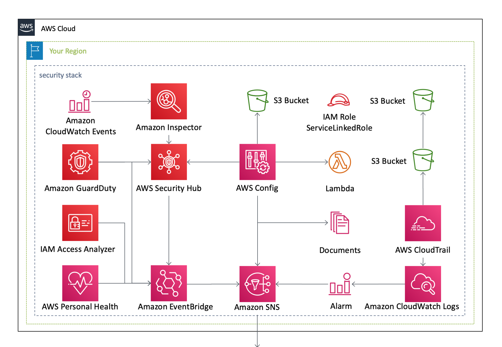
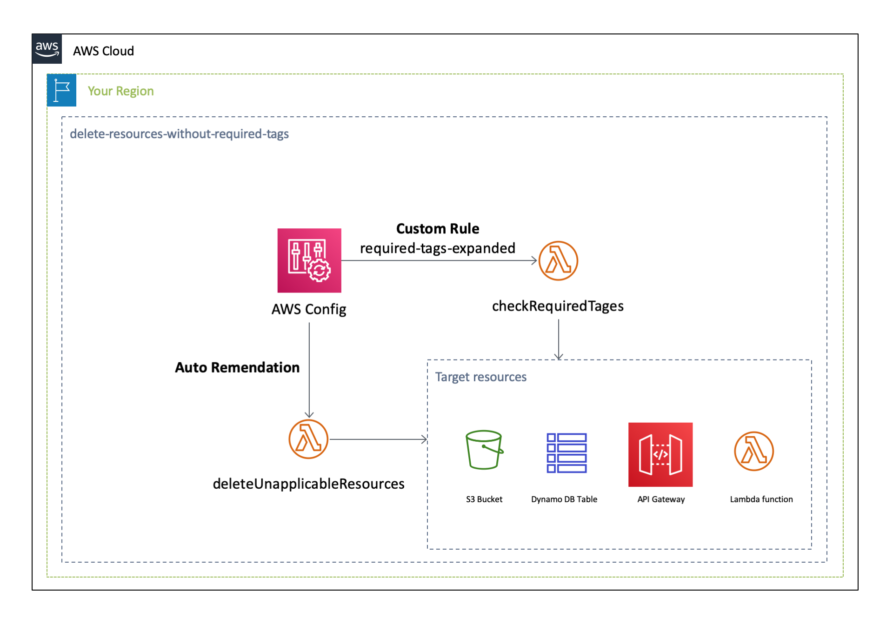
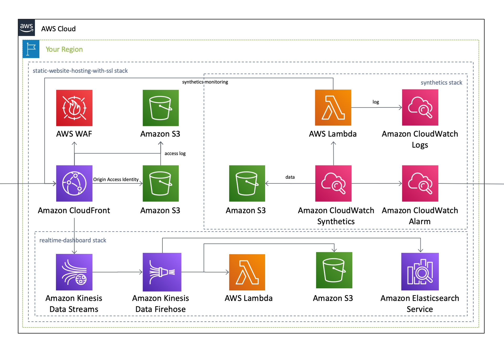
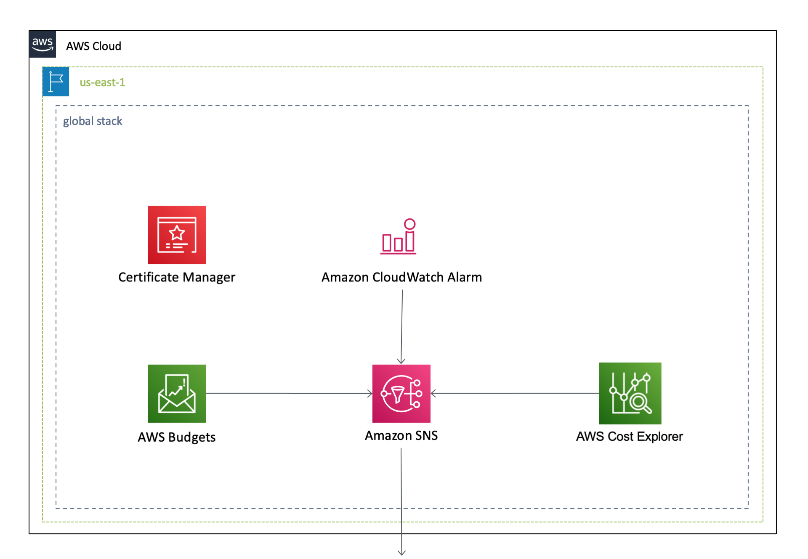
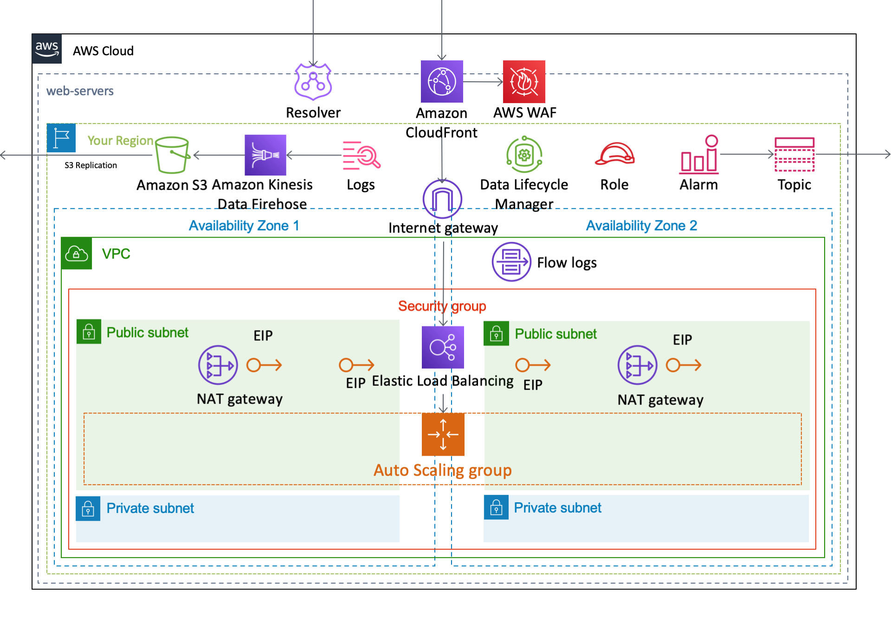
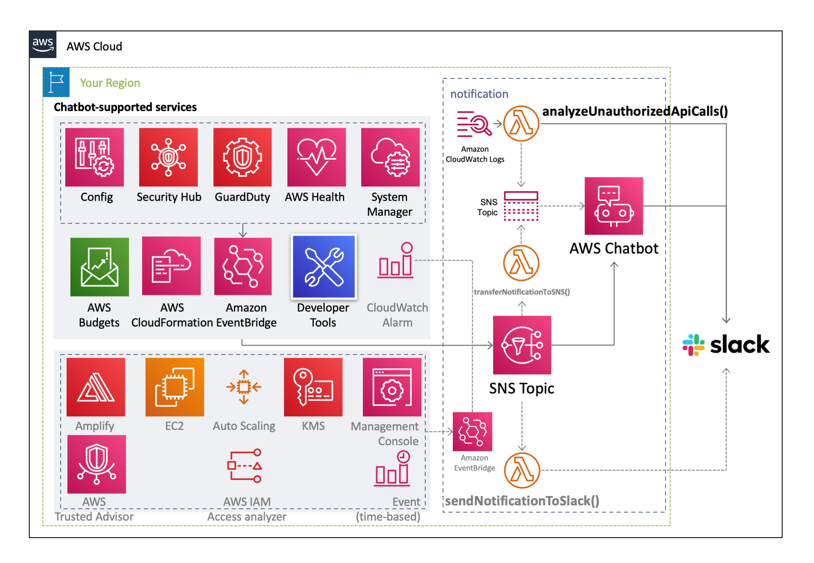

English / [**日本語**](README_JP.md)

# AWSCloudFormationTemplates

``AWSCloudFormationTemplates`` contains basic Cloudformation templates.

## AWS SAM–based Serverless Applications

This project contains **AWS SAM–based serverless applications** and they are published on the ``AWS Serverless Application Repository``.

| Application Name | Link |
| --- | --- |
| [codepipeline-default-settings](cicd/codepipeline-default-settings.md) | [AWS Serverless Application Repository](https://serverlessrepo.aws.amazon.com/applications/arn:aws:serverlessrepo:us-east-1:172664222583:applications~codepipeline-default-settings) |
| [cloudwatch-alarm-about-apigateway](monitoring/cloudwatch-alarm-about-apigateway.md) | [AWS Serverless Application Repository](https://serverlessrepo.aws.amazon.com/applications/arn:aws:serverlessrepo:us-east-1:172664222583:applications~cloudwatch-alarm-about-apigateway) |
| [cloudwatch-alarm-about-codebuild](monitoring/cloudwatch-alarm-about-codebuild.md) | [AWS Serverless Application Repository](https://serverlessrepo.aws.amazon.com/applications/arn:aws:serverlessrepo:us-east-1:172664222583:applications~cloudwatch-alarm-about-codebuild) |
| [cloudwatch-alarm-about-dynamodb-throttle](monitoring/cloudwatch-alarm-about-dynamodb-throttle.md) | [AWS Serverless Application Repository](https://serverlessrepo.aws.amazon.com/applications/arn:aws:serverlessrepo:us-east-1:172664222583:applications~cloudwatch-alarm-about-dynamodb-throttle) |
| [cloudwatch-alarm-about-dynamodb](monitorining/cloudwatch-alarm-about-dynamodb.md) | [AWS Serverless Application Repository](https://serverlessrepo.aws.amazon.com/applications/arn:aws:serverlessrepo:us-east-1:172664222583:applications~cloudwatch-alarm-about-dynamodb) |
| [cloudwatch-alarm-about-ec2](monitoring/cloudwatch-alarm-about-ec2.md) | [AWS Serverless Application Repository](https://serverlessrepo.aws.amazon.com/applications/arn:aws:serverlessrepo:us-east-1:172664222583:applications~cloudwatch-alarm-about-ec2) |
| [cloudwatch-alarm-about-events](monitoring/cloudwatch-alarm-about-events.md) | [AWS Serverless Application Repository](https://serverlessrepo.aws.amazon.com/applications/arn:aws:serverlessrepo:us-east-1:172664222583:applications~cloudwatch-alarm-about-events) |
| [cloudwatch-alarm-about-kinesis-data-streams](monitoring/cloudwatch-alarm-about-kinesis-data-streams.md) | [AWS Serverless Application Repository](https://serverlessrepo.aws.amazon.com/applications/arn:aws:serverlessrepo:us-east-1:172664222583:applications~cloudwatch-alarm-about-kinesis-data-streams) |
| [cloudwatch-alarm-about-lambda](monitoring/cloudwatch-alarm-about-lambda.md) | [AWS Serverless Application Repository](https://serverlessrepo.aws.amazon.com/applications/arn:aws:serverlessrepo:us-east-1:172664222583:applications~cloudwatch-alarm-about-lambda) |
| [cloudwatch-alarm-about-natgateway](monitoring/cloudwatch-alarm-about-natgateway.md) | [AWS Serverless Application Repository](https://serverlessrepo.aws.amazon.com/applications/arn:aws:serverlessrepo:us-east-1:172664222583:applications~cloudwatch-alarm-about-natgateway) |
| [cloudwatch-alarm-about-sns](monitoring/cloudwatch-alarm-about-sns.md) | [AWS Serverless Application Repository](https://serverlessrepo.aws.amazon.com/applications/arn:aws:serverlessrepo:us-east-1:172664222583:applications~cloudwatch-alarm-about-sns) |
| [sns-topic](notification/sns-topic.md) | [AWS Serverless Application Repository](https://serverlessrepo.aws.amazon.com/applications/arn:aws:serverlessrepo:us-east-1:172664222583:applications~sns-topic) |
| [eventbridge-rules](eventbridge-rules.md) | [AWS Serverless Application Repository](https://serverlessrepo.aws.amazon.com/applications/arn:aws:serverlessrepo:us-east-1:172664222583:applications~eventbridge-rules) |
| [delete-resources-without-required-tags](security-config-rules/delete-resources-without-required-tags.md) | [AWS Serverless Application Repository](https://serverlessrepo.aws.amazon.com/applications/arn:aws:serverlessrepo:us-east-1:172664222583:applications~delete-resources-without-required-tags) |

## Templates

This project contains **Cloudformation templates** as follows.

| Template Name | AWS Region Code | Launch |
| --- | --- | --- |
| [All-in-One Template](/cicd/README.md) | ap-northeast-1 |  |
| [**Security Template**](/security/README.md) | ap-northeast-1 |  |
| [Delete Resources without Required Tags](/security-config-rules/README.md) | |  |
| [Global Settings Template](/global/README.md) | us-east-1 |  |
| [Static Website Hosting Template](/static-website-hosting-with-ssl/README.md) | ap-northeast-1 |   |
| [EC2-based Web Servers Template](/web-servers/README.md) | ap-northeast-1 |   |
| [Systems Manager Template](/web-servers/README.md) | ap-northeast-1 |  |
| [Send Notification to Slack](/notification/README.md) | ap-northeast-1 |  |
| [Amplify Template](/amplify/README.md) | ap-northeast-1 |  |
| [CloudWatch Alarm Template](/monitoring/README.md) | | |

## Architecture

The following section describes the individual components of the architecture.

### Security Template

### Delete Resources without Required Tags

### Static Website Hosting Template

### Global Settings Template

### EC2-based Web Servers Template

### Amplify Template

### Send Notification to Slack

