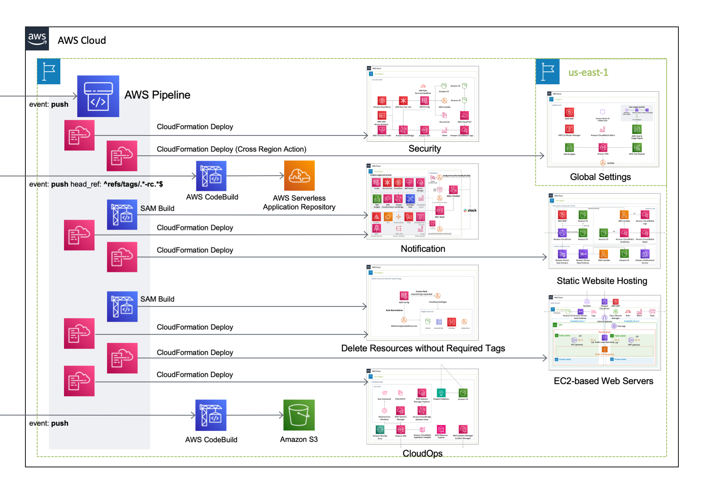

English / [**日本語**](README_JP.md)

# AWSCloudFormationTemplates

``AWSCloudFormationTemplates`` contains basic Cloudformation templates.

> [!NOTE]
> You can also get useful sample templates at [**eijikominami/aws-cloudformation-samples**](https://github.com/eijikominami/aws-cloudformation-samples).

## Templates

This project contains **Cloudformation templates** as follows.

| Services | US East (Virginia) | Asia Pacific (Tokyo) |
| --- | --- | --- |
| [All-in-One](/cicd/README.md) |  |  |
| [Amplify Console](/amplify/README.md) |  |  |
| [Analytics](/analytics/README.md) |  |  |
| [**CloudOps**](/cloudops/README.md) |  |  |
| [CloudWatch alarm](/monitoring/README.md) | | |
| [Delete Resources without Required Tags](/security-config-rules/README.md) |  |  |
| [EC2-based Web Servers](/web-servers/README.md) |  |  |
| [Global Settings](/global/README.md) |  | |
| [Identity](/identity/README.md) | | |
| [Media](/media/README.md) | | [Sample templates](https://github.com/eijikominami/aws-cloudformation-samples/tree/master/media) |
| [**Network**](/network/README.md) |  |  |
| [**Security**](/security/README.md) |  |  |
| [Send Notification to Slack](/notification/README.md) |  |  |
| [Shared Servivces](/shared/README.md) |  |  |
| [**Static Website Hosting**](/static-website-hosting-with-ssl/README.md) |  |  |

## Environment

This project uses the following modules.

| Service | Resource | Version |
| --- | --- | --- |
| Amazon CloudWatch Synthetics | Runtime | syn-nodejs-puppeteer-6.2 |
| AWS CodeBuild | Image | aws/codebuild/amazonlinux2-aarch64-standard:2.0 (Python 3.9) |
| Amazon EBS | Volume Type | gp3 |
| Amazon EC2 | Amazon Linux 2 Default AMI Id | ami-03dceaabddff8067e |
| Amazon EC2 | Microsoft Windows Server 2022 Default AMI Id | ami-0659e3a420d8a74ea |
| AWS Glue | GlueVersion | 4.0 |
| AWS Glue | PythonVersion | 3 |
| AWS Lambda | CodeGuru Profiler | [AWSCodeGuruProfilerPythonAgentLambdaLayer:11 (Python 3.9)](https://docs.aws.amazon.com/codeguru/latest/profiler-ug/python-lambda-layers.html) |
| AWS Lambda | Lambda Insights | [LambdaInsightsExtension-Arm64:11](https://docs.aws.amazon.com/ja_jp/AmazonCloudWatch/latest/monitoring/Lambda-Insights-extension-versionsARM.html) |
| AWS Lambda | Python | 3.9 |
| AWS Serverless Repository | aws-usage-queries | 0.1.5+19.38c7b8 |
| AWS Systems Manager | SSM Document Schema (Automation) | 0.3 |
| AWS Systems Manager | SSM Document Schema (Command) | 2.2 |
| Amazon OpenSearch Service | OpenSearch | OpenSearch_2.11 |
| Elastic Load Balancer | SSL Policy | ELBSecurityPolicy-TLS13-1-2-2021-06 |

## Architecture

The following section describes the individual components of the architecture.

### Security Template

### Delete Resources without Required Tags

### Global Settings Template

### Static Website Hosting Template

### Network Template

### EC2-based Web Servers Template

### Synthetics Monitoring Template

### Shared Services

### CloudOps Template

### Send Notification to Slack

### Amplify Console Template

