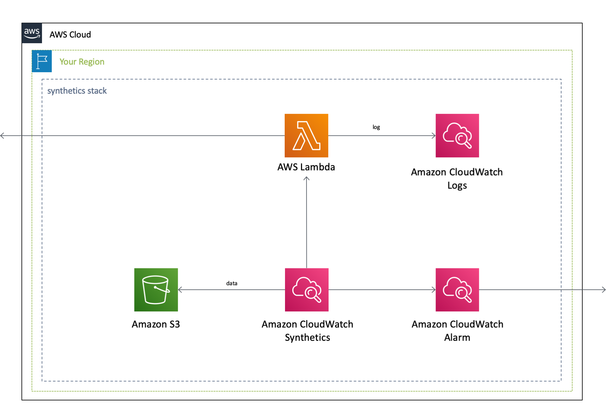
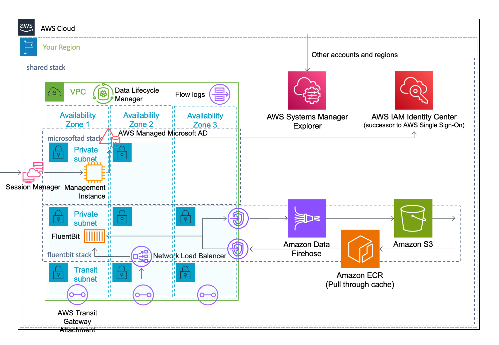
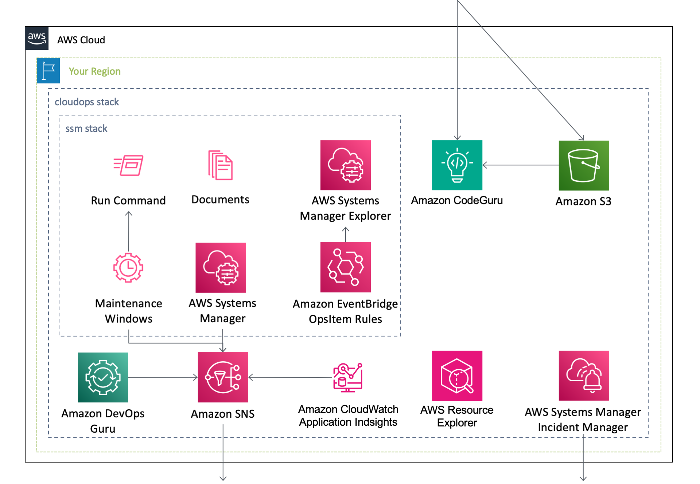

English / [**日本語**](README_JP.md)

# AWSCloudFormationTemplates

``AWSCloudFormationTemplates`` contains basic Cloudformation templates.

## AWS SAM–based Serverless Applications

This project contains **AWS SAM–based serverless applications** and they are published on the ``AWS Serverless Application Repository``.

| Application Name | Latest Version | Link |
| --- | --- | --- |
| [codepipeline-default-settings](cicd/codepipeline-default-settings.md) | 2.1.1 | [AWS Serverless Application Repository](https://serverlessrepo.aws.amazon.com/applications/arn:aws:serverlessrepo:us-east-1:172664222583:applications~codepipeline-default-settings) |
| [cloudwatch-alarm-about-acm](monitoring/readme/cloudwatch-alarm-about-acm.md) | 2.1.1 | [AWS Serverless Application Repository](https://serverlessrepo.aws.amazon.com/applications/arn:aws:serverlessrepo:us-east-1:172664222583:applications~cloudwatch-alarm-about-acm) |
| [cloudwatch-alarm-about-apigateway](monitoring/readme/cloudwatch-alarm-about-apigateway.md) | 2.1.1 | [AWS Serverless Application Repository](https://serverlessrepo.aws.amazon.com/applications/arn:aws:serverlessrepo:us-east-1:172664222583:applications~cloudwatch-alarm-about-apigateway) |
| [cloudwatch-alarm-about-application-elb](monitoring/readme/cloudwatch-alarm-about-application-elb.md) | 2.1.1 | [AWS Serverless Application Repository](https://serverlessrepo.aws.amazon.com/applications/arn:aws:serverlessrepo:us-east-1:172664222583:applications~cloudwatch-alarm-about-application-elb) |
| [cloudwatch-alarm-about-codebuild](monitoring/readme/cloudwatch-alarm-about-codebuild.md) | 2.1.1 | [AWS Serverless Application Repository](https://serverlessrepo.aws.amazon.com/applications/arn:aws:serverlessrepo:us-east-1:172664222583:applications~cloudwatch-alarm-about-codebuild) |
| [cloudwatch-alarm-about-application-directoryservice](monitoring/readme/cloudwatch-alarm-about-directoryservice.md) | 2.1.1 | [AWS Serverless Application Repository](https://serverlessrepo.aws.amazon.com/applications/arn:aws:serverlessrepo:us-east-1:172664222583:applications~cloudwatch-alarm-about-directoryservice) |
| [cloudwatch-alarm-about-dynamodb-throttle](monitoring/readme/cloudwatch-alarm-about-dynamodb-throttle.md) | 2.1.1 | [AWS Serverless Application Repository](https://serverlessrepo.aws.amazon.com/applications/arn:aws:serverlessrepo:us-east-1:172664222583:applications~cloudwatch-alarm-about-dynamodb-throttle) |
| [cloudwatch-alarm-about-dynamodb](monitorining/cloudwatch-alarm-about-dynamodb.md) | 2.1.1 | [AWS Serverless Application Repository](https://serverlessrepo.aws.amazon.com/applications/arn:aws:serverlessrepo:us-east-1:172664222583:applications~cloudwatch-alarm-about-dynamodb) | 2.1.1 |
| [cloudwatch-alarm-about-ec2](monitoring/readme/cloudwatch-alarm-about-ec2.md) | 2.1.1 | [AWS Serverless Application Repository](https://serverlessrepo.aws.amazon.com/applications/arn:aws:serverlessrepo:us-east-1:172664222583:applications~cloudwatch-alarm-about-ec2) |
| [cloudwatch-alarm-about-ec2-cwagent](monitoring/readme/cloudwatch-alarm-about-ec2-cwagent.md) | 2.1.1 | [AWS Serverless Application Repository](https://serverlessrepo.aws.amazon.com/applications/arn:aws:serverlessrepo:us-east-1:172664222583:applications~cloudwatch-alarm-about-ec2-cwagent) |
| [cloudwatch-alarm-about-elasticsearch](monitoring/readme/cloudwatch-alarm-about-elasticsearch.md) | 2.1.1 | [AWS Serverless Application Repository](https://serverlessrepo.aws.amazon.com/applications/arn:aws:serverlessrepo:us-east-1:172664222583:applications~cloudwatch-alarm-about-elasticsearch) |
| [cloudwatch-alarm-about-events](monitoring/readme/cloudwatch-alarm-about-events.md) | 2.1.1 | [AWS Serverless Application Repository](https://serverlessrepo.aws.amazon.com/applications/arn:aws:serverlessrepo:us-east-1:172664222583:applications~cloudwatch-alarm-about-events) |
| [cloudwatch-alarm-about-kinesis-data-streams](monitoring/readme/cloudwatch-alarm-about-kinesis-data-streams.md) | 2.1.1 | [AWS Serverless Application Repository](https://serverlessrepo.aws.amazon.com/applications/arn:aws:serverlessrepo:us-east-1:172664222583:applications~cloudwatch-alarm-about-kinesis-data-streams) |
| [cloudwatch-alarm-about-kinesis-data-firehose](monitoring/readme/cloudwatch-alarm-about-kinesis-data-firehose.md) | 2.1.1 | [AWS Serverless Application Repository](https://serverlessrepo.aws.amazon.com/applications/arn:aws:serverlessrepo:us-east-1:172664222583:applications~cloudwatch-alarm-about-kinesis-data-firehose) |
| [cloudwatch-alarm-about-lambda](monitoring/readme/cloudwatch-alarm-about-lambda.md) | 2.1.1 | [AWS Serverless Application Repository](https://serverlessrepo.aws.amazon.com/applications/arn:aws:serverlessrepo:us-east-1:172664222583:applications~cloudwatch-alarm-about-lambda) |
| [cloudwatch-alarm-about-medialive](monitoring/readme/cloudwatch-alarm-about-medialive.md) | 2.1.1 | [AWS Serverless Application Repository](https://serverlessrepo.aws.amazon.com/applications/arn:aws:serverlessrepo:us-east-1:172664222583:applications~cloudwatch-alarm-about-medialive) |
| [cloudwatch-alarm-about-mediastore](monitoring/readme/cloudwatch-alarm-about-mediastore.md) | 2.1.1 | [AWS Serverless Application Repository](https://serverlessrepo.aws.amazon.com/applications/arn:aws:serverlessrepo:us-east-1:172664222583:applications~cloudwatch-alarm-about-mediastore) |
| [cloudwatch-alarm-about-natgateway](monitoring/readme/cloudwatch-alarm-about-natgateway.md) | 2.1.1 | [AWS Serverless Application Repository](https://serverlessrepo.aws.amazon.com/applications/arn:aws:serverlessrepo:us-east-1:172664222583:applications~cloudwatch-alarm-about-natgateway) |
| [cloudwatch-alarm-about-privateendpoint](monitoring/readme/cloudwatch-alarm-about-privateendpoint.md) | 2.1.1 | [AWS Serverless Application Repository](https://serverlessrepo.aws.amazon.com/applications/arn:aws:serverlessrepo:us-east-1:172664222583:applications~cloudwatch-alarm-about-privateendpoint) |
| [cloudwatch-alarm-about-sns](monitoring/readme/cloudwatch-alarm-about-sns.md) | 2.1.1 | [AWS Serverless Application Repository](https://serverlessrepo.aws.amazon.com/applications/arn:aws:serverlessrepo:us-east-1:172664222583:applications~cloudwatch-alarm-about-sns) |
| [cloudwatch-alarm-about-ssm-command](monitoring/readme/cloudwatch-alarm-about-ssm-command.md) | 2.1.1 | [AWS Serverless Application Repository](https://serverlessrepo.aws.amazon.com/applications/arn:aws:serverlessrepo:us-east-1:172664222583:applications~cloudwatch-alarm-about-ssm-command) |
| [cloudwatch-alarm-about-transitgateway](monitoring/readme/cloudwatch-alarm-about-transitgateway.md) | 2.1.1 | [AWS Serverless Application Repository](https://serverlessrepo.aws.amazon.com/applications/arn:aws:serverlessrepo:us-east-1:172664222583:applications~cloudwatch-alarm-about-transitgateway) |
| [cloudwatch-alarm-about-transitgatewat-attachment](monitoring/readme/cloudwatch-alarm-about-trasitgateway-attachment.md) | 2.1.1 | [AWS Serverless Application Repository](https://serverlessrepo.aws.amazon.com/applications/arn:aws:serverlessrepo:us-east-1:172664222583:applications~cloudwatch-alarm-about-transitgateway-attachment) |
| [cloudwatch-alarm-about-workspaces](monitoring/readme/cloudwatch-alarm-about-workspaces.md) | 2.1.1 | [AWS Serverless Application Repository](https://serverlessrepo.aws.amazon.com/applications/arn:aws:serverlessrepo:us-east-1:172664222583:applications~cloudwatch-alarm-about-workspaces) |
| [sns-topic](notification/sns-topic.md) | 2.1.1 | [AWS Serverless Application Repository](https://serverlessrepo.aws.amazon.com/applications/arn:aws:serverlessrepo:us-east-1:172664222583:applications~sns-topic) |
| [eventbridge-rules](eventbridge-rules.md) | 2.1.1 | [AWS Serverless Application Repository](https://serverlessrepo.aws.amazon.com/applications/arn:aws:serverlessrepo:us-east-1:172664222583:applications~eventbridge-rules) |
| [delete-resources-without-required-tags](security-config-rules/delete-resources-without-required-tags.md) | 2.1.1 | [AWS Serverless Application Repository](https://serverlessrepo.aws.amazon.com/applications/arn:aws:serverlessrepo:us-east-1:172664222583:applications~delete-resources-without-required-tags) |

## Templates

This project contains **Cloudformation templates** as follows.

| Template Name | AWS Region Code | Launch |
| --- | --- | --- |
| [All-in-One](/cicd/README.md) | ap-northeast-1 |  |
| [**Security**](/security/README.md) | ap-northeast-1 |  |
| [Delete Resources without Required Tags](/security-config-rules/README.md) | ap-northeast-1 |  |
| [Global Settings](/global/README.md) | us-east-1 |  |
| [**Static Website Hosting**](/static-website-hosting-with-ssl/README.md) | ap-northeast-1 |   |
| [**Network**](/network/README.md) | ap-northeast-1 |  |
| [EC2-based Web Servers](/web-servers/README.md) | ap-northeast-1 |   |
| [**Synthetics Monitoring**](/synthetics/README.md) | ap-northeast-1 |  |
| [Shared Servivces](/shared/README.md) | ap-northeast-1 |  |
| [**CloudOps**](/cloudops/README.md) | ap-northeast-1 |  |
| [Send Notification to Slack](/notification/README.md) | ap-northeast-1 |  |
| [Amplify Console](/amplify/README.md) | ap-northeast-1 |  |

This contains sub modules as follows.

+ [CloudWatch Alarm](/monitoring/README.md)
+ [Identity Services ](/identity/README.md)
+ [**Media Services**](/media/README.md)

## Environment

This project uses the following modules.

| Service | Resource | Version |
| --- | --- | --- |
| Amazon CloudWatch Synthetics | Runtime | syn-nodejs-puppeteer-3.8 |
| AWS Codebuild | Image | aws/codebuild/amazonlinux2-aarch64-standard:2.0 |
| Amazon EBS | Volume Type | gp3 |
| Amazon EC2 | Amazon Linux 2 Default AMI Id | ami-072bfb8ae2c884cc4 |
| Amazon EC2 | Microsoft Windows Server 2022 Default AMI Id | ami-0659e3a420d8a74ea |
| AWS Lambda | CodeGuru Profiler | 11 |
| AWS Lambda | Lambda Insights | Arm64:2 |
| AWS Lambda | Python | 3.9 |
| AWS Systems Manager | SSM Document Schema (Automation) | 0.3 |
| AWS Systems Manager | SSM Document Schema (Command) | 2.2 |
| Amazon OpenSearch Service | OpenSearch | OpenSearch_1.3 |

## Architecture

The following section describes the individual components of the architecture.

### Security Template

### Delete Resources without Required Tags

### Global Settings Template

### Static Website Hosting Template

### Network Template

### EC2-based Web Servers Template

### Synthetics Monitoring Template

### Shared Services

### CloudOps Template

### Send Notification to Slack

### Amplify Console Template

