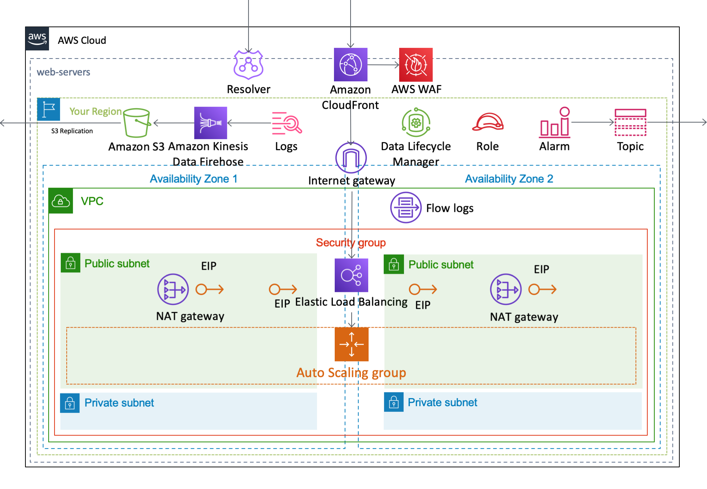
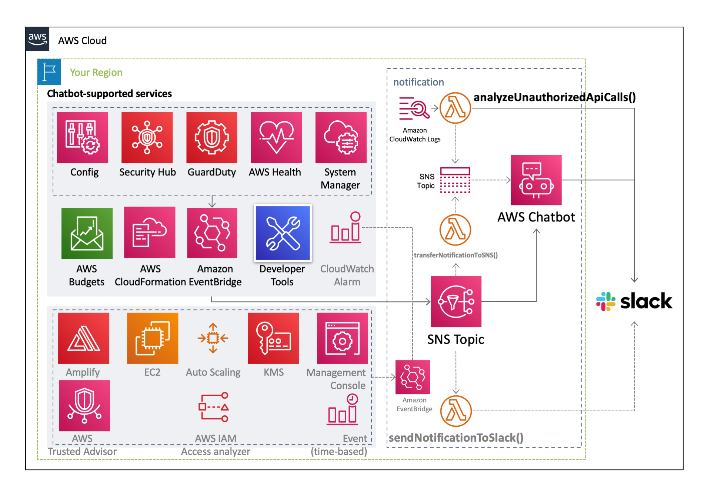
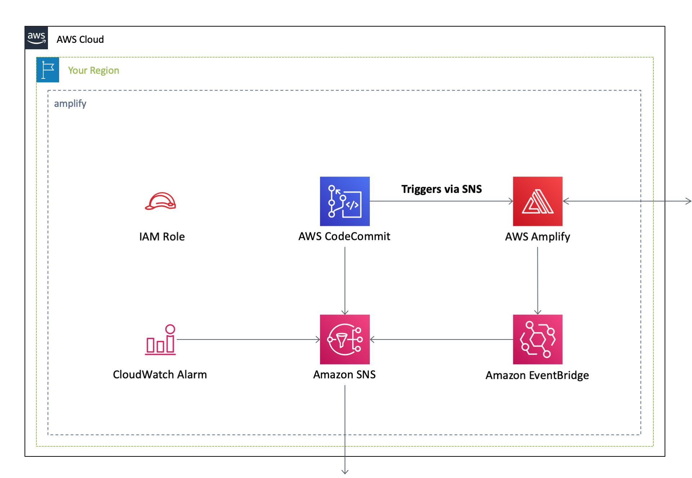

[**English**](README.md) / 日本語

# AWSCloudFormationTemplates

 
AWSCloudFormationTemplates は、**アカウント作成直後に行うべきセキュリティ設定** や **Webサイトのホスティング設定** など、AWSを利用する上で有用なCloudformationテンプレートを複数提供します。

## テンプレート

本プロジェクトには、以下の **Cloudformationテンプレート** が存在します。

| テンプレート名 | リージョン | 実行 |
| --- | --- | --- |
| [一括設定パイプライン](/cicd/README_JP.md) | 東京 |  |
| [Amplifyを用いたCI/CD環境を構築](/amplify/README_JP.md) | 東京 |  |
| [データ分析](/analytics/README_JP.md) | ap-northeast-1 |  |
| [**運用に関する設定**](/cloudops/README_JP.md) | 東京 |  |
| [CloudWatch アラーム](/monitoring/README_JP.md) | | |
| [必須タグが付与されていないリソースの削除](/security-config-rules/README_JP.md) | 東京 |  |
| [EC2ベースのWebサイトホスティング](/web-servers/README_JP.md) | 東京 |  |
| [支払いやCloudFrontの監視に関する設定](/global/README_JP.md) | バージニア北部 |  |
| [認証](/identity/README.md) | | |
| [メディア](/media/README_JP.md) | | |
| [**ネットワーク**](/network/README_JP.md) | 東京 |   |
| [**セキュリティ設定**](/security/README_JP.md) | 東京|  |
| [Slackへの通知](/notification/README_JP.md) | 東京 |  |
| [共通サービス](/shared/README_JP.md) | 東京 |  |
| [**Webサイトのホスティング**](/static-website-hosting-with-ssl/README_JP.md) | 東京 |   |

## 環境

本プロジェクトは、以下のモジュールで構成されています。

| サービス | リソース | バージョン |
| --- | --- | --- |
| Amazon CloudWatch Synthetics | Runtime | syn-nodejs-puppeteer-6.1 |
| AWS CodeBuild | Image | aws/codebuild/amazonlinux2-aarch64-standard:2.0 (Python 3.9) |
| Amazon EBS | Volume Type | gp3 |
| Amazon EC2 | Amazon Linux 2 Default AMI Id | ami-03dceaabddff8067e |
| Amazon EC2 | Microsoft Windows Server 2022 Default AMI Id | ami-0659e3a420d8a74ea |
| AWS Lambda | CodeGuru Profiler | [AWSCodeGuruProfilerPythonAgentLambdaLayer:11 (Python 3.9)](https://docs.aws.amazon.com/codeguru/latest/profiler-ug/python-lambda-layers.html) |
| AWS Lambda | Lambda Insights | [LambdaInsightsExtension-Arm64:11](https://docs.aws.amazon.com/ja_jp/AmazonCloudWatch/latest/monitoring/Lambda-Insights-extension-versionsARM.html) |
| AWS Lambda | Python | 3.9 |
| AWS Serverless Repository | aws-usage-queries | 0.1.5+19.38c7b8 |
| AWS Systems Manager | SSM Document Schema (Automation) | 0.3 |
| AWS Systems Manager | SSM Document Schema (Command) | 2.2 |
| Amazon OpenSearch Service | OpenSearch | OpenSearch_2.11 |
| Elastic Load Balancer | SSL Policy | ELBSecurityPolicy-TLS13-1-2-2021-06 |

## アーキテクチャ

これらのテンプレートが作成するAWSリソースのアーキテクチャ図は、以下の通りです。

### セキュリティ設定

### 必須タグが付与されていないリソースの削除

### 支払いやCloudFrontの監視に関する設定

### Webサイトのホスティング

### ネットワーク

### EC2ベースのWebサイトホスティング

### 外形監視の設定

### CloudOps

### Slackへの通知

### Amplifyを用いたCI/CD環境

