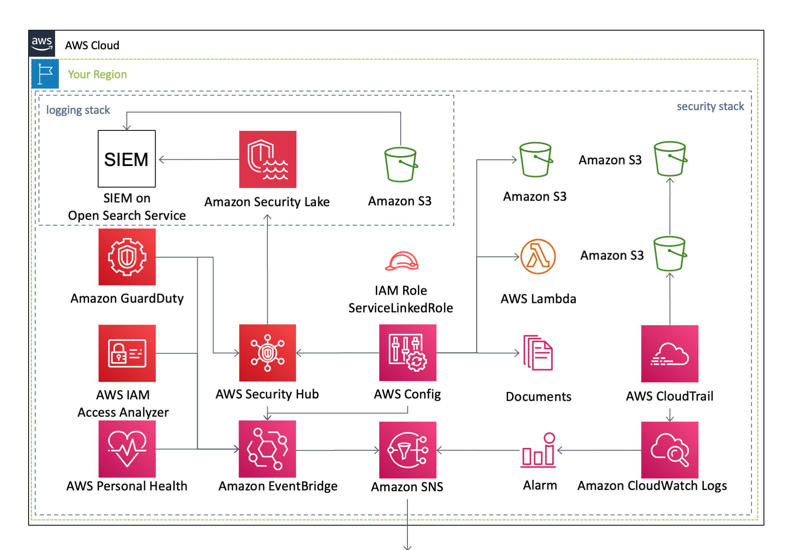

[**English**](README.md) / 日本語

# AWSCloudFormationTemplates

 
AWSCloudFormationTemplates は、**アカウント作成直後に行うべきセキュリティ設定** や **Webサイトのホスティング設定** など、AWSを利用する上で有用なCloudformationテンプレートを複数提供します。

> [!NOTE]
> [**eijikominami/aws-cloudformation-samples**](https://github.com/eijikominami/aws-cloudformation-samples/blob/master/README_JP.md) にサンプルテンプレート集があります。

## テンプレート

本プロジェクトには、以下の **Cloudformationテンプレート** が存在します。

| 作成されるAWSサービス | 米国東部 (バージニア北部) | アジアパシフィック (東京) |
| --- | --- | --- |
| [一括設定パイプライン](/cicd/README.md) |  |  |
| [Amplifyを用いたCI/CD環境を構築](/amplify/README.md) |  |  |
| [データ分析](/analytics/README.md) |  |  |
| [**運用に関する設定**](/cloudops/README.md) |  |  |
| [CloudWatch アラーム](/monitoring/README.md) | | |
| [必須タグが付与されていないリソースの削除](/security-config-rules/README.md) |  |  |
| [EC2 ベースのWebサイトホスティング](/web-servers/README.md) |  |  |
| [支払いやCloudFrontの監視に関する設定](/global/README.md) |  | |
| [認証](/identity/README.md) | | |
| [メディア](/media/README.md) | | |
| [**ネットワーク**](/network/README.md) |  |  |
| [**セキュリティ設定**](/security/README.md) |  |  |
| [Slack への通知](/notification/README.md) |  |  |
| [共通サービス](/shared/README.md) |  |  |
| [**Web サイトのホスティング**](/static-website-hosting-with-ssl/README.md) |  |  |
## 環境

本プロジェクトは、以下のモジュールで構成されています。

| サービス | リソース | バージョン |
| --- | --- | --- |
| Amazon CloudWatch Synthetics | [Runtime](https://docs.aws.amazon.com/ja_jp/AmazonCloudWatch/latest/monitoring/CloudWatch_Synthetics_Library_nodejs_puppeteer.html) | syn-nodejs-puppeteer-9.0 |
| AWS CodeBuild | [Image](https://docs.aws.amazon.com/ja_jp/codebuild/latest/userguide/build-env-ref-available.html) | aws/codebuild/amazonlinux2-aarch64-standard:2.0 (Python 3.9) |
| Amazon EBS | Volume Type | gp3 |
| Amazon EC2 | Amazon Linux 2 Default AMI Id | ami-03dceaabddff8067e |
| Amazon EC2 | Microsoft Windows Server 2022 Default AMI Id | ami-0659e3a420d8a74ea |
| AWS Glue | [GlueVersion](https://docs.aws.amazon.com/ja_jp/glue/latest/dg/release-notes.html) | 4.0 |
| AWS Glue | PythonVersion | 3 |
| AWS Lambda | [CodeGuru Profiler](https://docs.aws.amazon.com/codeguru/latest/profiler-ug/python-lambda-layers.html) | AWSCodeGuruProfilerPythonAgentLambdaLayer:11 (Python 3.9) |
| AWS Lambda | [Lambda Insights](https://docs.aws.amazon.com/ja_jp/AmazonCloudWatch/latest/monitoring/Lambda-Insights-extension-versionsARM.html) | LambdaInsightsExtension-Arm64:31 |
| AWS Lambda | Python | 3.9 |
| AWS Serverless Repository | aws-usage-queries | 0.1.5+19.38c7b8 |
| AWS Systems Manager | [SSM Document Schema (Automation)](https://docs.aws.amazon.com/ja_jp/systems-manager/latest/userguide/documents-schemas-features.html) | 0.3 |
| AWS Systems Manager | [SSM Document Schema (Command)](https://docs.aws.amazon.com/ja_jp/systems-manager/latest/userguide/documents-schemas-features.html) | 2.2 |
| Amazon OpenSearch Service | [OpenSearch](https://docs.aws.amazon.com/ja_jp/opensearch-service/latest/developerguide/version-migration.html) | OpenSearch_2.13 |
| Elastic Load Balancer | [SSL Policy](https://docs.aws.amazon.com/ja_jp/elasticloadbalancing/latest/application/create-https-listener.html) | ELBSecurityPolicy-TLS13-1-2-2021-06 |

## アーキテクチャ

これらのテンプレートが作成するAWSリソースのアーキテクチャ図は、以下の通りです。

### セキュリティ設定

### 必須タグが付与されていないリソースの削除

### 支払いやCloudFrontの監視に関する設定

### Webサイトのホスティング

### ネットワーク

### EC2ベースのWebサイトホスティング

### 外形監視の設定

### CloudOps

### Slackへの通知

### Amplifyを用いたCI/CD環境

