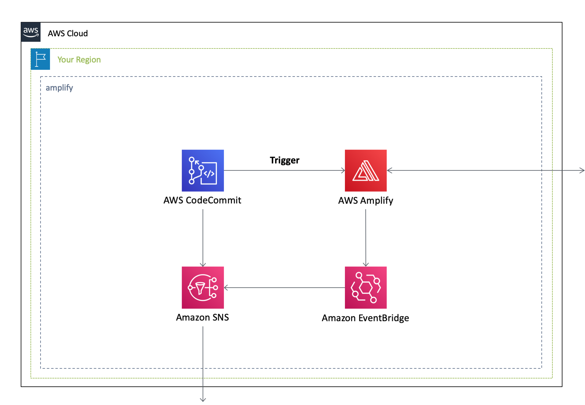

English / [**日本語**](README_JP.md)

# AWSCloudFormationTemplates/amplify


 

``AWSCloudFormationTemplates/amplify`` builds a CI/CD environment with ``AWS Amplify Console``, ``AWS CodeCommit`` , and related resources.

## TL;DR

If you just want to deploy the stack, click the button below.

[](https://console.aws.amazon.com/cloudformation/home?region=ap-northeast-1#/stacks/create/review?stackName=Amplify&templateURL=https://eijikominami.s3-ap-northeast-1.amazonaws.com/aws-cloudformation-templates/amplify/template.yaml) 

## Architecture

The following sections describe the individual components of the architecture.



## Deployment

Execute the command to deploy.

```bash
aws cloudformation deploy --template-file template.yaml --stack-name Amplify --capabilities CAPABILITY_NAMED_IAM CAPABILITY_AUTO_EXPAND
```

You can provide optional parameters as follows:

| Name | Type | Default | Requied | Details | 
| --- | --- | --- | --- | --- |
| AmplifyConsoleAppId | String |  |  | You can provide this parameter after your first deployment. |
| DomainName | String | | ○ | The custom domain name for your Amplify Console application |
| RepositoryName | String | | ○ | The repository name on CodeCommit | 
