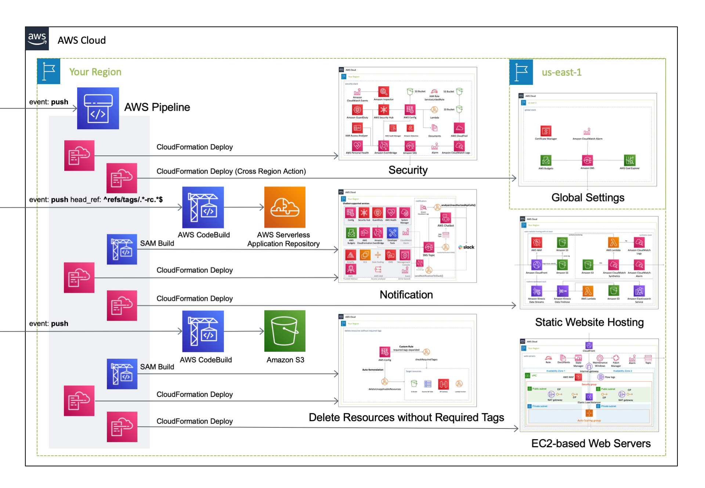
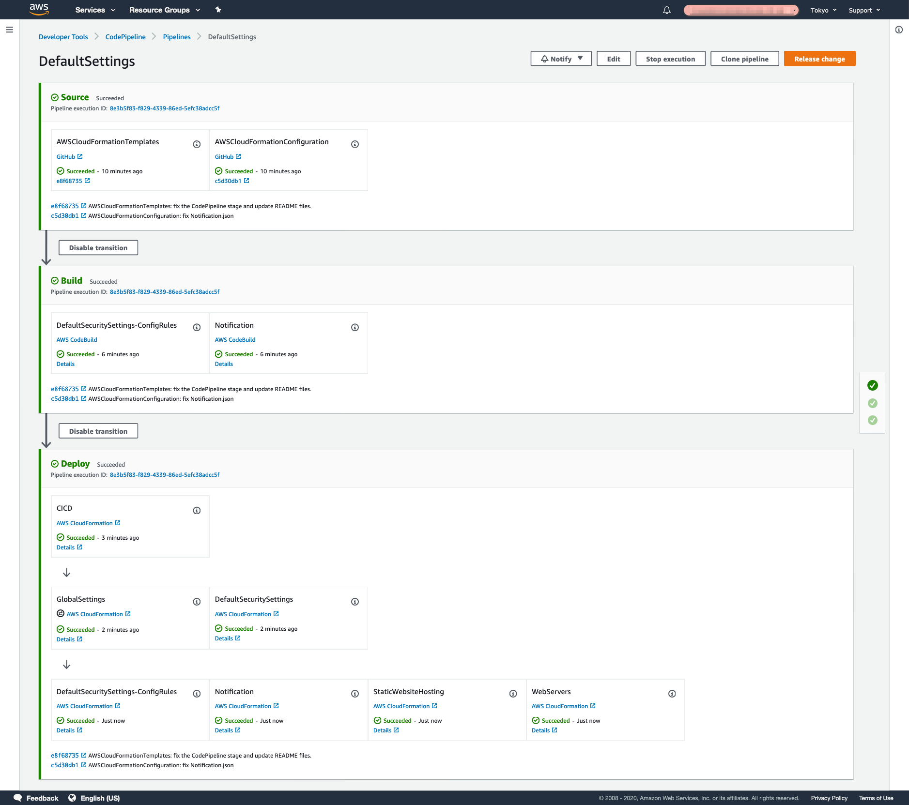

English / [**日本語**](README_JP.md)

# AWSCloudFormationTemplates/cicd


``AWSCloudFormationTemplates/cicd`` deploys CloudFormation templates in this repository using `CodePipeline`.

## Prerequisites

Before deploying this template, ensure you have:

- GitHub repository access for template configuration files
- S3 artifact bucket in us-east-1 region (if deploying Global Settings Template)
- Appropriate IAM permissions for CodePipeline, CodeBuild, and CloudFormation services

## TL;DR

If you just want to deploy the stack, click one of the two buttons below.

[codepipeline-default-settings - AWS Serverless Application Repository](https://serverlessrepo.aws.amazon.com/applications/arn:aws:serverlessrepo:us-east-1:172664222583:applications~codepipeline-default-settings)

| US East (Virginia) | Asia Pacific (Tokyo) |
| --- | --- |
| [](https://console.aws.amazon.com/cloudformation/home?region=us-east-1#/stacks/create/review?stackName=CICD&templateURL=https://eijikominami.s3-ap-northeast-1.amazonaws.com/aws-cloudformation-templates/cicd/template.yaml) | [](https://console.aws.amazon.com/cloudformation/home?region=ap-northeast-1#/stacks/create/review?stackName=CICD&templateURL=https://eijikominami.s3-ap-northeast-1.amazonaws.com/aws-cloudformation-templates/cicd/template.yaml) |

## Architecture

The following sections describe the individual components of the architecture.



This template creates the following diagram.



## Preparation

### Create S3 artifact bucket in us-east-1 (Optional)

If you deploy ``Global Settings Template``, create an ``S3 artifact bucket`` in N.Verginia (`us-east-1`) region.
 
```bash
aws s3api create-bucket --bucket my-bucket --region us-east-1
```

This template does not create the bucket. The ``GlobalSettings`` deploy stage is generated only when ``GlobalSettings`` is ``ENABLED`` and ``ArtifactBucketInVirginia`` is not empty, so enabling ``GlobalSettings`` without the bucket name has no effect.

Configure the bucket with SSE-S3 (AES256) encryption, all four public access block settings enabled, and a lifecycle rule that expires objects after 7 days.

### Set up template configuration files (Optional)

If you use [Template Configuration File](https://docs.aws.amazon.com/AWSCloudFormation/latest/UserGuide/continuous-delivery-codepipeline-cfn-artifacts.html#w2ab1c13c17c13), upload your configuration files to your GitHub repository with the following file names and specify `GitHubOwnerNameForTemplateConfiguration`, `GitHubOwnerNameForTemplateConfiguration` and `GitHubRepoNameForTemplateConfiguration` in your deployment.

| Stack Name | Template Configuration File Name | 
| --- | --- |
| CICD Template | CICD.json |
| [CloudOps Template](../cloudops/README_JP.md) | CloudOps.json |
| [Global Settings Template](../global/README.md) | GlobalSettings.json |
| [Network Template](../network/README.md) | Network.json |
| [Notification Template](../notification/README.md) | Notification.json |
| [Shared Service Template](../shared/README_JP.md) | SharedServices.json |
| [Security Template](../security/README.md) | DefaultSecuritySettings.json |
| [Security Template with Config Rule](../security-config-rules/README.md) | DefaultSecuritySettings-ConfigRules.json |
| [Static Website Hosting Template](../static-website-hosting/README.md) | StaticWebsiteHosting.json |
| [EC2-based Web Servers Template](../web-servers/README.md) | WebServers.json |

## Deployment

Execute the command to deploy with `ArtifactBucketInVirginia`, `GitHubOwnerNameForTemplateConfiguration` and `GitHubRepoNameForTemplateConfiguration` parameter.

```bash
aws cloudformation deploy --template-file template.yaml --stack-name StaticWebsiteHosting --parameter-overrides ArtifactBucketInVirginia=xxxxx GitHubOwnerNameForTemplateConfiguration=xxxxx GitHubRepoNameForTemplateConfiguration=xxxxx
```

You can provide optional parameters as follows.

| Name | Type | Default | Required | Details | 
| --- | --- | --- | --- | --- |
| AlarmLevel | NOTICE / WARNING | NOTICE | ○ | The alarm level of CloudWatch alarms |
| ArtifactBucketInVirginia | String | | | The S3 artifact bucket name in N.Verginia region |
| CentralizedLogBucketName | String | | | The centralize S3 bucket name for logging |
| **CloudOps** | ENABLED / DISABLED | ENABLED | ○ | If it is ENABLED, `CloudOps` stack is deployed |
| CodeBuildImageName | String | aws/codebuild/amazonlinux-aarch64-standard:3.0 | ○ | The Docker image name for CodeBuild |
| CodeStarConnectionArn | String | | ○ | The ARN of the CodeStar connection |
| **DefaultSecuritySettings** | ENABLED / DISABLED | ENABLED | ○ | If it is ENABLED, `DefaultSecuritySettings` stack is deployed |
| **GitHubOwnerNameForTemplateConfiguration** | String | | | The **GitHub owner name** for CloudFormation Template Configuration files |
| **GitHubRepoNameForTemplateConfiguration** | String | | | The **GitHub repository name** for CloudFormation Template Configuration files |
| GitHubBranchName | String | master | ○ | The Branch name of GitHub |
| **GlobalSettings** | ENABLED / DISABLED | DISABLED | ○ | If it is ENABLED, `GlobalSettings` stack is deployed |
| ManagementAccountId | String | | | The management account ID |
| **Network** | ENABLED / DISABLED | DISABLED | ○ | If it is ENABLED, `Network` stack is deployed |
| **Notification** | ENABLED / DISABLED | ENABLED | ○ | If it is ENABLED, `Notification` stack is deployed |
| OrganizationsRootId | String | | | The root id of AWS Organizations |
| **SharedServices** | ENABLED / DISABLED | DISABLED | ○ | If it is ENABLED, `SharedServices` stack is deployed |
| **StaticWebsiteHosting** | ENABLED / DISABLED | DISABLED | ○ | If it is ENABLED, `StaticWebsiteHosting` stack is deployed |
| TemplateConfigurationBasePath | String | | | The base path of template configration files |
| **UploadArtifacts** | ENABLED / DISABLED | DISABLED | ○ | If it is ENABLED, `UploadArtifacts` stack is deployed |
| **WebServers** | INSTANCE / CONTAINER / DISABLED | DISABLED | ○ | If it is ENABLED, `WebServers` stack is deployed |

## Serverless Application Repository Integration

This CI/CD pipeline includes automatic publishing to AWS Serverless Application Repository.

### How It Works

When you push a Git tag matching the pattern `*-rc*`, CodeBuild automatically:

1. Builds SAM templates
2. Packages and uploads to S3
3. Publishes to AWS Serverless Application Repository
4. Generates ApplicationId for reference

### Trigger Pattern

The webhook is configured to trigger on tags matching: `^refs/tags/.*-rc.*$`

**Example tags:**
```bash
git tag monitoring-glue-v1.0.0-rc
git push origin monitoring-glue-v1.0.0-rc
```

### Buildspec

The build process is defined in: `codebuild/buildspec-upload-artifacts-serverlessrepo.yml`

### Usage

For detailed instructions on creating and publishing SAM templates to Serverless Application Repository, see:
- [Monitoring Templates Contributing Guide](../monitoring/CONTRIBUTING.md)

## Known Issues

### A push starts the pipeline and the artifact upload at the same time

A push to the template branch starts two things at once: the `DefaultSettings` pipeline, through its source connection, and the `UploadArtifacts` CodeBuild project, through its webhook. The pipeline's `DeployInfrastructure` stage deploys the stacks at run order 1 while that CodeBuild is still copying the nested templates to the artifact bucket, so a stack whose nested template has not arrived yet fails with `S3 object does not exist ... Error: NoSuchKey`. The `GlobalSettings` and `Notification` stacks are the ones at run order 1, and they are the ones that fail.

Nothing is wrong with the templates when this happens. Wait for the `UploadArtifacts` build to finish and start the pipeline again; the second run reads the templates the first one was still writing. `UploadArtifacts` also appears inside the pipeline at run order 2, but that action deploys the stack rather than performing the copy, so it does not order the copy ahead of the stacks that need it.