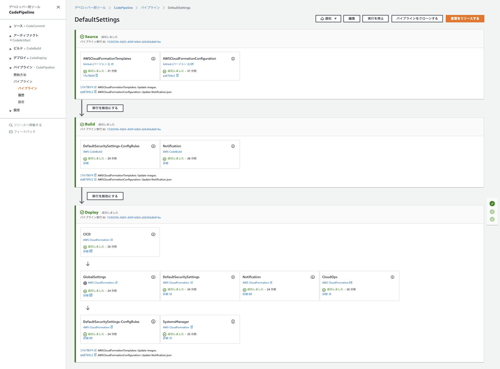

English / [**日本語**](README_JP.md)

# AWSCloudFormationTemplates/cicd


``AWSCloudFormationTemplates/cicd`` deploys CloudFormation templates in this repository using `CodePipeline`.

## TL;DR

If you just want to deploy the stack, click one of the two buttons below.

+ [codepipeline-default-settings - AWS Serverless Application Repository](https://serverlessrepo.aws.amazon.com/applications/arn:aws:serverlessrepo:us-east-1:172664222583:applications~codepipeline-default-settings)

+ [](https://console.aws.amazon.com/cloudformation/home?region=ap-northeast-1#/stacks/create/review?stackName=CICD&templateURL=https://eijikominami.s3-ap-northeast-1.amazonaws.com/aws-cloudformation-templates/cicd/template.yaml) 

## Architecture

The following sections describe the individual components of the architecture.


This template creates the following diagram.



## Preparation

### Create S3 artifact bucket in us-east-1 (Optional)

If you deploy ``Global Settings Template``, create an ``S3 artifact bucket`` in N.Verginia (`us-east-1`) region.
 
```bash
aws s3api create-bucket --bucket my-bucket --region us-east-1
```
### Set up template configuration files (Optional)

If you use [Template Configuration File](https://docs.aws.amazon.com/AWSCloudFormation/latest/UserGuide/continuous-delivery-codepipeline-cfn-artifacts.html#w2ab1c13c17c13), upload your configuration files to your GitHub repository with the following file names and specify `GitHubOwnerNameForTemplateConfiguration`, `GitHubOwnerNameForTemplateConfiguration` and `GitHubRepoNameForTemplateConfiguration` in your deployment.

| Stack Name | Template Configuration File Name | 
| --- | --- |
| CICD Template | CICD.json |
| [CloudOps Template](../cloudops/README_JP.md) | CloudOps.json |
| [Global Settings Template](../global/README.md) | GlobalSettings.json |
| [Network Template](../network/README.md) | Network.json |
| [Notification Template](../notification/README.md) | Notification.json |
| [Shared Service Template](../shared/README_JP.md) | SharedServices.json |
| [Security Template](../security/README.md) | DefaultSecuritySettings.json |
| [Security Template with Config Rule](../security-config-rules/README.md) | DefaultSecuritySettings-ConfigRules.json |
| [Static Website Hosting Template](../static-website-hosting-with-ssl/README.md) | StaticWebsiteHosting.json |
| [EC2-based Web Servers Template](../web-servers/README.md) | WebServers.json |

## Deployment

Execute the command to deploy with `ArtifactBucketInVirginia`, `GitHubOwnerNameForTemplateConfiguration` and `GitHubRepoNameForTemplateConfiguration` parameter.

```bash
aws cloudformation deploy --template-file template.yaml --stack-name StaticWebsiteHosting --parameter-overrides ArtifactBucketInVirginia=xxxxx GitHubOwnerNameForTemplateConfiguration=xxxxx GitHubRepoNameForTemplateConfiguration=xxxxx
```

You can provide optional parameters as follows.

| Name | Type | Default | Required | Details | 
| --- | --- | --- | --- | --- |
| ArtifactBucketInVirginia | String | | | The S3 artifact bucket name in N.Verginia region |
| CodeBuildImageName | String | aws/codebuild/amazonlinux2-x86_64-standard:3.0 | ○ | The Docker image name for CodeBuild |
| **GitHubOwnerNameForTemplateConfiguration** | String | | | The **GitHub owner name** for CloudFormation Template Configuration files |
| **GitHubRepoNameForTemplateConfiguration** | String | | | The **GitHub repository name** for CloudFormation Template Configuration files |
| TemplateConfigurationBasePath | String | | | The base path of template configration files |
| **CloudOps** | ENABLED / INCIDENT_MANAGER_DISABLED / DISABLED | DISABLED | ○ | If it is ENABLED, `GlobalSettings` stack is deployed |
| **DefaultSecuritySettings** | ENABLED / DISABLED | DISABLED | ○ | If it is ENABLED, `DefaultSecuritySettings` stack is deployed |
| **GlobalSettings** | ENABLED / DISABLED | DISABLED | ○ | If it is ENABLED, `GlobalSettings` stack is deployed |
| **Network** | ENABLED / DISABLED | DISABLED | ○ | If it is ENABLED, `Network` stack is deployed |
| **Notification** | ENABLED / DISABLED | DISABLED | ○ | If it is ENABLED, `Notification` stack is deployed |
| **Route53** | ENABLED / DISABLED | DISABLED | ○ | If it is ENABLED, `Route53` stack is deployed |
| **StaticWebsiteHosting** | ENABLED / DISABLED | DISABLED | ○ | If it is ENABLED, `StaticWebsiteHosting` stack is deployed |
| **WebServers** | ENABLED / DISABLED | DISABLED | ○ | If it is ENABLED, `WebServers` stack is deployed |