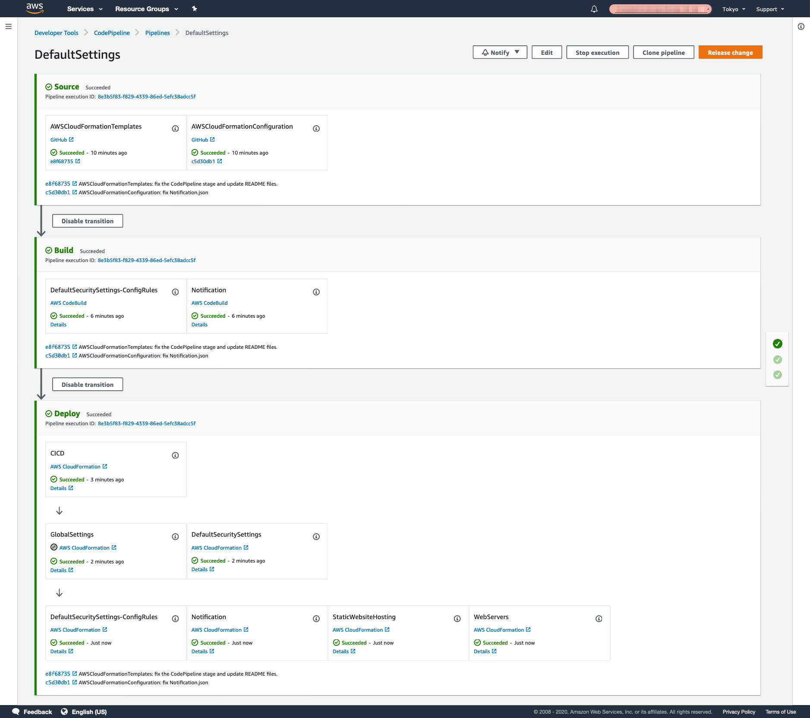
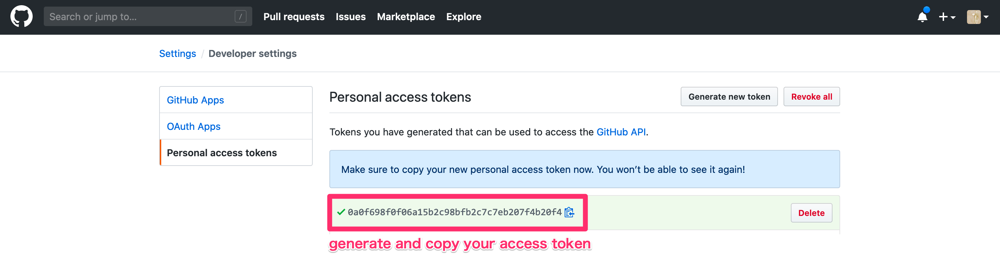

[**English**](README.md) / 日本語

# AWSCloudFormationTemplates/cicd


``AWSCloudFormationTemplates/cicd`` は、`CodePipeline` を用いて このリポジトリにある CloudFormation テンプレートを一括デプロイします。

## TL;DR

以下のいずれかのボタンをクリックすることで、 この **CloudFormationをデプロイ** することが可能です。

+ [codepipeline-default-settings - AWS Serverless Application Repository](https://serverlessrepo.aws.amazon.com/applications/arn:aws:serverlessrepo:us-east-1:172664222583:applications~codepipeline-default-settings)

+ [](https://console.aws.amazon.com/cloudformation/home?region=ap-northeast-1#/stacks/create/review?stackName=CICD&templateURL=https://eijikominami.s3-ap-northeast-1.amazonaws.com/aws-cloudformation-templates/cicd/template.yaml) 

## アーキテクチャ

このテンプレートが作成するAWSリソースのアーキテクチャ図は、以下の通りです。


このテンプレートは、以下のダイアグラムを作成します。



### 準備

### GitHub パーソナルアクセストークンの作成

GitHub [パーソナルアクセストークン](https://help.github.com/ja/github/authenticating-to-github/creating-a-personal-access-token-for-the-command-line) を作成し、その値をコピーします。



### S3 アーティファクトバケットの作成 (オプション)

``Global Settings Template`` を実行する際には、バージニアリージョン（`us-east-1`）に Amazon S3 アーティファクトバケットを作成してください。
 
```bash
aws s3api create-bucket --bucket my-bucket --region us-east-1
```

### テンプレート設定ファイルの作成 (オプション)

[テンプレート設定ファイル](https://docs.aws.amazon.com/AWSCloudFormation/latest/UserGuide/continuous-delivery-codepipeline-cfn-artifacts.html#w2ab1c13c17c13) を使用する場合は、GitHubリポジトリに以下に示す命名規則で Configuration File をアップロードした上で、CloudFormationを実行する際には、`GitHubOwnerNameForTemplateConfiguration` パラメータと `GitHubRepoNameForTemplateConfiguration` パラメータを指定してください。

| スタック名 | Template Configuration File 名 | 
| --- | --- |
| CICD Template | CICD.json |
| [Global Settings Template](../global/README_JP.md) | GlobalSettings.json |
| [Notification Template](../notification/README_JP.md) | Notification.json |
| [Security Template](../security/README_JP.md) | DefaultSecuritySettings.json |
| [Security Template with Config Rule](../security-config-rules/README_JP.md) | DefaultSecuritySettings-ConfigRules.json |
| [Static Website Hosting Template](../static-website-hosting-with-ssl/README_JP.md) | StaticWebsiteHosting.json |
| [EC2-based Web Servers Template](../web-servers/README_JP.md) | WebServers.json |
| [Systems Manager Template](../web-servers/README_JP.md) | SystemsManager.json |

## デプロイ

`ArtifactBucketInVirginia` パラメータと `GitHubOAuthToken` パラメータを指定して、デプロイを実行してください。

```bash
aws cloudformation deploy --template-file template.yaml --stack-name StaticWebsiteHosting --parameter-overrides ArtifactBucketInVirginia=my0bucket GitHubOAuthToken=XXXXX
```

デプロイ時に、以下のパラメータを指定することができます。

| 名前 | タイプ | デフォルト値 | 必須 | 詳細 |
| --- | --- | --- | --- | --- |
| ArtifactBucketInVirginia | String | | | Amazon S3 アーティファクトバケット（us-east-1） |
| CodeBuildImageName | String | aws/codebuild/amazonlinux2-x86_64-standard:3.0 | ○ | |
| GitHubOAuthToken | String | | | GitHubからコードを取得する際に用いる **OAuthトークン** |
| **GitHubOwnerNameForTemplateConfiguration** | String | | | TemplateConfigurationファイルが置かれている **GitHubリポジトリの所有者名** |
| **GitHubRepoNameForTemplateConfiguration** | String | | | TemplateConfigurationファイルが置かれている **GitHubリポジトリ名** |
| GitHubStage | String | master | ○ | CloudFormationテンプレートが置かれているリポジトリのステージ名 |
| TemplateConfigurationBasePath | String | | | 設定プロパティのあるディレクトリのパス |
| **CloudOps** | ENABLED / INCIDENT_MANAGER_DISABLED / DISABLED | DISABLED | ○ | ENABLEDを指定した場合、`CloudOps` スタックがデプロイされます。 |
| **DefaultSecuritySettingsConfigRules** | ENABLED / DISABLED | DISABLED | ○ | ENABLEDを指定した場合、`DefaultSecuritySettingsConfigRules` スタックがデプロイされます。 |
| **GlobalSettings** | ENABLED / DISABLED | DISABLED | ○ | ENABLEDを指定した場合、`GlobalSettings` スタックがデプロイされます。 |
| **Notification** | ENABLED / DISABLED | DISABLED | ○ | ENABLEDを指定した場合、`Notification` スタックがデプロイされます。 |
| **Route53** | ENABLED / DISABLED | DISABLED | ○ | ENABLEDを指定した場合、`Route53` スタックがデプロイされます。 |
| **StaticWebsiteHosting** | ENABLED / DISABLED | DISABLED | ○ | ENABLEDを指定した場合、`StaticWebsiteHosting` スタックがデプロイされます。 |
| **WebServers** | ENABLED / DISABLED | DISABLED | ○ | ENABLEDを指定した場合、`WebServers` スタックがデプロイされます。 |