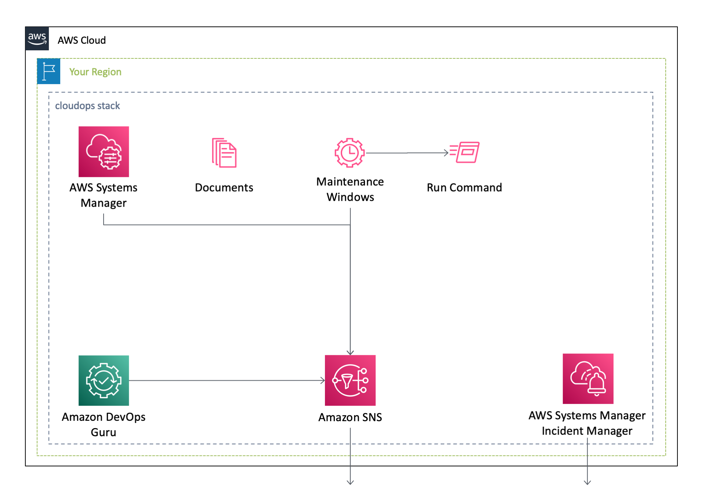
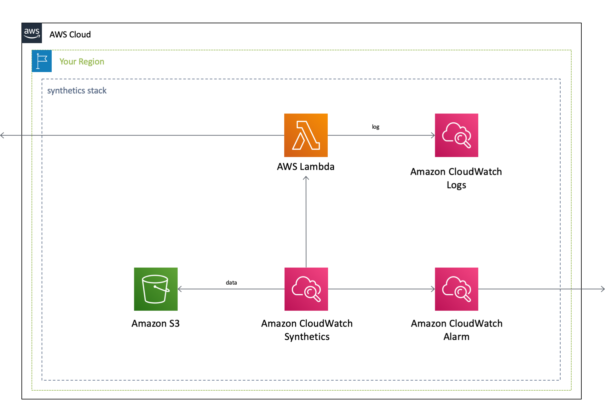

English / [**日本語**](README_JP.md)

# AWSCloudFormationTemplates/cloudops


 
``AWSCloudFormationTemplates/cloudops`` builds services for operational capabilities, such as ``Systems Manager`` and  ``DevOps Guru``.

## CloudOps

If you just want to deploy the stack, click the button below.

| US East (Virginia) | Asia Pacific (Tokyo) |
| --- | --- |
| [](https://console.aws.amazon.com/cloudformation/home?region=us-east-1#/stacks/create/review?stackName=CloudOps&templateURL=https://eijikominami.s3-ap-northeast-1.amazonaws.com/aws-cloudformation-templates/cloudops/template.yaml) | [](https://console.aws.amazon.com/cloudformation/home?region=ap-northeast-1#/stacks/create/review?stackName=CloudOps&templateURL=https://eijikominami.s3-ap-northeast-1.amazonaws.com/aws-cloudformation-templates/cloudops/template.yaml) |

If you want to deploy each service individually, click the button below.

| Services | US East (Virginia) | Asia Pacific (Tokyo) |
| --- | --- | --- |
| CloudWatch Application Insights | [](https://console.aws.amazon.com/cloudformation/home?region=us-east-1#/stacks/create/review?stackName=ApplicationInsights&templateURL=https://eijikominami.s3-ap-northeast-1.amazonaws.com/aws-cloudformation-templates/cloudops/applicationinsights.yaml) | [](https://console.aws.amazon.com/cloudformation/home?region=ap-northeast-1#/stacks/create/review?stackName=ApplicationInsights&templateURL=https://eijikominami.s3-ap-northeast-1.amazonaws.com/aws-cloudformation-templates/cloudops/applicationinsights.yaml) |
| CloudWatch Internet Monitor | [](https://console.aws.amazon.com/cloudformation/home?region=us-east-1#/stacks/create/review?stackName=InternetMonitor&templateURL=https://eijikominami.s3-ap-northeast-1.amazonaws.com/aws-cloudformation-templates/cloudops/internetmonitor.yaml) | [](https://console.aws.amazon.com/cloudformation/home?region=ap-northeast-1#/stacks/create/review?stackName=InternetMonitor&templateURL=https://eijikominami.s3-ap-northeast-1.amazonaws.com/aws-cloudformation-templates/cloudops/internetmonitor.yaml) |
| CodeGuru Reviewer | [](https://console.aws.amazon.com/cloudformation/home?region=us-east-1#/stacks/create/review?stackName=CodeGuru&templateURL=https://eijikominami.s3-ap-northeast-1.amazonaws.com/aws-cloudformation-templates/cloudops/codeguru.yaml) | [](https://console.aws.amazon.com/cloudformation/home?region=ap-northeast-1#/stacks/create/review?stackName=CodeGuru&templateURL=https://eijikominami.s3-ap-northeast-1.amazonaws.com/aws-cloudformation-templates/cloudops/codeguru.yaml) |
| DevOps Guru | [](https://console.aws.amazon.com/cloudformation/home?region=us-east-1#/stacks/create/review?stackName=DevOpsGuru&templateURL=https://eijikominami.s3-ap-northeast-1.amazonaws.com/aws-cloudformation-templates/cloudops/devopsguru.yaml) | [](https://console.aws.amazon.com/cloudformation/home?region=ap-northeast-1#/stacks/create/review?stackName=DevOpsGuru&templateURL=https://eijikominami.s3-ap-northeast-1.amazonaws.com/aws-cloudformation-templates/cloudops/devopsguru.yaml) |
| Resource Explorer | [](https://console.aws.amazon.com/cloudformation/home?region=us-east-1#/stacks/create/review?stackName=ResourceExplorer&templateURL=https://eijikominami.s3-ap-northeast-1.amazonaws.com/aws-cloudformation-templates/cloudops/resourceexplorer.yaml) | [](https://console.aws.amazon.com/cloudformation/home?region=ap-northeast-1#/stacks/create/review?stackName=ResourceExplorer&templateURL=https://eijikominami.s3-ap-northeast-1.amazonaws.com/aws-cloudformation-templates/cloudops/resourceexplorer.yaml) |
| Systems Manager | [](https://console.aws.amazon.com/cloudformation/home?region=us-east-1#/stacks/create/review?stackName=SystemsManager&templateURL=https://eijikominami.s3-ap-northeast-1.amazonaws.com/aws-cloudformation-templates/cloudops/ssm.yaml) | [](https://console.aws.amazon.com/cloudformation/home?region=ap-northeast-1#/stacks/create/review?stackName=SystemsManager&templateURL=https://eijikominami.s3-ap-northeast-1.amazonaws.com/aws-cloudformation-templates/cloudops/ssm.yaml) |
| Systems Manager Incident Manager | [](https://console.aws.amazon.com/cloudformation/home?region=us-east-1#/stacks/create/review?stackName=SystemsManagerIncidentManager&templateURL=https://eijikominami.s3-ap-northeast-1.amazonaws.com/aws-cloudformation-templates/cloudops/incidentmanager.yaml) | [](https://console.aws.amazon.com/cloudformation/home?region=ap-northeast-1#/stacks/create/review?stackName=SystemsManagerIncidentManager&templateURL=https://eijikominami.s3-ap-northeast-1.amazonaws.com/aws-cloudformation-templates/cloudops/incidentmanager.yaml) |

Execute the command to deploy.

```bash
aws cloudformation deploy --template-file template.yaml --stack-name CloudOps --capabilities CAPABILITY_NAMED_IAM CAPABILITY_AUTO_EXPAND
```

You can provide optional parameters as follows.

| Name | Type | Default | Required | Details |  
| --- | --- | --- | --- | --- |
| **ApplicationInsight** | ENABLED / DISABLED | DISABLED | ○ | If it is ENABLED, `ApplicationInsights` stack is deployed |
| CodeGuruTargetRepository | String | eijikominami/aws-cloudformation-templates | ○ | The GitHub owner name and repository name for AWS CodeGuru Reviewer |
| **IncidentManager** | ENABLED / DISABLED | DISABLED | ○ | If it is ENABLED, `IncidentManager` stack is deployed |
| IncidentManagerAlias | String | admimistrator | ○ | The unique and identifiable alias of the contact or escalation plan |
| IncidentManagerChatbotSnsArn | String | | | The SNS targets that AWS Chatbot uses to notify the chat channel of updates to an incident |
| IncidentManagerDisplayName | String | Administrator | ○ | The full name of the contact or escalation plan |
| IncidentManagerDurationInMinutes | Number | 1 | ○ | The time to wait until beginning the next stage |
| IncidentManagerEmail | String | | | The email address |
| IncidentManagerPhoneNumber | String | | | The Phone Number |
| IncidentManagerWorkloadName | String | Workload | ○ | The workload name |
| SSMAdminAccountId | Strig | | | AWS Account ID of the primary account (the account from which AWS Systems Manager Automation will be initiated) |
| SSMIgnoreResourceConflicts | ENABLED / DISABLED | DISABLED | ○ | If **Enabled** is set, the resources does NOT created |
| SSMOrganizationID | String | | | AWS Organizations ID |
| SSMPatchingAt | Number | 3 | ○ | Starting time of patching process. (Local Time) |



### Application Insight

This template sets ``Amazon CloudWatch Application Insight``.

| Name | Type | Default | Required | Details |  
| --- | --- | --- | --- | --- |
| **SNSForAlertArn** | String | | ○ | The ARN of an Amazon SNS topic |

### CodeGuru Reviewer

This template sets ``Amazon CodeGuru Reviewer``.

| Name | Type | Default | Required | Details |  
| --- | --- | --- | --- | --- |
| **CodeGuruTargetRepository** | String | eijikominami/aws-cloudformation-templates | ○ | The GitHub owner name and repository name for AWS CodeGuru Reviewer |

### DevOps Guru

This template sets a notification channel of ``AWS DevOps Guru``.

| Name | Type | Default | Required | Details |  
| --- | --- | --- | --- | --- |
| **SNSForAlertArn** | String | | ○ | The ARN of an Amazon SNS topic |

### Systems Manager

This template sets ``AWS Systems Manager``.

| Name | Type | Default | Required | Details |  
| --- | --- | --- | --- | --- |
| **AdminAccountId** | String | | | AWS Account ID of the primary account (the account from which AWS Systems Manager Automation will be initiated) |
| **IgnoreResourceConflicts** | ENABLED / DISABLED | DISABLED | ○ | Enable or disable AWS Systems Manager Incident Manager |
| **OrganizationID** | String | | | AWS Organizations ID |
| **PatchingAt** | Number | 3 | ○ | Daily patching time (H) |

If you use AWS Systems Manager Explorer in your `Shared Network` account, enable `Trusted Access` of **Systems Manager** and **AWS Trusted Advisor** in `AWS Organizations`.

### Systems Manager Incident Manager

This template sets a notification channel of ``AWS Systems Manager Incident Manager``.

| Name | Type | Default | Required | Details |  
| --- | --- | --- | --- | --- |
| Alias | String | admimistrator | ○ | The unique and identifiable alias of the contact or escalation plan |
| ChatbotSnsArn | String | | | The SNS targets that AWS Chatbot uses to notify the chat channel of updates to an incident |
| DisplayName | String | Administrator | ○ | The full name of the contact or escalation plan |
| DurationInMinutes | Number | 1 | ○ | The time to wait until beginning the next stage |
| Email | String | | | The email address |
| PhoneNumber | String | | | The Phone Number |
| WorkloadName | String | Workload | ○ | The workload name |

## Amazon CloudWatch Synthetics

CloudWatch Synthetics creates canaries, configurable scripts that run on a schedule, and monitors your endpoints. If you just want to deploy the stack, click the button below.

[](https://console.aws.amazon.com/cloudformation/home?region=ap-northeast-1#/stacks/create/review?stackName=Synthetics&templateURL=https://eijikominami.s3-ap-northeast-1.amazonaws.com/aws-cloudformation-templates/cloudops/synthetics-heartbeat.yaml) 

Execute the command to deploy with ``CanaryName``, ``DomainName`` and ``WatchedPagePath``.

```bash
aws cloudformation deploy --template-file synthetics-heartbeat.yaml --stack-name Synthetics --parameter-overrides CanaryName=XXXXX DomainName=XXXXX WatchedPagePath=XXXXX
```

You can provide optional parameters as follows.

| Name | Type | Default | Required | Details | 
| --- | --- | --- | --- | --- |
| IncidentManagerArn | String | | | Systems Manager Incident Manager response plan ARN |
| IncidentDurationInSeconds | Number | 600 | ○ | The time to wait until starting an incident |
| IncidentSuccessPercentThreshold | Number | 50 | ○ | The threshold of success percent starting an incident |
| **CanaryName** | String | | ○ | The name for this canary |
| **DomainName** | String | | ○ | The domain name that hearbeat scripts watches |
| WatchedPagePath | String | /index.html | ○ | The page path that hearbeat scripts watches |



### AWS Lambda

This template creates ``hearbeat scripts`` using AWS Lambda function that load the specified URL and store a screenshot of the page and an HTTP archive file (HAR file). They also store logs of accessed URLs. 

### Amazon S3

The S3 bucket stores screenshots, HAR files, and logs from the hearbeat scripts.

### Amazon CloudWatch Alarm

This template creates Amazon CloudWatch custom metrics and alarms.
These alarms are trigged when the success rate is less than **90%**.