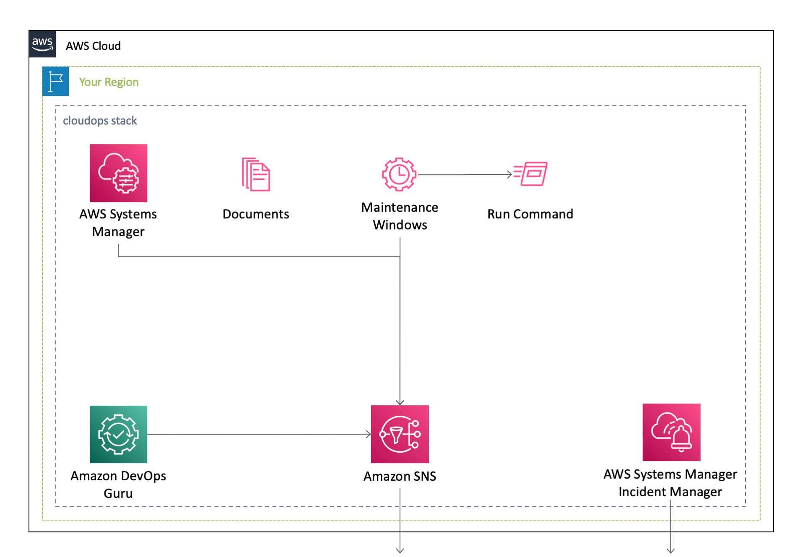
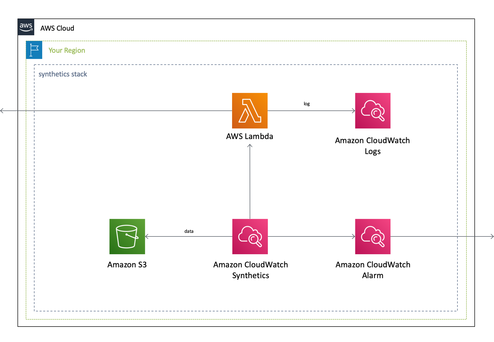

[**English**](README.md) / 日本語

# AWSCloudFormationTemplates/cloudops


 
``AWSCloudFormationTemplates/cloudops`` は、``Systems Manager`` や ``DevOps Guru`` などの運用の可用性に関するサービスを構築します。

## 前提条件

デプロイの前に以下を準備してください。

- AWS Organizations のセットアップ（クロスアカウント Systems Manager 機能を使用する場合）
- CloudWatch、Systems Manager、DevOps Guru サービスに対する適切な IAM 権限

## CloudOps

以下のボタンをクリックすることで、この **CloudFormationをデプロイ** することが可能です。

| 米国東部 (バージニア北部) | アジアパシフィック (東京) |
| --- | --- |
| [](https://console.aws.amazon.com/cloudformation/home?region=us-east-1#/stacks/create/review?stackName=CloudOps&templateURL=https://eijikominami.s3-ap-northeast-1.amazonaws.com/aws-cloudformation-templates/cloudops/template.yaml) | [](https://console.aws.amazon.com/cloudformation/home?region=ap-northeast-1#/stacks/create/review?stackName=CloudOps&templateURL=https://eijikominami.s3-ap-northeast-1.amazonaws.com/aws-cloudformation-templates/cloudops/template.yaml) |

以下のボタンから、個別のAWSサービスを有効化することも可能です。

| 作成されるAWSサービス | 米国東部 (バージニア北部) | アジアパシフィック (東京) |
| --- | --- | --- |
| CloudWatch Application Insights | [](https://console.aws.amazon.com/cloudformation/home?region=us-east-1#/stacks/create/review?stackName=ApplicationInsights&templateURL=https://eijikominami.s3-ap-northeast-1.amazonaws.com/aws-cloudformation-templates/cloudops/applicationinsights.yaml) | [](https://console.aws.amazon.com/cloudformation/home?region=ap-northeast-1#/stacks/create/review?stackName=ApplicationInsights&templateURL=https://eijikominami.s3-ap-northeast-1.amazonaws.com/aws-cloudformation-templates/cloudops/applicationinsights.yaml) |
| CloudWatch Internet Monitor | [](https://console.aws.amazon.com/cloudformation/home?region=us-east-1#/stacks/create/review?stackName=InternetMonitor&templateURL=https://eijikominami.s3-ap-northeast-1.amazonaws.com/aws-cloudformation-templates/cloudops/internetmonitor.yaml) | [](https://console.aws.amazon.com/cloudformation/home?region=ap-northeast-1#/stacks/create/review?stackName=InternetMonitor&templateURL=https://eijikominami.s3-ap-northeast-1.amazonaws.com/aws-cloudformation-templates/cloudops/internetmonitor.yaml) |
| DevOps Agent | [](https://console.aws.amazon.com/cloudformation/home?region=us-east-1#/stacks/create/review?stackName=DevOpsAgent&templateURL=https://eijikominami.s3-ap-northeast-1.amazonaws.com/aws-cloudformation-templates/cloudops/devopsagent.yaml) | [](https://console.aws.amazon.com/cloudformation/home?region=ap-northeast-1#/stacks/create/review?stackName=DevOpsAgent&templateURL=https://eijikominami.s3-ap-northeast-1.amazonaws.com/aws-cloudformation-templates/cloudops/devopsagent.yaml) |
| DevOps Guru | [](https://console.aws.amazon.com/cloudformation/home?region=us-east-1#/stacks/create/review?stackName=DevOpsGuru&templateURL=https://eijikominami.s3-ap-northeast-1.amazonaws.com/aws-cloudformation-templates/cloudops/devopsguru.yaml) | [](https://console.aws.amazon.com/cloudformation/home?region=ap-northeast-1#/stacks/create/review?stackName=DevOpsGuru&templateURL=https://eijikominami.s3-ap-northeast-1.amazonaws.com/aws-cloudformation-templates/cloudops/devopsguru.yaml) |
| Resource Explorer | [](https://console.aws.amazon.com/cloudformation/home?region=us-east-1#/stacks/create/review?stackName=ResourceExplorer&templateURL=https://eijikominami.s3-ap-northeast-1.amazonaws.com/aws-cloudformation-templates/cloudops/resourceexplorer.yaml) | [](https://console.aws.amazon.com/cloudformation/home?region=ap-northeast-1#/stacks/create/review?stackName=ResourceExplorer&templateURL=https://eijikominami.s3-ap-northeast-1.amazonaws.com/aws-cloudformation-templates/cloudops/resourceexplorer.yaml) |
| Systems Manager | [](https://console.aws.amazon.com/cloudformation/home?region=us-east-1#/stacks/create/review?stackName=SystemsManager&templateURL=https://eijikominami.s3-ap-northeast-1.amazonaws.com/aws-cloudformation-templates/cloudops/ssm.yaml) | [](https://console.aws.amazon.com/cloudformation/home?region=ap-northeast-1#/stacks/create/review?stackName=SystemsManager&templateURL=https://eijikominami.s3-ap-northeast-1.amazonaws.com/aws-cloudformation-templates/cloudops/ssm.yaml) |

以下のコマンドを実行することで、CloudFormationをデプロイすることが可能です。

```bash
aws cloudformation deploy --template-file template.yaml --stack-name CloudOps --capabilities CAPABILITY_NAMED_IAM CAPABILITY_AUTO_EXPAND
```

デプロイ時に、以下のパラメータを指定することができます。

| 名前 | タイプ | デフォルト値 | 必須 | 詳細 |
| --- | --- | --- | --- | --- |
| AlarmLevel | NOTICE / WARNING | NOTICE | ○ | CloudWatch アラームのアラームレベル |
| **ApplicationInsights** | ENABLED / DISABLED | DISABLED | ○ | ENABLEDを指定した場合、`ApplicationInsights` スタックがデプロイされます。 |
| **DevOpsAgent** | PRIMARY / MEMBER / DISABLED | MEMBER | ○ | DISABLED 以外を指定した場合、`DevOpsAgent` スタックがデプロイされます。 |
| DevOpsAgentMemberAccountIds | CommaDelimitedList | | | MEMBER アカウント ID のカンマ区切りリスト |
| DevOpsAgentPrimaryAccountId | String | | conditional | PRIMARY アカウントの ID |
| DevOpsAgentSpaceId | String | | conditional | PRIMARY アカウントの AgentSpace ID |
| DevOpsAgentWebhookMinimumPriority | CRITICAL / HIGH / MEDIUM / LOW | HIGH | | DevOps Agent に転送する最低優先度 |
| **ResourceExplorerIndexType** | AGGREGATOR / LOCAL | LOCAL | ○ | Resource Explorer のインデックスタイプ |
| SSMAdminAccountId | String | | | SSM の管理を行う AWS アカウントの ID |
| **SSMIgnoreResourceConflicts** | ENABLED / DISABLED | DISABLED | ○ | DISABLEDを指定した場合、AWS Systems Manager のリソースが作成されます。 |
| SSMOrganizationId | String | | | AWS Organizations の ID |
| SSMOrganizationsRootId | String | | | AWS Organizations のルート ID |
| SSMPatchingAt | Number | 3 | ○ | パッチ適用処理開始時刻 (現地時) |



### Application Insight

このテンプレートは、``CloudWatch Application Insight`` を作成します。

| 名前 | タイプ | デフォルト値 | 必須 | 詳細 |
| --- | --- | --- | --- | --- |
| **SNSForAlertArn** | String | | ○ | The ARN of an Amazon SNS topic |

### DevOps Agent

このテンプレートは、``AWS DevOps Agent`` の Agent Space、IAM ロール、AWS アカウント関連付けを作成します。DevOps Agent はインシデントの自動調査、予防的な改善提案、オンデマンド SRE タスクを提供します。PRIMARY モードでは、MEMBER アカウントの SNS Alert Topic からの CloudWatch Alarm 通知を受信し、DevOps Agent の webhook に転送するクロスアカウント構成も作成します。

> [!NOTE]
> IAM ロールには `AIDevOpsAgentAccessPolicy` マネージドポリシーに含まれていない権限を補う `AdditionalServiceReadAccess` インラインポリシーが含まれています。これらの権限は [DevOps Agent パーミッションガードレール](https://docs.aws.amazon.com/devopsagent/latest/userguide/aws-devops-agent-security-limiting-agent-access-in-an-aws-account.html)にも含まれている場合のみ有効です。デプロイ後もアクセスエラーが続く場合、ガードレールが未対応の可能性があります。

| 名前 | タイプ | デフォルト値 | 必須 | 詳細 |
| --- | --- | --- | --- | --- |
| **AgentSpaceName** | String | DefaultAgentSpace | ○ | Agent Space の名前 |
| AgentSpaceId | String | | conditional | PRIMARY アカウントの AgentSpace ID |
| MemberAccountIds | CommaDelimitedList | | | MEMBER アカウント ID のカンマ区切りリスト |
| Mode | PRIMARY / MEMBER | PRIMARY | ○ | PRIMARY は AgentSpace を作成、MEMBER は IAM ロールのみ作成 |
| PrimaryAccountId | String | | conditional | AgentSpace を所有する PRIMARY アカウントの ID |
| SNSForAlertArn | String | | | SNS トピックの ARN |
| WebhookMinimumPriority | CRITICAL / HIGH / MEDIUM / LOW | HIGH | | DevOps Agent に転送する最低優先度 |

#### Webhook Forwarder の優先度フィルタ

WebhookForwarder Lambda は SNS Alert トピックから全イベントを受信し、`WebhookMinimumPriority`（デフォルト: HIGH）以上のイベントのみを DevOps Agent に転送します。

| ソース | 条件 | 優先度 | 転送 |
| --- | --- | --- | --- |
| CloudWatch Alarm | アラーム名が `Incident` で始まる | CRITICAL | ○ |
| CloudWatch Alarm | アラーム名が `Warning` で始まる | HIGH | ○ |
| CloudWatch Alarm | アラーム名が `Notice` で始まる | MEDIUM | |
| Security Hub | Severity label = CRITICAL | CRITICAL | ○ |
| Security Hub | Severity label = HIGH | HIGH | ○ |
| GuardDuty | Severity >= 7 | HIGH | ○ |
| GuardDuty | Severity >= 4 | MEDIUM | |
| AWS Health | イベントカテゴリ = issue | CRITICAL | ○ |
| AWS Health | イベントカテゴリ = scheduledChange | MEDIUM | |
| Cost Anomaly Detection | 異常スコア >= 0.7 | HIGH | ○ |
| Cost Anomaly Detection | 異常スコア < 0.7 | MEDIUM | |
| AutoScaling / EBS / SSM の失敗 | ステータス = Failed または Timed Out | HIGH | ○ |

上記のいずれにも該当しないイベント（EC2 状態変化、タグ変更、コンソールサインイン等）はスキップされます。

### DevOps Guru

このテンプレートは、``AWS DevOps Guru`` の通知チャンネルを作成します。

| 名前 | タイプ | デフォルト値 | 必須 | 詳細 |
| --- | --- | --- | --- | --- |
| **SNSForAlertArn** | String | | ○ | SNSトピックのARN |

### Systems Manager

このテンプレートは、``AWS Systems Manager`` を作成します。

| 名前 | タイプ | デフォルト値 | 必須 | 詳細 |
| --- | --- | --- | --- | --- |
| AdminAccountId | String | | | AWS Systems Manager Automation を設定する AWS アカウント ID |
| AlarmLevel | NOTICE / WARNING | NOTICE | ○ | CloudWatch アラームのアラームレベル |
| **IgnoreResourceConflicts** | ENABLED / DISABLED | DISABLED | ○ | DISABLEDを指定した場合、AWS Systems Manager のリソースが作成されます。 |
| **PatchingAt** | Number | 3 | ○ | 日時のパッチ時刻 |

SSM Explorer のクロスアカウントデータ集約を有効化するには、**管理アカウント**で以下を実行してください。

```bash
aws organizations enable-aws-service-access --service-principal opsdatasync.ssm.amazonaws.com
```

### Default Host Management Configuration (DHMC)

DHMC は CloudFormation で管理できないため、CloudOps スタックのデプロイ後に以下の手順で有効化してください。

```bash
aws ssm update-service-setting \
  --setting-id /ssm/managed-instance/default-ec2-instance-management-role \
  --setting-value service-role/AWSSystemsManagerDefaultEC2InstanceManagementRole
```

IAM ロール `AWSSystemsManagerDefaultEC2InstanceManagementRole` は ssm.yaml が作成します。

### Operational Insights (OpsInsights)

OpsInsights は CloudFormation で管理できないため、API で有効化してください。

```bash
aws ssm update-service-setting \
  --setting-id /ssm/opsinsights/opscenter \
  --setting-value Enabled
```

### SSM Unified Console (Quick Setup)

全アカウントに CloudOps スタックをデプロイした後、Quick Setup CLI で SSM Unified Console を組織全体に有効化してください。

```bash
aws ssm-quicksetup create-configuration-manager \
  --configuration-definitions '[{
    "Type": "AWSQuickSetupType-SSM",
    "TypeVersion": "3.0",
    "Parameters": {
      "AgentUpdateSchedule": "rate(14 days)",
      "EnableDHMCSchedule": "rate(1 day)",
      "HomeRegion": "<HOME_REGION>",
      "InventoryCollectionSchedule": "rate(12 hours)",
      "TargetOrganizationalUnits": "<ORGANIZATION_ROOT_ID>",
      "TargetRegions": "<TARGET_REGION>",
      "DelegatedAccountId": "<DELEGATED_ADMIN_ACCOUNT_ID>"
    }
  }]'
```

前提条件（`ssm.yaml` で作成済み）:
- `AWS-QuickSetup-SSM-RoleForEnablingExplorer`
- `AWS-QuickSetup-SSM-EnableDHMC`
- `AWS-QuickSetup-SSM-EnableAREX`
- `AWS-QuickSetup-SSM-ManageInstanceProfile`

委任管理者アカウントから実行すると Organization 全体がターゲットになります。

## Amazon CloudWatch Internet Monitor

このテンプレートは、``Amazon CloudWatch Internet Monitor`` を作成します。

| 名前 | タイプ | デフォルト値 | 必須 | 詳細 | 
| --- | --- | --- | --- | --- |
| **ResourceNames** | String |  | ○ | モニターに追加するリソース |

## Amazon CloudWatch Synthetics

CloudWatch Synthetics は、カナリアおよび設定可能なスクリプトを作成し、指定されたエンドポイントを監視します。 以下のボタンをクリックすることで、この **CloudFormationをデプロイ** することが可能です。

[](https://console.aws.amazon.com/cloudformation/home?region=ap-northeast-1#/stacks/create/review?stackName=Synthetics&templateURL=https://eijikominami.s3-ap-northeast-1.amazonaws.com/aws-cloudformation-templates/cloudops/synthetics-heartbeat.yaml)

``CanaryName``, ``DomainName``, ``WatchedPagePath`` パラメータとともに以下のコマンドを実行することで、CloudFormationをデプロイすることが可能です。

```bash
aws cloudformation deploy --template-file synthetics-heartbeat.yaml --stack-name Synthetics --parameter-overrides CanaryName=XXXXX DomainName=XXXXX WatchedPagePath=XXXXX
```

デプロイ時に、以下のパラメータを指定することができます。

| 名前 | タイプ | デフォルト値 | 必須 | 詳細 | 
| --- | --- | --- | --- | --- |
| IncidentManagerArn | String | | | Systems Manager Incident Manager のレスポンスプラン ARN |
| IncidentDurationInSeconds | Number | 600 | ○ | インシデントの基準となる時間 |
| IncidentSuccessPercentThreshold | Number | 50 | ○ | インシデントの基準となるアクセス成功率（％） |
| **CanaryName** | String | | ○ | カナリア名 |
| **DomainName** | String | | ○ | スクリプトが監視するドメイン名 |
| WatchedPagePath | String | /index.html | ○ | スクリプトが監視するページのパス |



### AWS Lambda

このテンプレートは、 Lambda を用いて ``ハートビートスクリプト`` を作成します。この関数は特定のURLを読み込んで、そのスクリーンショットとファイル、およびログを保存します。

### Amazon S3

S3バケットは、ハートビートスクリプトが取得したスクリーンショットとファイル、ログを保存します。

### Amazon CloudWatch Alarm

このテンプレートは、CloudWatch のカスタムメトリクスとアラームを作成します。
これらのアラームは、成功率が90%を下回ったときにトリガされます。

## DevOps Agent

`devopsagent.yaml` テンプレートは PRIMARY モードで AgentSpace を作成し、MEMBER モードで IAM ロールを作成します。

### 既知の制限事項

クロスアカウント Association は CloudFormation および `associate_service` API では作成**できません**。以下のエラーが返されます。

```
AccessDeniedException: Cross-account pass role is not allowed.
```

これは IAM Trust Policy の問題ではなく、サービス側の制限です。MEMBER 側の IAM ロールには PRIMARY アカウントの `aws:SourceAccount` と `aws:SourceArn` が正しく設定されています。

### 手動手順

全アカウントに CloudOps スタックをデプロイした後、**AWS コンソール**からセカンダリクラウドソースを追加してください。

1. DevOps Agent → Agent Spaces → DefaultAgentSpace → Cloud sources
2. 「セカンダリクラウドソースを追加」をクリック
3. メンバーアカウント ID と既存のロール名を入力（ロールは CFn で作成済みのため新規作成不要）