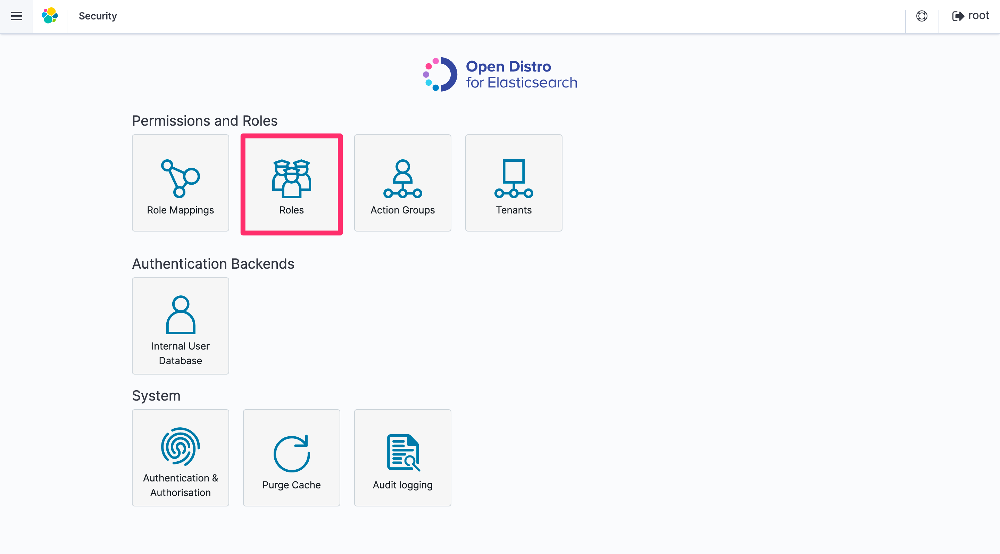
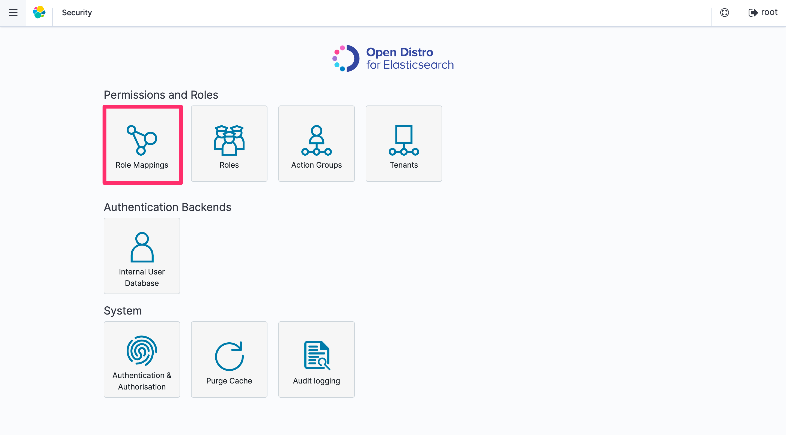
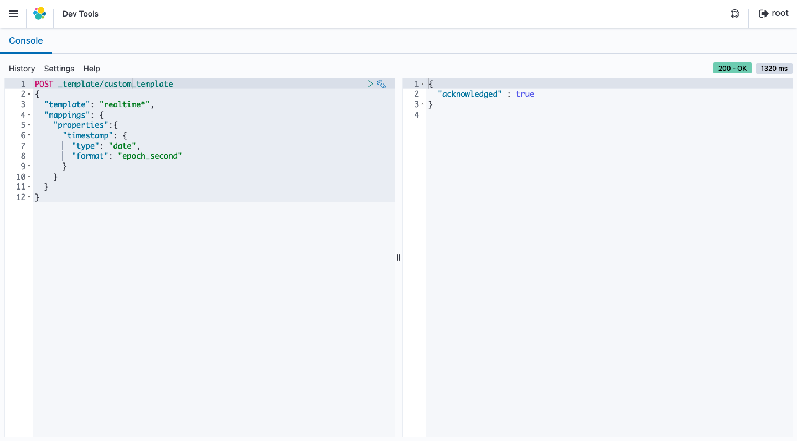

English / [**日本語**](README_JP.md)

# AWSCloudFormationTemplates/edge


 
``AWSCloudFormationTemplates/edge`` builds edge services.

## TL;DR

If you just want to deploy the stack, click the button below.

| Services | US East (Virginia) | Asia Pacific (Tokyo) |
| --- | --- | --- |
| CloudFront | [](https://console.aws.amazon.com/cloudformation/home?region=us-east-1#/stacks/create/review?stackName=CloudFront&templateURL=https://eijikominami.s3-ap-northeast-1.amazonaws.com/aws-cloudformation-templates/edge/cloudfront.yaml) | |
| Realtime Dashboard | [](https://console.aws.amazon.com/cloudformation/home?region=us-east-1#/stacks/create/review?stackName=RealtimeDashboard&templateURL=https://eijikominami.s3-ap-northeast-1.amazonaws.com/aws-cloudformation-templates/edge/realtime-dashboard.yaml) | |
| WAF | [](https://console.aws.amazon.com/cloudformation/home?region=us-east-1#/stacks/create/review?stackName=WAF&templateURL=https://eijikominami.s3-ap-northeast-1.amazonaws.com/aws-cloudformation-templates/edge/waf.yaml) | |

## Deployment

Execute the command to deploy.

```bash
aws cloudformation deploy --template-file cloudfront.yaml --stack-name CloudFront --capabilities CAPABILITY_AUTO_EXPAND
aws cloudformation deploy --template-file realtime-dashboard.yaml --stack-name RealtimeDashboard --capabilities CAPABILITY_NAMED_IAM CAPABILITY_AUTO_EXPAND
aws cloudformation deploy --template-file waf.yaml --stack-name WAF --capabilities CAPABILITY_AUTO_EXPAND
```

You can provide optional parameters as follows.

### CloudFront

This template creates ``CloudFront`` distribution.

| Name | Type | Default | Required | Details | 
| --- | --- | --- | --- | --- |
| CertificateManagerARN | String | | | If it's NOT empty, **SSL Certification** is associated with **CloudFront** |
| CloudFrontAdditionalName | String | | | If it's NOT empty, **Alias name** is set on **CloudFront** |
| CloudFrontDefaultRootObject | String | index.html | | CloudFront Viewer Protocol Policy |
| CloudFrontDefaultTTL | Number | 86400 | ○ | CloudFront Default TTL |
| CloudFrontMinimumTTL | Number | 0 | ○ | CloudFront Minimum TTL |
| CloudFrontMaximumTTL | Number | 31536000 | ○ | CloudFront Maximum TTL |
| CloudFrontOriginAccessControl | String | | Conditional | The origin access control |
| **CloudFrontOriginDomainName** | String | | ○ | The origin domain | 
| CloudFrontOriginShield | true or false | false | ○ | A flag that specifies whether Origin Shield is enabled |
| CloudFrontOriginType | S3 or NOT_S3 | S3 | ○ | The Origin Type | 
| CloudFrontRestrictViewerAccess | ENABLED / DISABLED | DISABLED | ○ | Enable or disable Restrict Viewer Access |
| CloudFrontSecondaryOriginId | String | | | If it's NOT empty, **Secondary S3 bucket** is associated with **CloudFront** |
| CloudFrontViewerProtocolPolicy | allow-all / redirect-to-https / https-only | redirect-to-https | ○ | CloudFront Viewer Protocol Policy |
| CloudFront403ErrorResponsePagePath | String | | | The path to the 403 custom error page |
| CloudFront404ErrorResponsePagePath | String | | | The path to the 404 custom error page |
| CloudFront500ErrorResponsePagePath | String | | | The path to the 500 custom error page |
| **DomainName** | String | | ○ | The CNAME attached to CloudFront |
| RealtimeDashboardElasticSearchVolumeSize | Number | 10 | ○ | The volume size (GB) of ElasticSearch Service |
| RealtimeDashboardElasticSearchInstanceType | String | r5.large.elasticsearch | ○ | The instance type of OpenSearch Service |
| RealtimeDashboardElasticSearchMasterType | String | r5.large.elasticsearch | ○ | The master type of OpenSearch Service |
| RealtimeDashboardElasticSearchLifetime | Number | 1 | ○ | The lifetime (hour) of ElasticSearch Service |
| RealtimeDashboardElasticSearchMasterUserName | String | root | ○ | The user name of OpenSearch Service |
| RealtimeDashboardElasticSearchMasterUserPassword | String | Password1+ | ○ | The password of OpenSearch Service |
| RealtimeDashboardElasticsearchVersion | String | OpenSearch_2.11 | ○ | The version of OpenSearch Service |
| RealtimeDashboardKinesisFirehoseStreamNameSuffix | String | default | ○ | The suffix of the Kinesis Firehose stream |
| RealtimeDashboardState | ENABLED / DISABLED | DISABLED | ○ | If it is ENABLED, Real-time Dashboard is enabled |
| RealtimeDashboardSamplingRate | Number | 100 | ○ | The sampling rate of logs sent by CloudFront |
| RealtimeDashboardKinesisShardCount | Number | 1 | ○ | The shard count of Kinesis |
| RealtimeDashboardKinesisNumberOfPutRecordThreshold | Number | 12000000 | ○ | The threshold of PutRecord API calls |
| RealtimeKinesisNumberOfPutRecordThreshold | Number | | | The threshold of PutRecord API calls |
| Route53HostedZoneId | String | | | Route53 hosted zone id |
| S3DestinationBucketArnOfCrossRegionReplication | String | | | If it's NOT empty, Cross region replication is enabled on **S3** |
| SyntheticsCanaryName | String | | | If it's NOT empty, CloudWatch Synthetics is enabled |
| UserAgent | String | | | The secret key that 'User-Agent' header contains | 
| Logging | ENABLED / DISABLED | ENABLED | ○ | If it is ENABLED, Logging is enabled on **CloudFront** and **S3** |
| LogBucketName | String | | Conditional | The custom S3 bucket name for access logging |
| WebACLArn | String | | | The ARN of Web ACL |

### Realtime Dashboard

This template creates an environment about CloudFront realtime dashboard.

| Name | Type | Default | Required | Details | 
| --- | --- | --- | --- | --- |
| ElasticSearchVolumeSize | Number | 10 | ○ | The volume size (GB) of ElasticSearch Service |
| ElasticSearchDomainName | String | cloudfront-realtime-logs | ○ | The domain name of ElasticSearch Service |
| ElasticSearchInstanceType | String | r5.large.elasticsearch | ○ | The instance type of OpenSearch Service |
| ElasticSearchMasterType | String | r5.large.elasticsearch | ○ | The master type of OpenSearch Service |
| ElasticSearchLifetime | Number | 1 | ○ | The lifetime (hour) of ElasticSearch Service |
| ElasticSearchMasterUserName | String | root | ○ | The user name of OpenSearch Service |
| ElasticSearchMasterUserPassword | String | Password1+ | ○ | The password of OpenSearch Service |
| ElasticsearchVersion | String | 7.8 | ○ | The version of OpenSearch Service |
| SamplingRate | Number | 100 | ○ | The sampling rate of logs sent by CloudFront |
| KinesisFirehoseStreamNameSuffix | String | default | ○ | The suffix of the Kinesis Firehose stream |
| KinesisShardCount | Number | 1 | ○ | The shard count of Kinesis |
| KinesisNumberOfPutRecordThreshold | Number | 12000000 | ○ | The threshold of PutRecord API calls |

Follow the steps below to create a real-time dashboard using Kibana.

1. Under **Security**, choose **Roles**.



2. Click the ``+`` icon to add new role.
3. Name your role; for example, ``firehose``.


4. In the **Cluster Permissions** tab, for **Cluster-wide permissions**, add as Action Groups: ``cluster_composite_ops`` and ``cluster_monitor``.


5. In the **Index Permissions** tab, click **Add index permissions**. Then choose **Index Patterns** and enter ``realtime*``. Under **Permissions: Action Groups**, add three action groups: ``crud``, ``create_index``, and ``manage``.


6. Click **Save Role Definition**.
7. Under **Security**, choose **Role Mappings**.



8. Click **Add Backend Role**.
9. Choose the ``firehose`` you just created.
10. For Backend roles, enter the IAM ARN of the role Kinesis Data Firehose uses to write to Amazon ES and S3 ``arn:aws:iam::<aws_account_id>:role/service-role/<KinesisFirehoseServiceRole>``.


11. Click **Submit**.
12. Choose **Dev Tools**.
13. Enter the following command to register the ``timestamp`` field as a ``date`` type and execute it.

```json
PUT _template/custom_template
{
    "template": "realtime*",
    "mappings": {
        "properties": {
            "timestamp": {
                "type": "date",
                "format": "epoch_second"
            }
        }
    }
}
```



14. Import [visualizes and a dashboard](export.ndjson) to your Kibana.

### WAF

This template sets ``AWS WAF``.

| Name | Type | Default | Required | Details | 
| --- | --- | --- | --- | --- |
| Scope | REGIONAL or CLOUDFRONT | REGIONAL | ○ | Specifies whether this is for an Amazon CloudFront distribution or for a regional application |
| **TargetResourceArn** | String | | ○ | The ARN of the resource to associate with the web ACL |