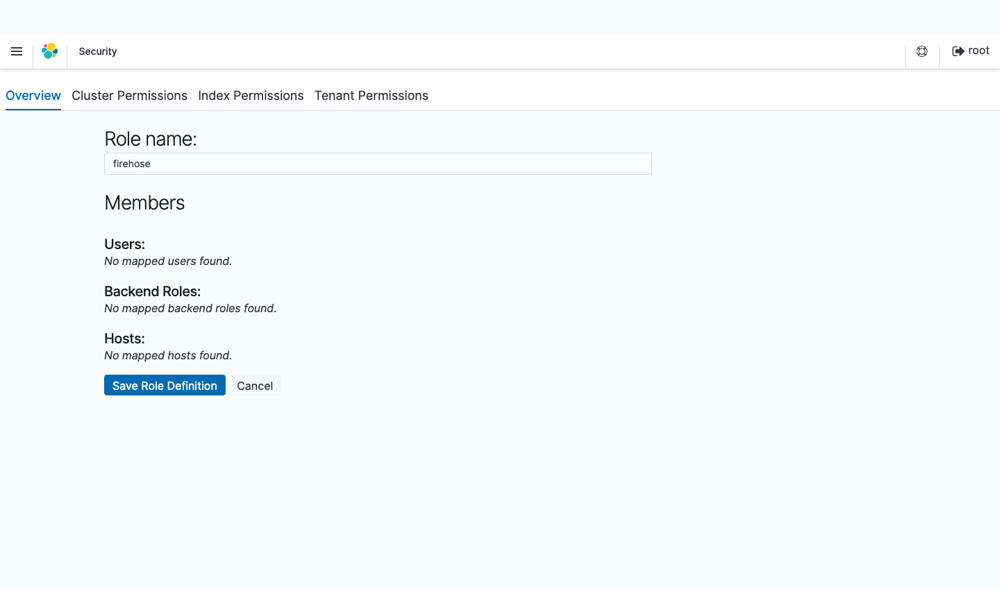
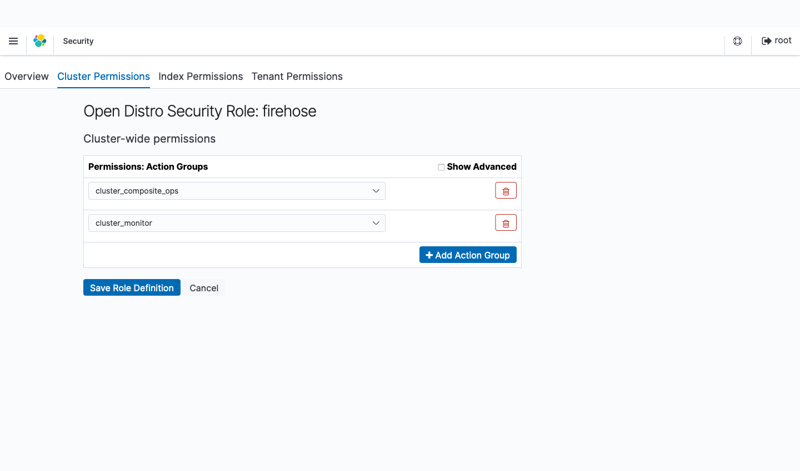
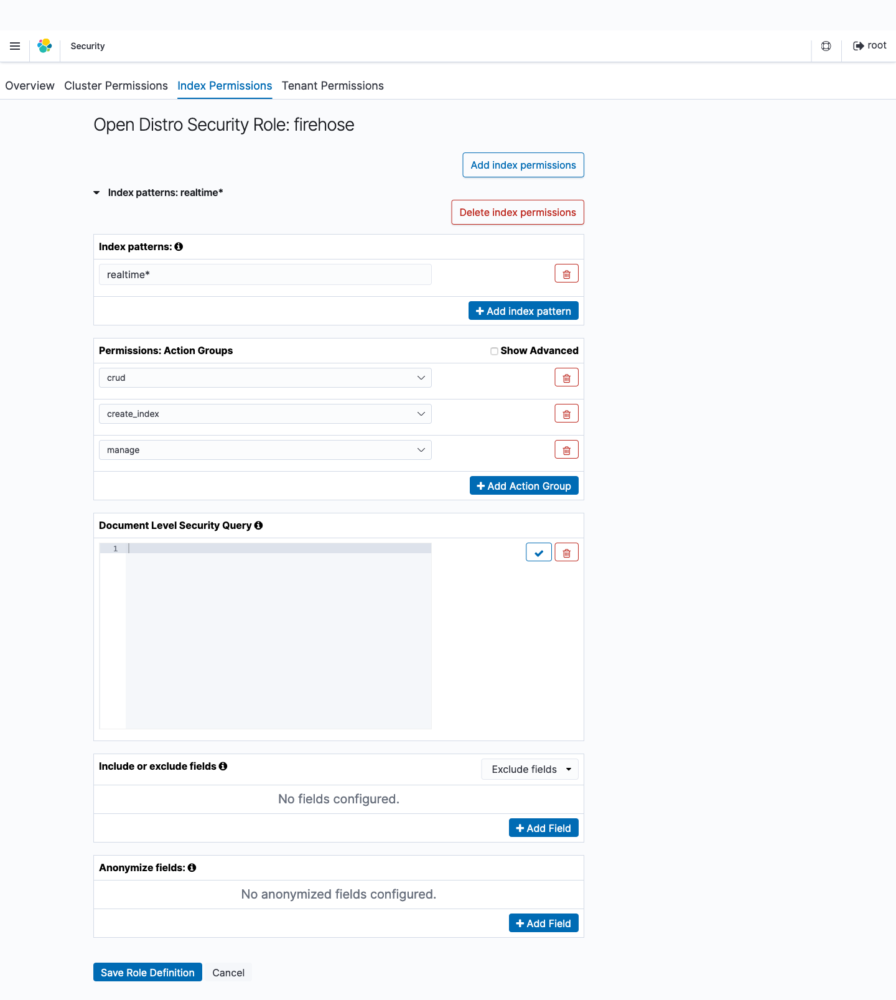
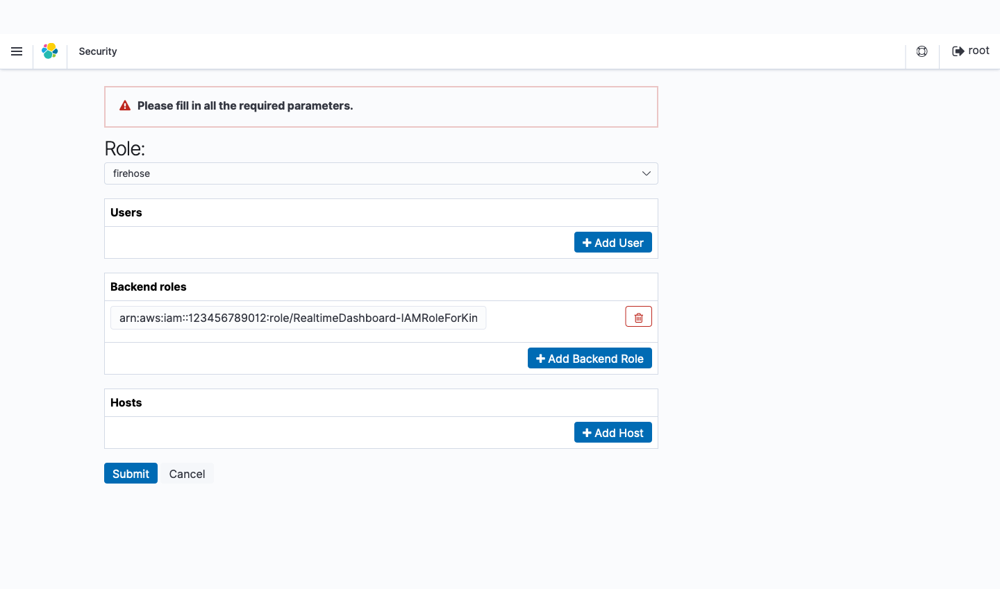

[**English**](README.md) / 日本語

# AWSCloudFormationTemplates/edge


 
``AWSCloudFormationTemplates/edge`` AWSのエッジサービスを構築します。

## TL;DR

以下のボタンをクリックすることで、この **CloudFormationをデプロイ** することが可能です。

| 作成されるAWSサービス | 個別のCloudFormationテンプレート |
| --- | --- |
| CloudFront | [](https://console.aws.amazon.com/cloudformation/home?region=ap-northeast-1#/stacks/create/review?stackName=CloudFront&templateURL=https://eijikominami.s3-ap-northeast-1.amazonaws.com/aws-cloudformation-templates/edge/cloudfront.yaml) |
| Realtime Dashboard | [](https://console.aws.amazon.com/cloudformation/home?region=ap-northeast-1#/stacks/create/review?stackName=RealtimeDashboard&templateURL=https://eijikominami.s3-ap-northeast-1.amazonaws.com/aws-cloudformation-templates/edge/realtime-dashboard.yaml) |
| WAF | [](https://console.aws.amazon.com/cloudformation/home?region=ap-northeast-1#/stacks/create/review?stackName=WAF&templateURL=https://eijikominami.s3-ap-northeast-1.amazonaws.com/aws-cloudformation-templates/edge/waf.yaml) |

## デプロイ

以下のコマンドを実行することで、CloudFormationをデプロイすることが可能です。

```bash
aws cloudformation deploy --template-file cloudfront.yaml --stack-name CloudFront --capabilities CAPABILITY_AUTO_EXPAND
aws cloudformation deploy --template-file realtime-dashboard.yaml --stack-name RealtimeDashboard --capabilities CAPABILITY_NAMED_IAM CAPABILITY_AUTO_EXPAND
aws cloudformation deploy --template-file waf.yaml --stack-name WAF --capabilities CAPABILITY_AUTO_EXPAND
```

デプロイ時に、以下のパラメータを指定することができます。

### CloudFront

このテンプレートは、 ``CloudFront`` ディストリビューションを構築します。

| 名前 | タイプ | デフォルト値 | 必須 | 詳細 |
| --- | --- | --- | --- | --- |
| CertificateManagerARN | String | | | ARNを指定した場合、**CloudFront** に **SSL証明書** が紐付けられます。 |
| CloudFrontAdditionalName | String | | | AdditionalNameを指定した場合、**CloudFront** に **エイリアス名** が紐付けられます。 |
| CloudFrontDefaultRootObject | String | index.html | | CloudFront Viewer Protocol Policy |
| CloudFrontDefaultTTL | Number | 86400 | ○ | CloudFront Default TTL |
| CloudFrontMinimumTTL | Number | 0 | ○ | CloudFront Minimum TTL |
| CloudFrontMaximumTTL | Number | 31536000 | ○ | CloudFront Maximum TTL |
| CloudFrontOriginAccessControl | String | | 条件付き | The origin access control |
| **CloudFrontOriginDomainName** | String | | ○ | The origin domain | 
| CloudFrontOriginShield | true or false | false | ○ | Origin Shield 有効化フラグ |
| CloudFrontOriginType | S3 or NOT_S3 | S3 | ○ | The Origin Type | 
| CloudFrontRestrictViewerAccess | ENABLED / DISABLED | DISABLED | ○ | ENABLEDを指定した場合、**CloudFront** の **Restrict Viewer Access** が有効化されます。 |
| CloudFrontSecondaryOriginId | String | | | SecondaryOriginIdを指定した場合、**CloudFront** に **セカンダリS3バケット** が紐付けられます。 |
| CloudFrontViewerProtocolPolicy | allow-all / redirect-to-https / https-only | redirect-to-https | ○ | CloudFront Viewer Protocol Policy |
| CloudFront403ErrorResponsePagePath | String | | | エラーコード403のページパス |
| CloudFront404ErrorResponsePagePath | String | | | エラーコード404のページパス |
| CloudFront500ErrorResponsePagePath | String | | | エラーコード500のページパス |
| **DomainName** | String | | ○ | The CNAME attached to CloudFront |
| RealtimeDashboardElasticSearchVolumeSize | Number | 10 | ○ | OpenSearch Service のボリュームサイズ（GB） |
| RealtimeDashboardElasticSearchInstanceType | String | r5.large.elasticsearch | ○ | OpenSearch Service のインスタンスタイプ |
| RealtimeDashboardElasticSearchMasterType | String | r5.large.elasticsearch | ○ | OpenSearch Service のマスタータイプ |
| RealtimeDashboardElasticSearchLifetime | Number | 1 | ○ | OpenSearch Service の生存時間 |
| RealtimeDashboardElasticSearchMasterUserName | String | root | ○ | OpenSearch Service のユーザ名 |
| RealtimeDashboardElasticSearchMasterUserPassword | String | Password1+ | ○ | OpenSearch Service のパスワード |
| RealtimeDashboardElasticsearchVersion | String | OpenSearch_2.11 | ○ | OpenSearch Service のバージョン |
| RealtimeDashboardKinesisFirehoseStreamNameSuffix | String | default | ○ | Kinesis Firehose ストリームの接頭語 |
| RealtimeDashboardState | ENABLED / DISABLED | DISABLED | ○ | ENABLEDを指定した場合、 **Real-time Dashboard** が有効化されます。|
| RealtimeDashboardSamplingRate | Number | 100 | ○ | CloudFrontから送信するログのサンプリングレート |
| RealtimeDashboardKinesisShardCount | Number | 1 | ○ | Kinesisのシャード数 |
| RealtimeDashboardKinesisNumberOfPutRecordThreshold | Number | 12000000 | ○ | PutRecord のAPIコールの閾値 |
| RealtimeKinesisNumberOfPutRecordThreshold | Number | | | PutRecord の API コールの閾値 |
| Route53HostedZoneId | String | | | Route53のホストゾーンID |
| S3DestinationBucketArnOfCrossRegionReplication | String | | | ARNを指定した場合、**S3** に **クロスリージョンレプリケーション** が設定されます。 |
| SyntheticsCanaryName | String | | | SyntheticsCanaryNameを指定した場合、 **CloudWatch Synthetics** が有効化されます。 |
| UserAgent | String | | | 'User-Agent' ヘッダが含む秘密鍵 | 
| Logging | ENABLED / DISABLED | ENABLED | ○ | ENABLEDを指定した場合、**CloudFront** と **S3** のログ機能が有効化されます。 |
| LogBucketName | String | | 条件付き | ログを格納するバケット名 |
| WebACLArn | String | | | WebACL のARN |

### Realtime Dashboard

このテンプレートは、 ``CloudFront`` のリアルタイムダッシュボードを構築します。

| 名前 | タイプ | デフォルト値 | 必須 | 詳細 |
| --- | --- | --- | --- | --- |
| ElasticSearchVolumeSize | Number | 10 | ○ | OpenSearch Service のボリュームサイズ（GB） |
| ElasticSearchDomainName | String | cloudfront-realtime-logs | ○ | OpenSearch Service のドメイン名 |
| ElasticSearchLifetime | Number | 1 | ○ | OpenSearch Service の生存時間 |
| ElasticSearchInstanceType | String | r5.large.elasticsearch | ○ | OpenSearch Service のインスタンスタイプ |
| ElasticSearchMasterType | String | r5.large.elasticsearch | ○ | OpenSearch Service のマスタータイプ |
| ElasticSearchMasterUserName | String | root | ○ | OpenSearch Service のユーザ名 |
| ElasticSearchMasterUserPassword | String | Password1+ | ○ | OpenSearch Service のパスワード |
| ElasticsearchVersion | String | 7.8 | ○ | OpenSearch Service のバージョン |
| SamplingRate | Number | 100 | ○ | CloudFrontから送信するログのサンプリングレート |
| KinesisFirehoseStreamNameSuffix | String | default | ○ | Kinesis Firehose ストリーム名の接尾辞 |
| KinesisShardCount | Number | 1 | ○ | Kinesisのシャード数 |
| KinesisNumberOfPutRecordThreshold | Number | 12000000 | ○ | PutRecord のAPIコールの閾値 |

Kibana を使ってリアルタイムダッシュボードを作成するためには、以下の手順を行ってください。

1. **Security** の **Roles** を選択します。


2. ``+`` アイコンをクリックして新しいロールを追加します。
3. 作成したロールに ``firehose`` という名前をつけます。



4. **Cluster Permissions** タブの **Cluster-wide permissions** で ``cluster_composite_ops`` ``cluster_monitor`` グループを追加します。



5. **Index Permissions** タブの **Add index permissions** から **Index Patterns** を選んで ``realtime*`` を入力します。**Permissions: Action Groups** で ``crud`` ``create_index`` ``manage`` アクショングループを追加します。



6. **Save Role Definition** をクリックします。
7. **Security** の **Role Mappings** を選択します。


8. **Add Backend Role** をクリックします。
9. 先ほど作成した ``firehose``を選択します。
10. Backend roles に Kinesis Data Firehose が Amazon ES および S3 に書き込むために使用する IAM ロールの ARN を入力します。



11. **Submit** をクリックします。
12. **Dev Tools** を選択します。
13. ``timestamp`` フィールドを ``date`` タイプと認識させるために、以下のコマンドを入力して実行します。

```json
PUT _template/custom_template
{
    "template": "realtime*",
    "mappings": {
        "properties": {
            "timestamp": {
                "type": "date",
                "format": "epoch_second"
            }
        }
    }
}
```


14. [visualizes と dashboard の設定ファイル](export.ndjson) をインポートします。

### WAF

このテンプレートは、 ``AWS WAF`` を構築します。

| 名前 | タイプ | デフォルト値 | 必須 | 詳細 |
| --- | --- | --- | --- | --- |
| Scope | REGIONAL or CLOUDFRONT | REGIONAL | ○ | CloudFrontかリージョン単位のリソースであるかの指定 |
| **TargetResourceArn** | String | | ○ | Web ACL と関連付けるリソースのARN |