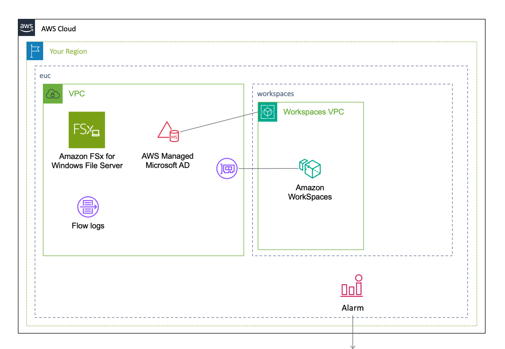
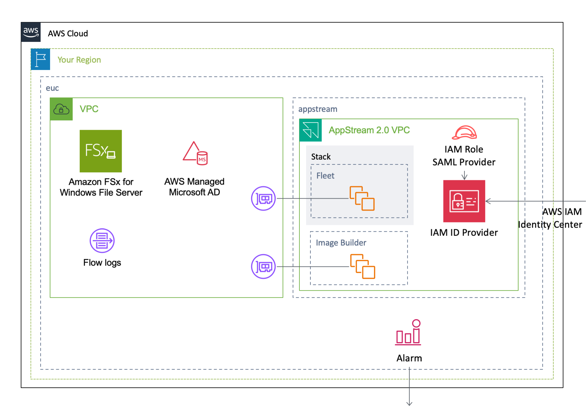

English / [**日本語**](README_JP.md)

# AWSCloudFormationTemplates/euc


``AWSCloudFormationTemplates/euc`` builds an environment for end user computing.

## TL;DR

If you just want to deploy the stack, click the button below.

| US East (Virginia) | Asia Pacific (Tokyo) |
| --- | --- |
| [](https://console.aws.amazon.com/cloudformation/home?region=us-east-1#/stacks/create/review?stackName=VDI&templateURL=https://eijikominami.s3-ap-northeast-1.amazonaws.com/aws-cloudformation-templates/euc/template.yaml) | [](https://console.aws.amazon.com/cloudformation/home?region=ap-northeast-1#/stacks/create/review?stackName=VDI&templateURL=https://eijikominami.s3-ap-northeast-1.amazonaws.com/aws-cloudformation-templates/euc/template.yaml) |

## Architecture

The following sections describe the individual components of the architecture.




## Deployment

Execute the command to deploy.

```bash
aws cloudformation deploy --template-file template.yaml --stack-name VDI --capabilities CAPABILITY_NAMED_IAM CAPABILITY_AUTO_EXPAND
```

You can provide optional parameters as follows:

| Name | Type | Default | Requied | Details | 
| --- | --- | --- | --- | --- |
| ActiveDirectoryAccountNameForAppStream | String | AppStreamAdmin | | The user name of the account | 
| ActiveDirectoryEdition | Enterprise / Standard | Standard | conditional |  The edition of AWS Directory Service for Microsoft Active Directory  | 
| ActiveDirectoryEnableSso  | true / false | true | conditional | Whether to enable single sign-on for a Microsoft Active Directory in AWS |
| ActiveDirectoryName | String | corp.example.com | conditional | The fully qualified domain name for the AWS Managed Microsoft AD directory |
| ActiveDirectoryPassword | String | Password1+ | conditional | The password for the default administrative user named Admin |
| ActiveDirectoryShortName | String | CORP | conditional | The NetBIOS name for your domain |
| ActiveDirectoryIdForFSx | String | | conditional | The identifier of the AWS Directory Service directory for FSx |
| ActiveDirectoryIdForWorkspaces | String | | conditional | The identifier of the AWS Directory Service directory for Workspaces |
| AppStreamImageBuilderImageName | String | | | The name of the image used to create the fleet |
| AppStreamImageName | String | | | The name of the image used to create the fleet |
| ComputeTypeName | GRAPHICS / GRAPHICSPRO / PERFORMANCE / POWER / POWERPRO / STANDARD / VALUE | PERFORMANCE | ○ | The compute type |
| FSxDeploymentMode | NONE / SINGLE_AZ_2 / MULTI_AZ_1 | SINGLE_AZ_2 | ○ | Specifies the file system deployment type |
| FSxIngressCidrIp | String | 0.0.0.0/0 | | The IPv4 address range, in CIDR format |
| FSxStorageSize | Number | 1024 | ○ | The storage capacity of the file system being created. 32 GiB - 65,536 GiB (64 TiB) |
| FSxThroughput | Number | 16 | ○ | The throughput capacity of an Amazon FSx file system, measured in megabytes per second in powers of 2 (8, 16, 32, ... , 1024), with the recommended value based on the file system size: 8 for <800 GiB, 16 for <1600 GiB, ... 512 for <51200 GiB, 1024 for >=51200 GiB |
| OrganizationalUnitDistinguishedNamesForAppStream | CommaDelimitedList | OU=EXAMPLE,DC=example,DC=com | | The distinguished names of the organizational units for computer accounts |
| SamlMetadataDocument | String | | | An XML document generated by an identity provider (IdP) that supports SAML 2.0 |
| Service | WORKSPACES / APPSTREAM / VPC_ONLY | WORKSPACES | ○ | The based AWS Services which the workload runs |
| SubnetPrivateCidrBlockForAz1 | String | 10.2.8.0/23 | ○ | The private subnet CIDR block at AZ1 |
| SubnetPrivateCidrBlockForAz2 | String | 10.2.12.0/23 | ○ | The private subnet CIDR block at AZ2 |
| SubnetPublicCidrBlockForAz1 | String | 10.2.10.0/24 | ○ | The public subnet CIDR block at AZ1 |
| SubnetPublicCidrBlockForAz2 | String | 10.2.14.0/24 | ○ | The public subnet CIDR block at AZ2 |
| SubnetTransitCidrBlockAz1 | String | 10.2.11.0/24 | ○ | The transit subnet CIDR block at AZ1 |
| SubnetTransitCidrBlockAz2 | String | 10.2.15.0/24 | ○ | The transit subnet CIDR block at AZ2 |
| TransitGatewayId | String | | | The ID of a transit gateway |
| TransitGatewayDestinationCidrBlock | String | 0.0.0.0/0 | | The IPv4 CIDR block forward to TransitGateway |
| VPCCidrBlock | String | 10.2.8.0/21 | ○ | The VPC CIDR block |
| WorkspacesBundleId | String | wsb-w94f3tgkh | | The identifier of the bundle for the WorkSpace |
| WorkspacesRootVolumeSizeGib | Number | 80 | ○ | The size of the root volume |
| WorkspacesRunningMode | ALWAYS_ON / AUTO_STOP / MANUAL | AUTO_STOP | | The identifier of the bundle for the WorkSpace |
| WorkspacesWorkspacesRunningModeAutoStopTimeoutInMinutes | Number | 60 | ○ | The time after a user logs off when WorkSpaces are automatically stopped |
| WorkspacesUserNames | CommaDelimitedList | | | ○ | The user name of the user for the WorkSpace |
| WorkspacesUserVolumeSizeGib | Number | 100 | ○ | The size of the user storage |

If you use your existing Active Directory on AppStreams, [**you need to set up permissions on it**](https://docs.aws.amazon.com/appstream2/latest/developerguide/active-directory-admin.html#active-directory-permissions).