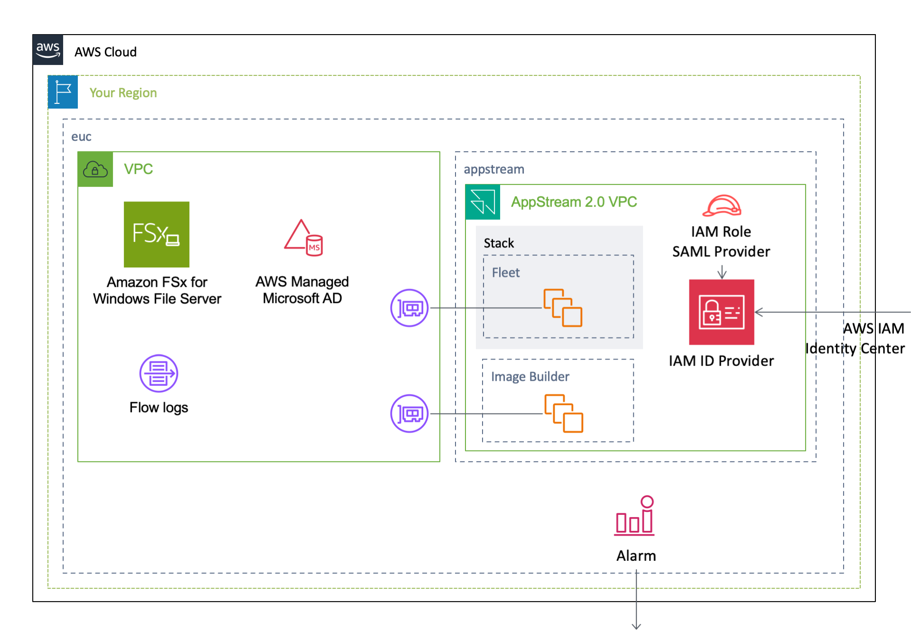

[**English**](README.md) / 日本語

# AWSCloudFormationTemplates/euc


 
``AWSCloudFormationTemplates/euc`` は、エンドユーザコンピューティングに関する環境を構築します。

## TL;DR

以下のボタンをクリックすることで、この **CloudFormationをデプロイ** することが可能です。

| 米国東部 (バージニア北部) | アジアパシフィック (東京) |
| --- | --- |
| [](https://console.aws.amazon.com/cloudformation/home?region=us-east-1#/stacks/create/review?stackName=VDI&templateURL=https://eijikominami.s3-ap-northeast-1.amazonaws.com/aws-cloudformation-templates/euc/template.yaml) | [](https://console.aws.amazon.com/cloudformation/home?region=ap-northeast-1#/stacks/create/review?stackName=VDI&templateURL=https://eijikominami.s3-ap-northeast-1.amazonaws.com/aws-cloudformation-templates/euc/template.yaml) |

## AWS IAM Identity Center

このテンプレートは、 ``AWS IAM Identity Center`` を構成します。

### デプロイ

以下のコマンドを実行することで、CloudFormationをデプロイすることが可能です。

```bash
aws cloudformation deploy --template-file identitycenter.yaml --stack-name IdentityCenter --capabilities CAPABILITY_NAMED_IAM CAPABILITY_AUTO_EXPAND
```

## Architecture

このテンプレートが作成するAWSリソースのアーキテクチャ図は、以下の通りです。




## デプロイ

以下のコマンドを実行することで、CloudFormationをデプロイすることが可能です。

```bash
aws cloudformation deploy --template-file template.yaml --stack-name VDI --capabilities CAPABILITY_NAMED_IAM CAPABILITY_AUTO_EXPAND
```

デプロイ時に、以下のパラメータを指定することができます。

| 名前 | タイプ | デフォルト値 | 必須 | 詳細 |
| --- | --- | --- | --- | --- |
| ActiveDirectoryAccountNameForAppStream | String | AppStreamAdmin | | Active Directory のユーザ名 | 
| ActiveDirectoryEdition | Enterprise / Standard | Standard | conditional |  Active Directory のエディション  |
| ActiveDirectoryEnableSso  | true / false | true | conditional | Active Directory で SSO を有効にするかどうか |
| ActiveDirectoryName | String | corp.example.com | conditional | Active Directory で使用するフルドメイン名 |
| ActiveDirectoryPassword | String | Password1+ | conditional | Active Directory で使用する Admin ユーザのパスワード |
| ActiveDirectoryShortName | String | CORP | conditional | NetBIOS 名 |
| ActiveDirectoryIdForFSx | String | | conditional | FSx で使用する Active Directory ID |
| ActiveDirectoryIdForWorkspaces | String | | conditional | Workspaces で使用する Active Directory ID |
| AppStreamImageBuilderImageName | String | | | AppStream Image Builder で使用するイメージ名 |
| AppStreamImageName | String | | | AppStream で使用するイメージ名 |
| ComputeTypeName | GRAPHICS / GRAPHICSPRO / PERFORMANCE / POWER / POWERPRO / STANDARD / VALUE | PERFORMANCE | ○ | コンピュートタイプ |
| FSxDeploymentMode | NONE / SINGLE_AZ_2 / MULTI_AZ_1 | SINGLE_AZ_2 | ○ | FSx のデプロイモード |
| FSxIngressCidrIp | String | 0.0.0.0/0 | | FSx へアクセスが可能なアドレス範囲 |
| FSxStorageSize | Number | 1024 | ○ | 32 GiB - 65,536 GiB (64 TiB) の範囲内で規定する FSx のストレージサイズ |
| FSxThroughput | Number | 16 | ○ | FSx のスループット |
| OrganizationalUnitDistinguishedNamesForAppStream | CommaDelimitedList | OU=EXAMPLE,DC=example,DC=com | | AppStream で使用する OU の distinguished names |
| SamlMetadataDocument | String | | | IdP が作成した SAML メタデータ XML |
| Service | WORKSPACES / APPSTREAM / VPC_ONLY | WORKSPACES | ○ | 構築する AWS サービス |
| SubnetPrivateCidrBlockForAz1 | String | 10.2.8.0/23 | ○ | AZ1 のプライベートサブネットの CIDR ブロック |
| SubnetPrivateCidrBlockForAz2 | String | 10.2.12.0/23 | ○ | AZ2 のプライベートサブネットの CIDR ブロック |
| SubnetPublicCidrBlockForAz1 | String | 10.2.10.0/24 | ○ | AZ1 のパブリックサブネットの CIDR ブロック |
| SubnetPublicCidrBlockForAz2 | String | 10.2.14.0/24 | ○ | AZ2 のパブリックサブネットの CIDR ブロック |
| SubnetTransitCidrBlockAz1 | String | 10.2.11.0/24 | ○ | AZ1 の Transit サブネットの CIDR ブロック |
| SubnetTransitCidrBlockAz2 | String | 10.2.15.0/24 | ○ | AZ2 の Transit サブネットの CIDR ブロック |
| TransitGatewayId | String | | | Transit Gateway ID |
| TransitGatewayDestinationCidrBlock | String | 0.0.0.0/0 | | Transit Gateway に転送するサブネットの CIDR ブロック |
| VPCCidrBlock | String | 10.2.8.0/21 | ○ | VPC の CIDR ブロック |
| WorkspacesBundleId | String | wsb-w94f3tgkh | | Workspaces のバンドル ID |
| WorkspacesRootVolumeSizeGib | Number | 80 | ○ | Workspaces のルートボリュームのサイズ |
| WorkspacesRunningMode | ALWAYS_ON / AUTO_STOP / MANUAL | AUTO_STOP | | Workspaces の Running Mode |
| WorkspacesWorkspacesRunningModeAutoStopTimeoutInMinutes | Number | 60 | ○ | Workspaces が自動的に停止するまでの時間 |
| WorkspacesUserNames | CommaDelimitedList | | | ○ | Workspaces のプレイアウトイーザー名 |
| WorkspacesUserVolumeSizeGib | Number | 100 | ○ | Workspaces のユーザボリュームのサイズ |

AppStreams で Active Directory を使用する場合には、[**Active Directory 上で権限の設定を行う**](https://docs.aws.amazon.com/ja_jp/appstream2/latest/developerguide/active-directory-admin.html#active-directory-permissions)必要があります。