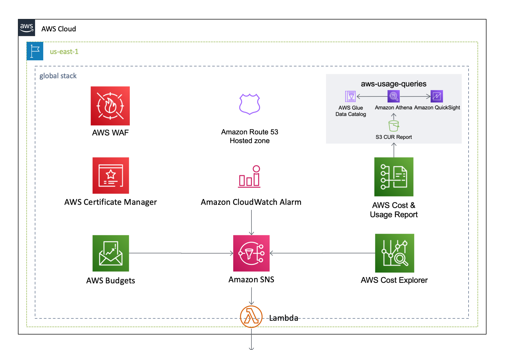

English / [**日本語**](README_JP.md)

# AWSCloudFormationTemplates/global


 
``AWSCloudFormationTemplates/global`` creates global settings on N.Virginia Region (`us-east-1`).

## TL;DR

If you just want to deploy the stack, click the button below.

[](https://console.aws.amazon.com/cloudformation/home?region=us-east-1#/stacks/create/review?stackName=GlobalSettings&templateURL=https://eijikominami.s3-ap-northeast-1.amazonaws.com/aws-cloudformation-templates/global/template.yaml) 

## Architecture

The following sections describe the individual components of the architecture.



### AWS Certificate Manager

This template creates an SSL certification in ``AWS Certificate Manager``.

### CloudWatch Alarm

This template creates CloudWatch Alarm about ``Billing`` and ``CloudFront`` (``Error Rate``, ``Requests`` and ``Download Bytes``).

### Other Resources

This template creates some other resources, such as ``Amazon SNS``.

## Deployment

Execute the command to deploy in the ``us-east-1`` region because ``AWS Certificate Manager``, ``CloudFront`` and ``Billing`` only support the region.

```bash
aws cloudformation deploy --template-file template.yaml --stack-name GlobalSettings --region us-east-1
```

You can provide optional parameters as follows.

| Name | Type | Default | Required | Details | 
| --- | --- | --- | --- | --- |
| ACMValidationMethod | DNS / EMAIL | DNS | ○ |  |
| **ACMDomainName** | String | | | If it's NOT empty, **SSL certification** is created. |
| BillingAlertThreshold | Number | 0 | ○ | If it's NOT ZERO, **CloudWatch Alarm** is created. |
| CloudFrontErrorRateThreshold | Number | 0 | ○ | If it's NOT ZERO, **CloudWatch Alarm** is created. |
| CloudFrontBytesDownloadedPerMinuteThreshold | Number | 0 | ○ | If it's NOT ZERO, **CloudWatch Alarm** is created. |
| CloudFrontDistributionId | String | | | Targeted CloudFront Distribution Id for monitoring |
| SnsTopicArn | String | | | If it's empty, notifications are send to 'arn:aws:sns:${AWS::Region}:${AWS::AccountId}:DefaultSecuritySettings-system-notifications' | 