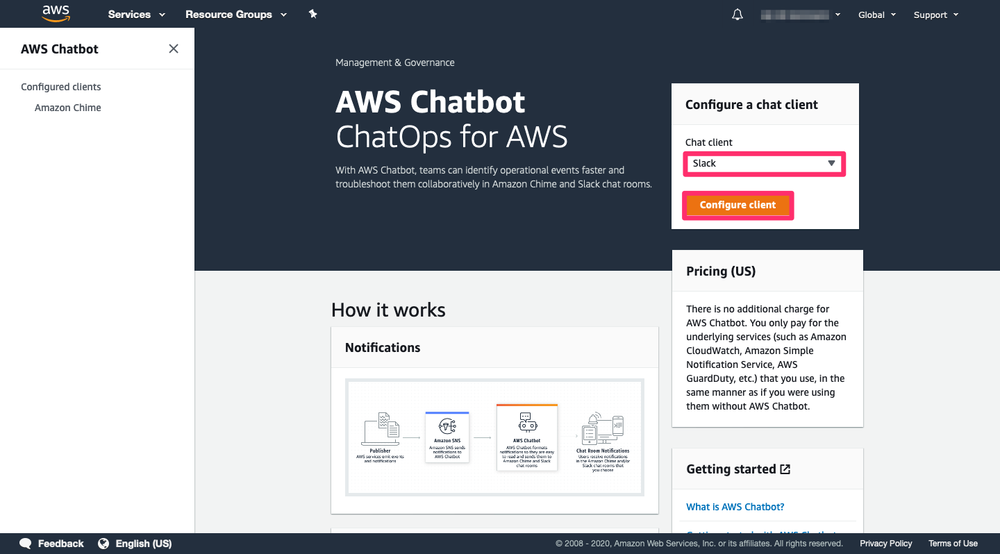
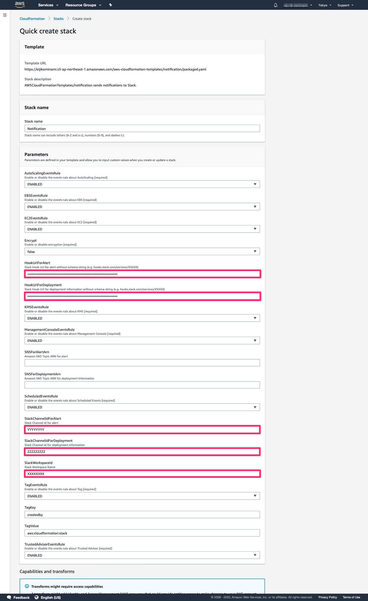
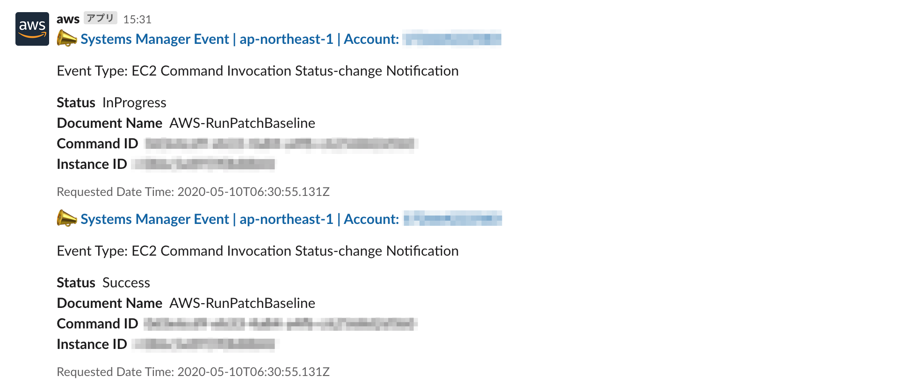
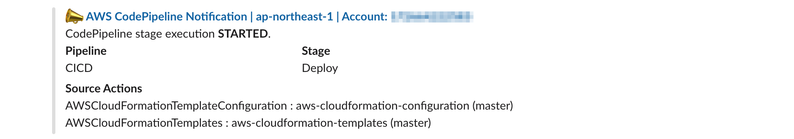
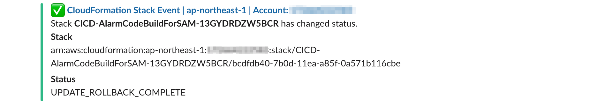

English / [**日本語**](README_JP.md)

# AWSCloudFormationTemplates/notification


 
``AWSCloudFormationTemplates/notification`` sets up AWS Chatbot and AWS Lambda to send notifications to Slack.

```bash
.
├── README_JP.md                    <-- Instructions file (Japanese)
├── README.md                       <-- This instructions file
├── templages
│   └── chatbot.yaml                <-- CloudFormation Template
└── sam-app
    ├── sendNotificationToSlack     <-- Source code for a lambda function
    │   ├── lambda_function.py      <-- Lambda function code
    │   └── requirements.txt        <-- List of items to be installed using pip install
    ├── events.yaml                 <-- SAM Template
    ├── sns.yaml                    <-- SAM Template
    └── template.yaml               <-- SAM Template
```

## Preparation

**This template requires some setup to be done in the AWS Chatbot console.** To provide the required Slack workspace ID, you must perform the initial authorization flow with Slack in the AWS Chatbot console, then copy and paste the workspace ID from the console. For more details, see steps 1-4 in [Setting Up AWS Chatbot with Slack](https://docs.aws.amazon.com/chatbot/latest/adminguide/setting-up.html#Setup_intro) in the ``AWS Chatbot User Guide``. 



At the same time, **you also need to get the Incoming Webhook URLs from your Slack App.** See [Getting started with Incoming Webhooks](https://api.slack.com/messaging/webhooks#getting_started) for more information.


## TL;DR

1. Run the [**Security template**](../security/README.md) in this project. (Optional)

[](https://console.aws.amazon.com/cloudformation/home?region=ap-northeast-1#/stacks/create/review?stackName=DefaultSecuritySettings&templateURL=https://eijikominami.s3-ap-northeast-1.amazonaws.com/aws-cloudformation-templates/security/template.yaml) 

2. **Click the button below to deploy this template.**

[](https://console.aws.amazon.com/cloudformation/home?region=ap-northeast-1#/stacks/create/review?stackName=Notification&templateURL=https://eijikominami.s3-ap-northeast-1.amazonaws.com/aws-cloudformation-templates/notification/packaged.yaml) 




## Architecture

The following sections describe the individual components of the architecture.


### Amazon EventBridge Events Rule

This template creates ``EventBridge Events Rule`` for [supported AWS Services](https://docs.aws.amazon.com/eventbridge/latest/userguide/event-types.html).This template covers the following events.

| Events | Source | Detail Type |
| --- | --- | --- |
| AWS CloudFormation Events | aws.cloudformation | CloudFormation Stack Status Change |
| Amazon EventBridge Scheduled Events | aws.events | Scheduled Event |
| Amazon EBS Events | aws.ec2 | EBS Volume Notification |
| Amazon EBS Events | aws.ec2 | EBS Snapshot Notification |
| Amazon EBS Events | aws.ec2 | EBS Multi-Volume Snapshots Completion Status |
| Amazon EBS Events | aws.ec2 | EBS Fast Snapshot Restore State-change Notification |
| Amazon EC2 Auto Scaling Events | aws.autoscaling | EC2 Instance-launch Lifecycle Action  |
| Amazon EC2 Auto Scaling Events | aws.autoscaling | EC2 Instance Launch Successful  |
| Amazon EC2 Auto Scaling Events | aws.autoscaling | EC2 Instance Launch Unsuccessful  |
| Amazon EC2 Auto Scaling Events | aws.autoscaling | EC2 Instance-terminate Lifecycle Action |
| Amazon EC2 Auto Scaling Events | aws.autoscaling | EC2 Instance Terminate Successful  |
| Amazon EC2 Auto Scaling Events | aws.autoscaling | EC2 Instance Terminate Unsuccessful |
| Amazon EC2 State Change Events | aws.ec2 | EC2 Instance State-change Notification |
| AWS Elemental MediaLive Events | aws.medialive | MediaLive Channel State Change Events |
| AWS KMS Events | aws.kms | KMS CMK Rotations |
| AWS KMS Events | aws.kms | KMS Imported Key Material Expiration |
| AWS KMS Events | aws.kms | KMS CMK Deletion |
| AWS Management Console Sign-in Events | aws.signin | AWS Console Sign In via CloudTrail |
| AWS Application Migration Service Events | aws.mgn | MGN Source Server Launch Result |
| AWS Application Migration Service Events | aws.mgn | MGN Source Server Lifecycle State Change |
| AWS Application Migration Service Events | aws.mgn | MGN Source Server Data Replication Stalled Change |
| AWS Transit Gateway Network Manager | aws.networkmanager | Network Manager Topology Change | 
| AWS Transit Gateway Network Manager | aws.networkmanager | Network Manager Routing Update | 
| AWS Transit Gateway Network Manager | aws.networkmanager | Network Manager Status Update | 
| Savings Plans | aws.savingsplans | Savings Plans State Change | 
| Savings Plans | aws.savingsplans | Savings Plans State Change Alert | 
| Amazon EventBridge | aws.events | Scheduled Event |
| AWS Support | aws.support | Support Case Update |
| Tag Change Events on AWS Resources | aws.tag | Tag Change on Resource |
| AWS Trusted Advisor Events | aws.trustedadvisor | Trusted Advisor Check Item Refresh Notification |

These events are transfered to the **Amazon SNS topic** set by the ``SNSForAlertArn`` input parameter.

### AWS ChatBot

This template configures ``Slack Channels`` in AWS Chatbot.
AWS Chatbot sends notifications from [supported services](https://docs.aws.amazon.com/chatbot/latest/adminguide/related-services.html) to Slack such as ``AWS Billing and Cost Management ``, ``AWS CloudFormation ``, ``AWS developer tools``, ``Amazon CloudWatch Alarms``, ``AWS Config``, ``Amazon GuardDuty``, ``AWS Health``, ``AWS Security Hub`` and ``AWS Systems Manager``.

### AWS Lambda

This template creates the Lambda function to create Slack messages from Amazon SNS messages. The function supports ``EventBridge Scheduled Events``, ``Amazon EBS Events``, ``Amazon EC2 Auto Scaling Events``, ``AWS KMS Events``, ``AWS Management Console Sign-in Events``, ``Tag Change Events on AWS Resources`` and ``AWS Trusted Advisor Events``.

## Screenshots










## Deployment

Execute the command to deploy.

```bash
sam build
sam package --output-template-file packaged.yaml --s3-bucket S3_BUCKET_NAME
aws cloudformation deploy --template-file packaged.yaml --stack-name Notification --s3-bucket S3_BUCKET_NAM --capabilities CAPABILITY_NAMED_IAM CAPABILITY_AUTO_EXPAND
```

You can provide optional parameters as follows.

| Name | Type | Default | Requied | Details | 
| --- | --- | --- | --- | --- |
| CloudTrailAdditionalFilters | String | | | Additional expression of CloudWatch Logs metric filters |
| CloudTrailLogGroup | | | | If it is not empty, Slack sends details about ``Unauthorized API Calls`` logs |
| Encrypt | ENABLED / DISABLED | DISABLED | ○ | If it is ENABLED, Slack hook urls are encrypted by an AWS KMS Custom key |
| **HookUrlForDeployment** | String | | | Slack Hook Url for deployment information | 
| **HookUrlForAlert** | String | | | Slack Hook Url for alert |
| **SlackWorkspaceId** | String | | | Slack Workspace Name | 
| **SlackChannelIdForDeployment** | String | | | Slack Channel Id for deployment information |
| **SlackChannelIdForAlert** | String | | | Slack Channel Id for alert |
| AutoScalingEventsRule | ENABLED / ERROR_ONLY / DISABLED | ENABLED | ○ | If it is ENABLED, the events rule about AutoScaling is enabled |
| EBSEventsRule | ENABLED / ERROR_ONLY / DISABLED | ENABLED | ○ | If it is ENABLED, the events rule about EBS is enabled |
| EC2EventsRule | ENABLED / DISABLED | ENABLED | ○ | If it is ENABLED, the events rule about EC2 is enabled |
| KMSEventsRule | ENABLED / DISABLED | ENABLED | ○ | If it is ENABLED, the events rule about KMS is enabled |
| ManagementConsoleEventsRule | ENABLED / DISABLED | ENABLED | ○ | If it is ENABLED, the events rule about Management Console is enabled |
| NetworkManagerEventsRule | ENABLED / DISABLED | ENABLED | ○ | If it is ENABLED, the events rule about AWS Transit Gateway Network Manager is enabled |  
| SavingsPlansEventsRule | ENABLED / DISABLED | ENABLED | ○ | If it is ENABLED, the events rule about Savings Plans is enabled | 
| ScheduledEventsRule | ENABLED / DISABLED | ENABLED | ○ | If it is ENABLED, the events rule about ScheduledEvents is enabled |
| SupportEventsRule | ENABLED / DISABLED | ENABLED | ○ | If it is ENABLED, the events rule about AWS Support is enabled |
| TagEventsRule | ENABLED / DISABLED | ENABLED | ○ | If it is ENABLED, the events rule about Tag Events is enabled |
| TrustedAdvisorEventsRule | ENABLED / DISABLED | ENABLED | ○ | If it is ENABLED, the events rule about Trusted Advisor is enabled |
| UnauthorizedApiCallsCloudWatchAlarmName | String | | ○ | The CloudWatch Alarm name to notify unauthorized API calls |
| SNSForAlertArn | String | | | Amazon SNS Topic ARN for alert | 
| SNSForAlertArn | String | | | Amazon SNS Topic ARN for CI/CD information | 
| SNSForDeploymentArn | String | | | Amazon SNS Topic ARN for deployment information |