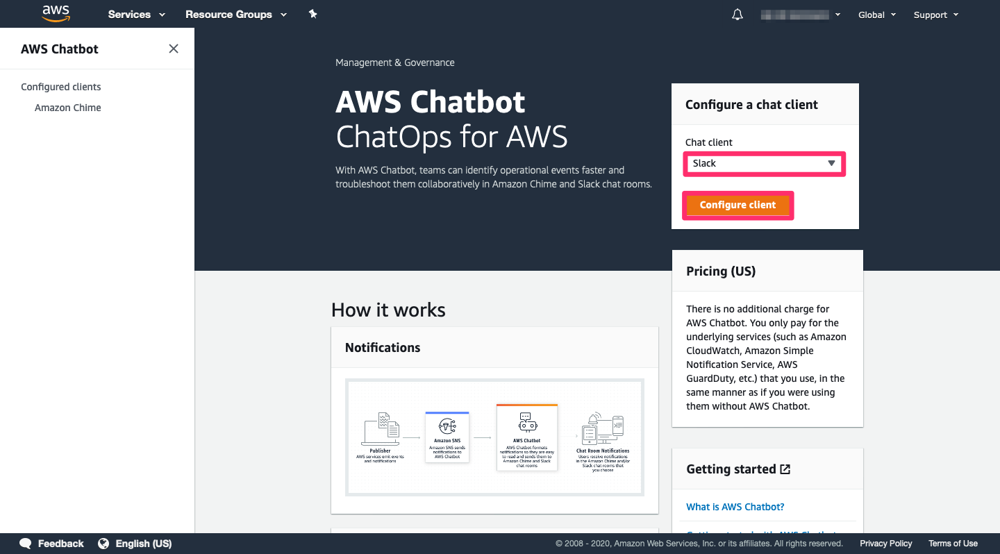
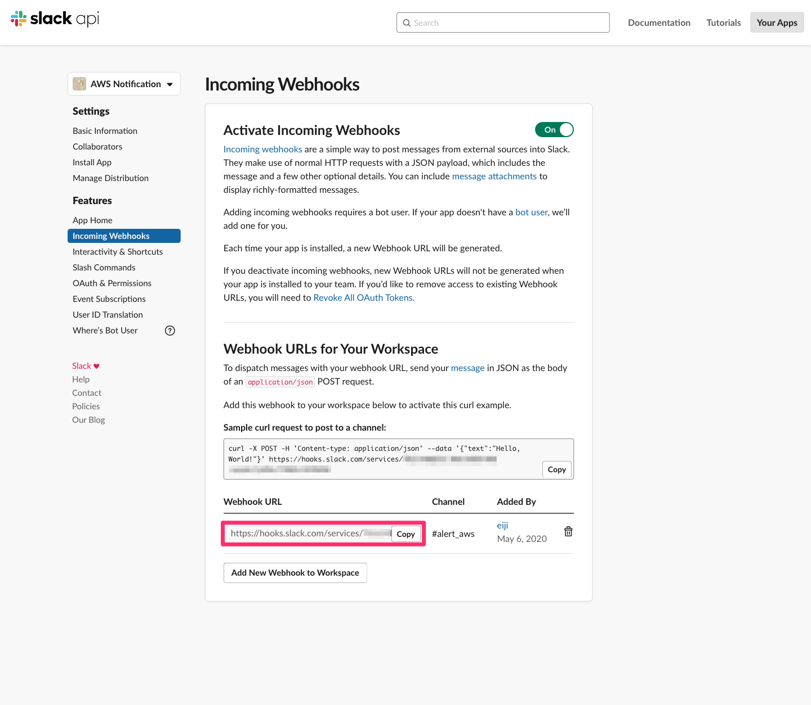
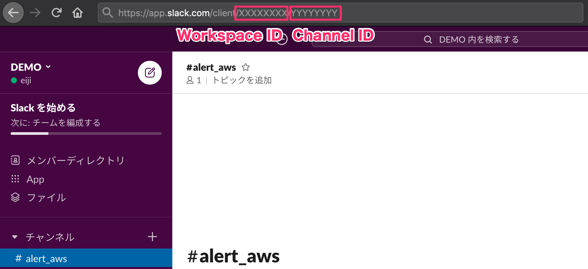
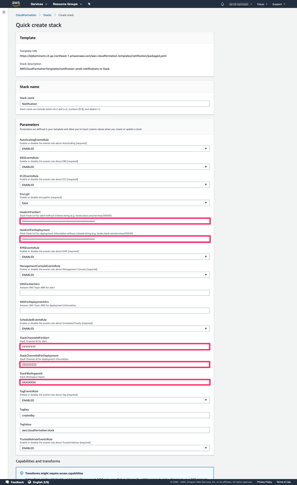
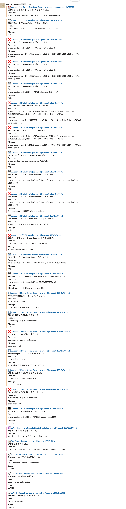
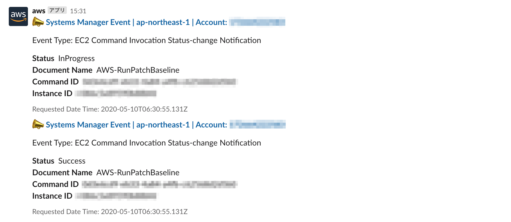
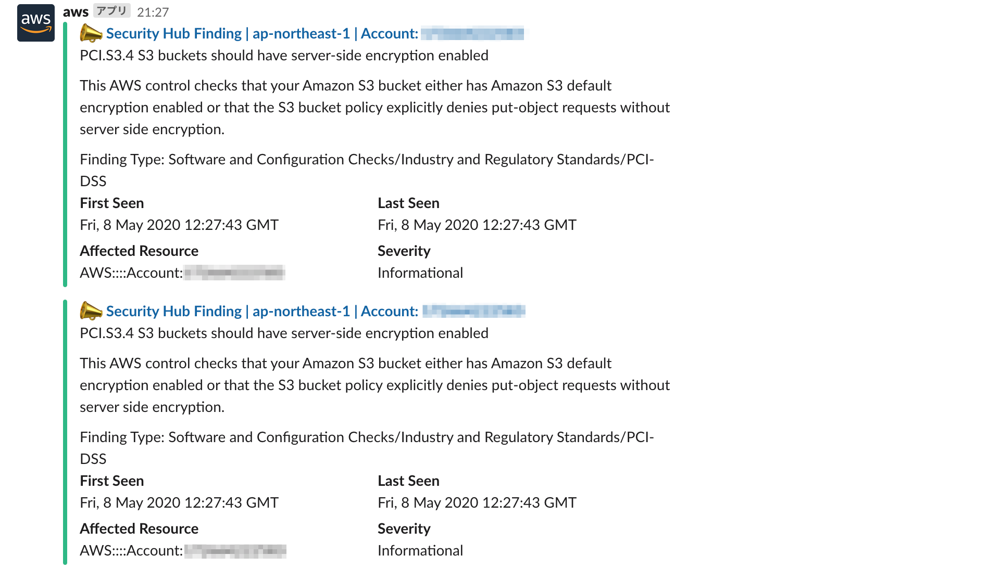
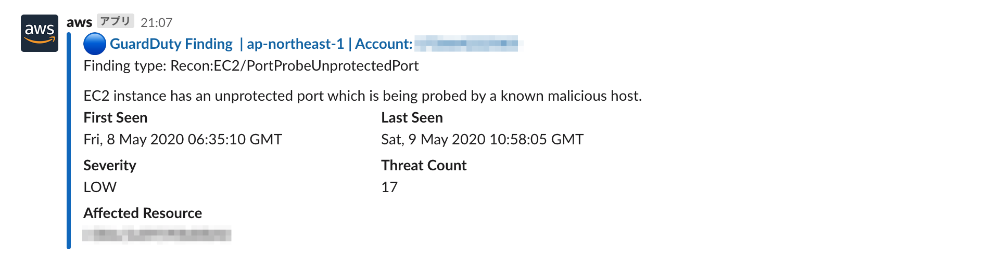
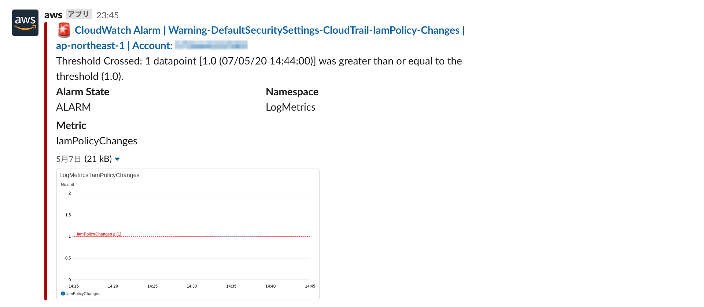
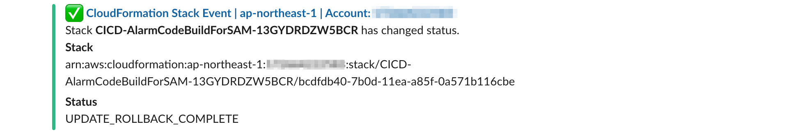

[**English**](README.md) / 日本語

# AWSCloudFormationTemplates/notification


 
 
``AWSCloudFormationTemplates/notification`` は、 ``AWS Chatbot`` と ``AWS Lambda`` を用いて **Slackに通知を送信** します。

```bash
.
├── README_JP.md                    <-- この導入ガイド
├── README.md                       <-- 導入ガイド（英語版）
├── templages
│   └── chatbot.yaml                <-- CloudFormation テンプレート
└── sam-app
    ├── sendNotificationToSlack     <-- Lambda用ディレクトリ
    │   ├── lambda_function.py      <-- メイン関数
    │   └── requirements.txt        <-- ライブラリの依存関係ファイル
    ├── events.yaml                 <-- SAM Template
    ├── sns.yaml                    <-- SAMテンプレート
    └── template.yaml               <-- SAMテンプレート
```

## 準備

**このテンプレートを実行する前に、AWS Chatbotコンソール上で初回認証フロー行う必要があります。** これには、SlackワークスペースIDが必要です。詳細は、``AWS Chatbot ユーザガイド``内の[Setting Up AWS Chatbot with Slack](https://docs.aws.amazon.com/ja_jp/chatbot/latest/adminguide/setting-up.html#Setup_intro)のステップ1から4を参照してください。



また、これと同時に、**Slack App の Incoming Webhook URL を取得する必要があります。** 詳細は、[Getting started with Incoming Webhooks](https://api.slack.com/messaging/webhooks#getting_started)を御覧ください。



## TL;DR

1. [**セキュリティテンプレート**](../security/README_JP.md)をデプロイしてください。 (オプション)

[](https://console.aws.amazon.com/cloudformation/home?region=ap-northeast-1#/stacks/create/review?stackName=DefaultSecuritySettings&templateURL=https://eijikominami.s3-ap-northeast-1.amazonaws.com/aws-cloudformation-templates/security/template.yaml) 

2. **以下のボタンをクリックして、このテンプレートをデプロイしてください。**

[](https://console.aws.amazon.com/cloudformation/home?region=ap-northeast-1#/stacks/create/review?stackName=Notification&templateURL=https://eijikominami.s3-ap-northeast-1.amazonaws.com/aws-cloudformation-templates/notification/packaged.yaml) 





## アーキテクチャ

このテンプレートが作成するAWSリソースのアーキテクチャ図は、以下の通りです。


### Amazon EventBridge Events Rule

このテンプレートは、 [サポート対象のAWSサービス](https://docs.aws.amazon.com/ja_jp/eventbridge/latest/userguide/event-types.html) に関する **EventBridge イベントルール** を作成します。このテンプレートは、以下のイベントに対応しています。

| イベント | ソース | 詳細タイプ |
| --- | --- | --- |
| Amazon EventBridge Scheduled Events | aws.events | Scheduled Event |
| Amazon EBS Events | aws.ec2 | EBS Volume Notification |
| Amazon EBS Events | aws.ec2 | EBS Snapshot Notification |
| Amazon EBS Events | aws.ec2 | EBS Multi-Volume Snapshots Completion Status |
| Amazon EBS Events | aws.ec2 | EBS Fast Snapshot Restore State-change Notification |
| Amazon EC2 Auto Scaling Events | aws.autoscaling | EC2 Instance-launch Lifecycle Action  |
| Amazon EC2 Auto Scaling Events | aws.autoscaling | EC2 Instance Launch Successful  |
| Amazon EC2 Auto Scaling Events | aws.autoscaling | EC2 Instance Launch Unsuccessful  |
| Amazon EC2 Auto Scaling Events | aws.autoscaling | EC2 Instance-terminate Lifecycle Action |
| Amazon EC2 Auto Scaling Events | aws.autoscaling | EC2 Instance Terminate Successful  |
| Amazon EC2 Auto Scaling Events | aws.autoscaling | EC2 Instance Terminate Unsuccessful |
| Amazon EC2 State Change Events | aws.ec2 | EC2 Instance State-change Notification |
| AWS KMS Events | aws.kms | KMS CMK Rotations |
| AWS KMS Events | aws.kms | KMS Imported Key Material Expiration |
| AWS KMS Events | aws.kms | KMS CMK Deletion |
| AWS Management Console Sign-in Events | aws.signin | AWS Console Sign In via CloudTrail |
| Tag Change Events on AWS Resources | aws.tag | Tag Change on Resource |
| AWS Trusted Advisor Events | aws.trustedadvisor | Trusted Advisor Check Item Refresh Notification |

これらのイベントは、入力パラメータ ``SNSForAlertArn`` で指定した **Amazon SNS トピック** に転送されます。

### AWS ChatBot

このテンプレートは、AWS Chatbot の ``Slackチャンネル`` を設定します。
AWS Chatbot は、``AWS Billing and Cost Management ``、 ``AWS CloudFormation ``、 ``AWS developer tools``、 ``Amazon CloudWatch Alarms``、 ``AWS Config``、 ``Amazon GuardDuty``、 ``AWS Health``、 ``AWS Security Hub``、 ``AWS Systems Manager`` などの [対象のAWSサービス](https://docs.aws.amazon.com/ja_jp/chatbot/latest/adminguide/related-services.html) から送信された通知をSlackに送信します。

### AWS Lambda

このテンプレートは、Amazon SNSメッセージからSlackメッセージを作成するLambda関数を作成します。この関数は、``EventBridge Scheduled Events``、 ``Amazon EBS Events``、 ``Amazon EC2 Auto Scaling Events``、 ``AWS KMS Events``、 ``AWS Management Console Sign-in Events``、 ``Tag Change Events on AWS Resources``、 ``AWS Trusted Advisor Events`` に対応しています。

## スクリーンショット














## デプロイ

以下のコマンドを実行することで、CloudFormationをデプロイすることが可能です。

```bash
sam build
sam package --output-template-file packaged.yaml --s3-bucket S3_BUCKET_NAME
aws cloudformation deploy --template-file packaged.yaml --stack-name Notification --s3-bucket S3_BUCKET_NAM --capabilities CAPABILITY_NAMED_IAM CAPABILITY_AUTO_EXPAND
```

デプロイ時に、以下のパラメータを指定することができます。

| 名前 | タイプ | デフォルト値 | 必須 | 詳細 | 
| --- | --- | --- | --- | --- |
| Encrypt | String | Disabled | ○ | Enabledを指定した場合、AWS KMS カスタムキーで SlackのHook URL を暗号化します。 |
| **HookUrlForDeployment** | String | | | Slack デプロイチャンネルのHook URL | 
| **HookUrlForAlert** | String | | | Slack アラートチャンネルのHook URL |
| **SlackWorkspaceId** | String | | | Slackのワークスペース名 | 
| **SlackChannelIdForDeployment** | String | | | Slack デプロイチャンネルのID |
| **SlackChannelIdForAlert** | String | | | Slack アラートチャンネルのID | 
| AutoScalingEventsRule | ENABLED / DISABLED | ENABLED | ○ | Enabledを指定した場合、AutoScaling に関するイベントルールを作成します。  |
| EBSEventsRule | ENABLED / DISABLED | ENABLED | ○ | Enabledを指定した場合、EBS に関するイベントルールを作成します。 |
| EC2EventsRule | ENABLED / DISABLED | ENABLED | ○ | Enabledを指定した場合、EC2 に関するイベントルールを作成します。 |
| KMSEventsRule | ENABLED / DISABLED | ENABLED | ○ | Enabledを指定した場合、KMS に関するイベントルールを作成します。 |
| ManagementConsoleEventsRule | ENABLED / DISABLED | ENABLED | ○ | Enabledを指定した場合、Management Console に関するイベントルールを作成します。 |
| ScheduledEventsRule | ENABLED / DISABLED | ENABLED | ○ | Enabledを指定した場合、ScheduledEvents に関するイベントルールを作成します。 |
| TagEventsRule | ENABLED / DISABLED | ENABLED | ○ |Enabledを指定した場合、Tag Events に関するイベントルールを作成します。 |
| TrustedAdvisorEventsRule | ENABLED / DISABLED | ENABLED | ○ | Enabledを指定した場合、Trusted Advisor に関するイベントルールを作成します。 |
| SNSForAlertArn | String | | | アラート用 Amazon SNS トピックの ARN | 
| SNSForDeploymentArn | String | | | デプロイ用 Amazon SNS トピックの ARN |