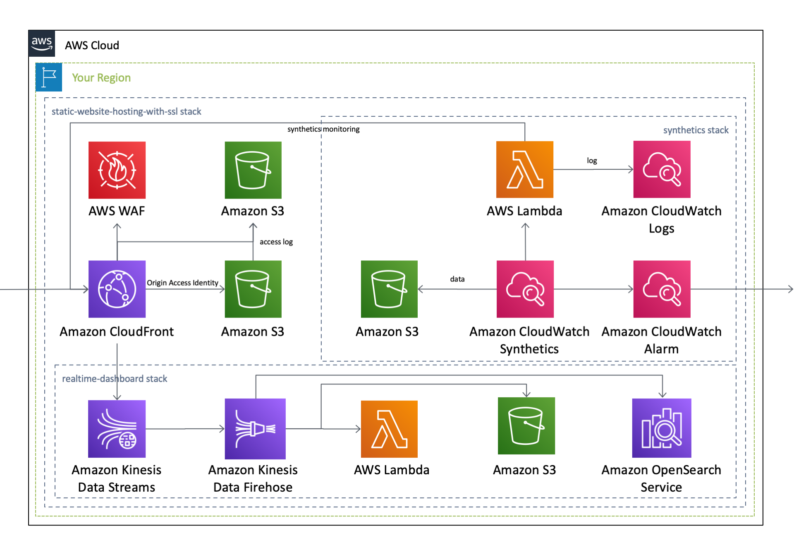

English / [**日本語**](README_JP.md)

# AWSCloudFormationTemplates/static-website-hosting-with-ssl


``AWSCloudFormationTemplates/static-website-hosting-with-ssl`` builds ``Amazon CloudFront``, ``Amazon S3`` and related resources for **static website hosting**.

## TL;DR

If you just want to deploy the stack follow these steps.

1. Before running this Cloudformation template, run both the ``Security`` template and ``Global Settings`` template in this project.

+ [Security Template](../security/README.md)
+ [Global Settings Template](../global/README.md)

2. click the button below.

[](https://console.aws.amazon.com/cloudformation/home?region=ap-northeast-1#/stacks/create/review?stackName=StaticWebsiteHosting&templateURL=https://eijikominami.s3-ap-northeast-1.amazonaws.com/aws-cloudformation-templates/static-website-hosting-with-ssl/template.yaml) 

## Architecture

The following sections describe the individual components of the architecture.



### Amazon S3

This template create an S3 bucket as origin for web distributions.
S3 allows to be accessed from CloudFront using an ``origin access identity`` (``OAI``) , but denies direct access from anonimous users.

### Amazon CloudFront

This template creates a CloudFront.
It supports ``Custom Domain Name with ACM``, ``Aliases``, ``Origin Access Identity``, ``Secondary Origin`` and ``Logging``.

## Deployment

Execute the command to deploy with ``DomainName`` parameter.

```bash
aws cloudformation deploy --template-file template.yaml --stack-name StaticWebsiteHosting --parameter-overrides DomainName=XXXXX CertificateManagerARN=XXXXX
```

You can provide optional parameters as follows.

| Name | Type | Default | Required | Details | 
| --- | --- | --- | --- | --- |
| CertificateManagerARN | String | | | If it's NOT empty, **SSL Certification** is associated with **CloudFront**. |
| **DomainName** | String | | ○ | The CNAME attached to CloudFront |
| CloudFrontDefaultTTL | Number | 86400 | ○ | CloudFront Default TTL |
| CloudFrontMinimumTTL | Number | 0 | ○ | CloudFront Minimum TTL |
| CloudFrontMaximumTTL | Number | 31536000 | ○ | CloudFront Maximum TTL |
| CloudFrontViewerProtocolPolicy | allow-all / redirect-to-https / https-only | redirect-to-https | ○ | CloudFront Viewer Protocol Policy |
| CloudFrontAdditionalName | String | | | If it's NOT empty, **Alias name** is set on **CloudFront**. |
| CloudFrontSecondaryOriginId | String | | | If it's NOT empty, **Secondary S3 bucket** is associated with **CloudFront**. |
| CloudFrontRestrictViewerAccess | Enabled / Disabled | Disabled | ○ | Enable or disable Restrict Viewer Access |
| CloudFront403ErrorResponsePagePath | String | | | The path to the 403 custom error page |
| S3DestinationBucketArnOfCrossRegionReplication | String | | | If it's NOT empty, Cross region replication is enabled on **S3**. |
| LoggingEnabled | Enabled / Disabled | Enabled | ○ | If Enabled, Logging is enabled on **CloudFront** and **S3**. |
| LogBacketName | String | | ○ | If it's empty, the bucket name logging data are stored is named 'defaultsecuritysettings-logs-${AWS::Region}-${AWS::AccountId}'. |
| WebACL | Enabled / Disabled | Disabled | ○ | If **Disabled** is set, AWS WAF does NOT created. |

### Manual Deployment

You can add ``secondary origin server`` in ``CloudFront`` by this CloudFormation Template, but it does **NOT suppport** creating ``Origin Group``.
Therefore create ``Origin Group`` and edit ``Default Cache Behavior Settings`` manually after comleting CloudFormation deployment.

1. Create ``Origin Group`` with ``Origins`` and ``Failover criteria`` .
2. Change ``Origin or Origin Group`` at ``Default Cache Behavior Settings`` to ``Origin Group`` you created.