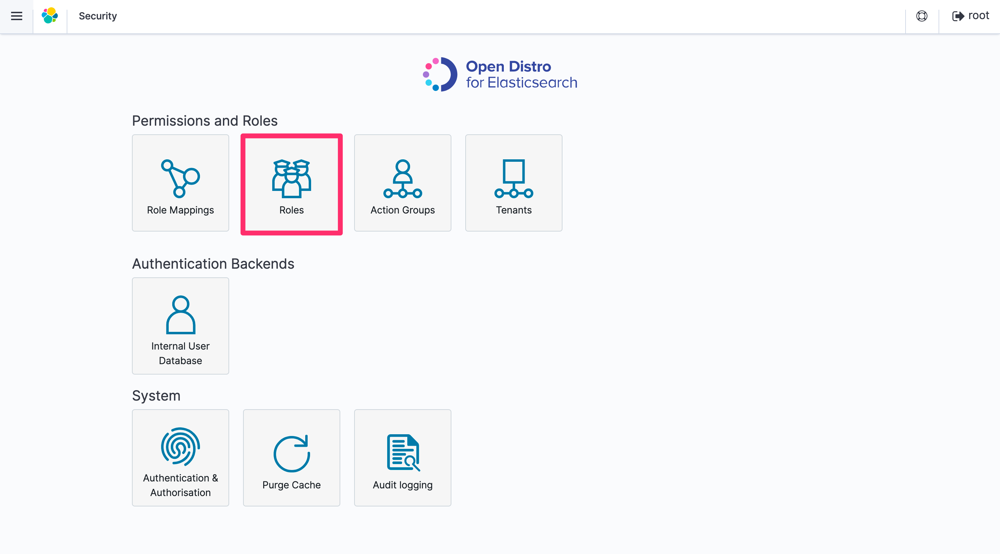
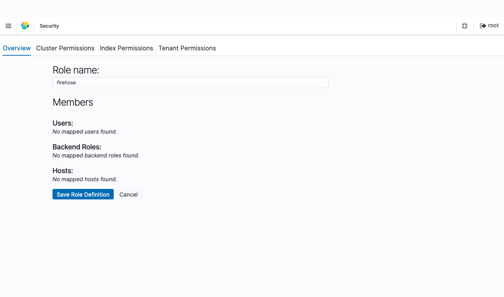
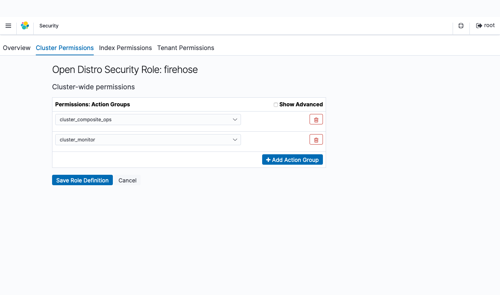
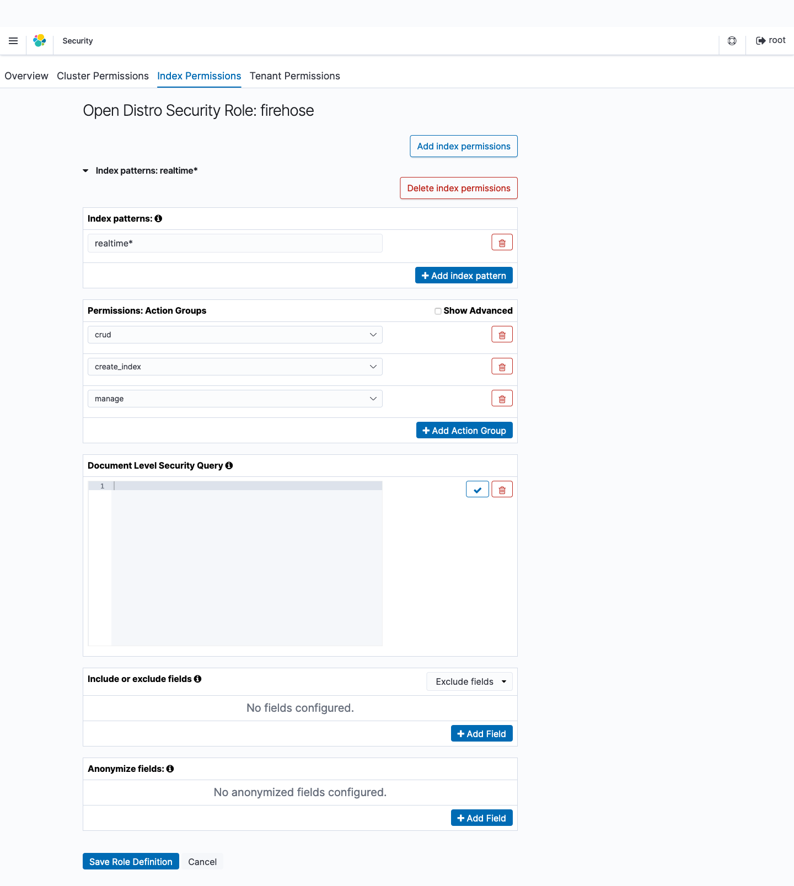
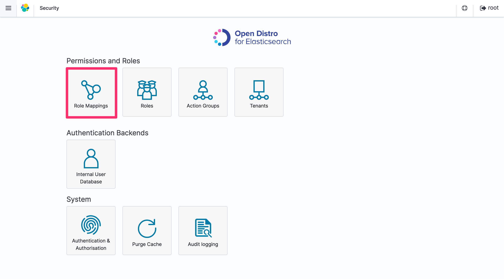
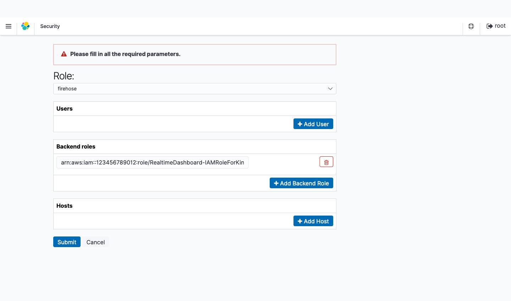
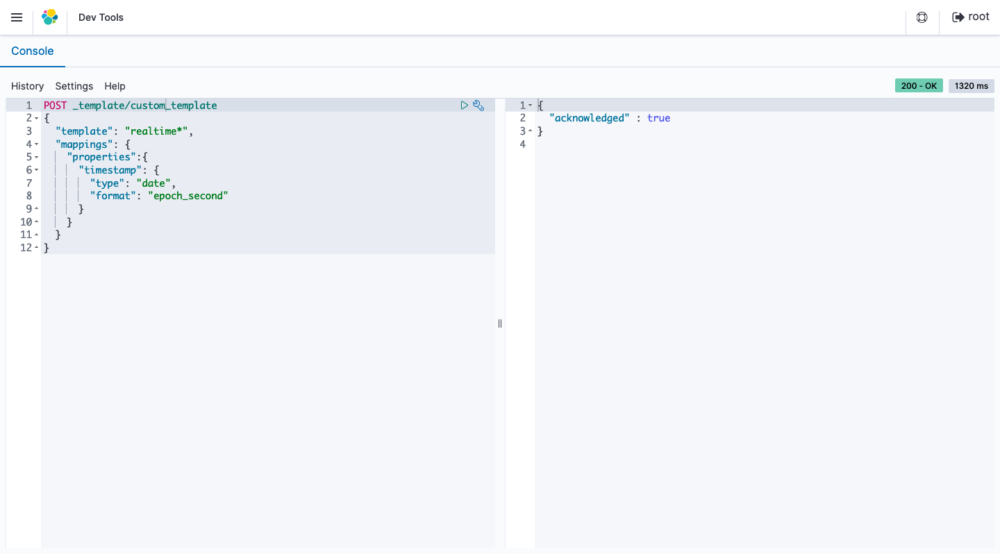

[**English**](README.md) / 日本語

# AWSCloudFormationTemplates/static-website-hosting-with-ssl


``AWSCloudFormationTemplates/static-website-hosting-with-ssl`` は、 ``Amazon CloudFront``, ``Amazon S3`` などの **静的Webサイトホスティング** に関連するAWSサービスを設定します。

## TL;DR

1. このテンプレートを実行する前に、本プロジェクトに含まれる ``Security`` テンプレートと ``Global Settings`` テンプレートの両方を実行してください。

+ [Security Template](../security/README_JP.md)
+ [Global Settings Template](../global/README_JP.md)

2. 以下のボタンをクリックすることで、**CloudFormationをデプロイ**することが可能です。

[](https://console.aws.amazon.com/cloudformation/home?region=ap-northeast-1#/stacks/create/review?stackName=StaticWebsiteHosting&templateURL=https://eijikominami.s3-ap-northeast-1.amazonaws.com/aws-cloudformation-templates/static-website-hosting-with-ssl/template.yaml) 

以下のボタンから、個別のAWSサービスを有効化することも可能です。

| 作成されるAWSサービス | 個別のCloudFormationテンプレート |
| --- | --- |
| Synthetics | [](https://console.aws.amazon.com/cloudformation/home?region=ap-northeast-1#/stacks/create/review?stackName=Synthetics&templateURL=https://eijikominami.s3-ap-northeast-1.amazonaws.com/aws-cloudformation-templates/synthetics/heartbeat.yaml) |
| Realtime Dashboard | [](https://console.aws.amazon.com/cloudformation/home?region=ap-northeast-1#/stacks/create/review?stackName=RealtimeDashboard&templateURL=https://eijikominami.s3-ap-northeast-1.amazonaws.com/aws-cloudformation-templates/static-website-hosting-with-ssl/realtime-dashboard.yaml) |
| WAF | [](https://console.aws.amazon.com/cloudformation/home?region=ap-northeast-1#/stacks/create/review?stackName=WAF&templateURL=https://s3.amazonaws.com/eijikominami/aws-cloudformation-templates/network/waf.yaml) |

## アーキテクチャ

このテンプレートが作成するAWSリソースのアーキテクチャ図は、以下の通りです。


### Amazon S3

#### オリジン

このテンプレートは、WebディストリビューションのオリジンとしてS3バケットを作成します。
``オリジンアクセスアイデンティティ``（``OAI``）を用いたCloudFrontからのアクセスは許可されますが、匿名ユーザからの直接アクセスは拒否されます。

#### ログの保存

S3やCloudFrontで生成されたログは、このテンプレートで作成されたS3バケットに保存されます。

### Amazon CloudFront

このテンプレートは、CloudFrontを作成します。
CloudFrontは、``Custom Domain Name with ACM``、 ``Aliases``、 ``Origin Access Identity``、 ``Secondary Origin``、``Logging``に対応します。

### AWS WAF

このテンプレートは、Amazon CloudFront に ``AWS WAF`` を適用することができます。
以下の [**AWS Managed Rules rule**](https://docs.aws.amazon.com/ja_jp/waf/latest/developerguide/aws-managed-rule-groups-list.html) が有効化されます。

+ AWSManagedRulesCommonRuleSet
+ AWSManagedRulesAdminProtectionRuleSet
+ AWSManagedRulesKnownBadInputsRuleSet
+ AWSManagedRulesAmazonIpReputationList

### Synthetics Stack

このテンプレートは、外形監視に関するネストされたスタックを生成します。
このスタックの詳細は、 [こちら](../synthetics/README_JP.md) をご覧ください。

### Real-time Dashboard Stack

このテンプレートは、CloudFrontのリアルタイムログのダッシュボードに関するネストされたスタックを生成します。
これには、以下のリソースが含まれます。

#### Amazon Kinesis Data Streams

Amazon CloudFrontで生成されたリアルタイムログは、 ``Amazon Kinesis Data Streams`` と統合され、 ``Amazon Kinesis Data Firehose`` を用いて一般的なHTTPエンドポイントに対してこれらのログを配信します。

#### Amazon Kinesis Firehose とこれに関連したリソース

``Amazon Kinesis Data Firehose`` は、ログを ``Amazon S3`` や ``Amazon Elasticsearch Service`` に配信します。
Kinesis Firehose は、 ``AWS Lambda`` を用いて、ログの処理やログのフォーマットの変換を行います。
Elasticsearch にログを送信できない場合、Kinesis Firehose は ``Amazon S3`` バケットにログを送信します。

#### Amazon Elasticsearch Service

``Amazon Elasticsearch Service`` を用いて、リアルタイムダッシュボードやアラートの作成、異常の調査、運用イベントに迅速に対応できます。
追跡できる一般的なデータポイントには、さまざまな地域から発信されたユーザのリクエストの数や、待ち時間が長くなったユニークユーザの数が含まれます。

## デプロイ

以下のコマンドを実行することで、CloudFormationをデプロイすることが可能です。

```bash
aws cloudformation deploy --template-file template.yaml --stack-name StaticWebsiteHosting --parameter-overrides DomainName=XXXXX CertificateManagerARN=XXXXX
```

デプロイ時に、以下のパラメータを指定することができます。

| 名前 | タイプ | デフォルト値 | 必須 | 詳細 |
| --- | --- | --- | --- | --- |
| CertificateManagerARN | String | | | ARNを指定した場合、**CloudFront** に **SSL証明書** が紐付けられます。 |
| **DomainName** | String | | ○ | |
| CloudFrontDefaultTTL | Number | 86400 | ○ | |
| CloudFrontMinimumTTL | Number | 0 | ○ | |
| CloudFrontMaximumTTL |  Number | 31536000 | ○ | |
| CloudFrontViewerProtocolPolicy | allow-all / redirect-to-https / https-only | redirect-to-https | ○ | |
| CloudFrontAdditionalName | String | | | AdditionalNameを指定した場合、**CloudFront** に **エイリアス名** が紐付けられます。 |
| CloudFrontSecondaryOriginId | String | | | SecondaryOriginIdを指定した場合、**CloudFront** に **セカンダリS3バケット** が紐付けられます。 |
| CloudFrontRestrictViewerAccess | ENABLED / DISABLED | DISABLED | ○ | ENABLEDを指定した場合、**CloudFront** の **Restrict Viewer Access** が有効化されます。 |
| CloudFront403ErrorResponsePagePath | String | | | エラーコード403のページパス |
| CloudFront404ErrorResponsePagePath | String | | | エラーコード404のページパス |
| CloudFront500ErrorResponsePagePath | String | | | エラーコード500のページパス |
| RealtimeDashboardElasticSearchVolumeSize | Number | 10 | ○ | Elasticsearch Service のボリュームサイズ（GB） |
| RealtimeDashboardElasticSearchInstanceType | String | r5.large.elasticsearch | ○ | Elasticsearch Service のインスタンスタイプ |
| RealtimeDashboardElasticSearchMasterType | String | r5.large.elasticsearch | ○ | Elasticsearch Service のマスタータイプ |
| RealtimeDashboardElasticSearchLifetime | Number | 1 | ○ | Elasticsearch Service の生存時間 |
| RealtimeDashboardElasticSearchMasterUserName | String | root | ○ | Elasticsearch Service のユーザ名 |
| RealtimeDashboardElasticSearchMasterUserPassword | String | Password1+ | ○ | Elasticsearch Service のパスワード |
| RealtimeDashboardElasticsearchVersion | String | 7.8 | ○ | Elasticsearch Service のバージョン |
| RealtimeDashboardState | ENABLED / DISABLED | DISABLED | ○ | ENABLEDを指定した場合、 **Real-time Dashboard** が有効化されます。|
| RealtimeDashboardSamplingRate | Number | 100 | ○ | CloudFrontから送信するログのサンプリングレート |
| RealtimeDashboardKinesisShardCount | Number | 1 | ○ | Kinesisのシャード数 |
| RealtimeDashboardKinesisNumberOfPutRecordThreshold | Number | 12000000 | ○ | PutRecord のAPIコールの閾値 |
| Route53HostedZoneId | String | | | Route53のホストゾーンID |
| S3DestinationBucketArnOfCrossRegionReplication | String | | | ARNを指定した場合、**S3** に **クロスリージョンレプリケーション** が設定されます。 |
| SyntheticsCanaryName | String | | | SyntheticsCanaryNameを指定した場合、 **CloudWatch Synthetics** が有効化されます。 |
| Logging | ENABLED / DISABLED | ENABLED | ○ | ENABLEDを指定した場合、**CloudFront** と **S3** のログ機能が有効化されます。 |
| LogBacketName | String | | ○ | バケット名を指定しなかった場合、ログが保管されるバケット名は、 'defaultsecuritysettings-logs-${AWS::Region}-${AWS::AccountId}' になります。 |
| WebACLArn | String | | | WebACL の　ARN |

``Real-time Dashboard Stack`` を単独でデプロイする場合は、以下のパラメータを指定することができます。

| 名前 | タイプ | デフォルト値 | 必須 | 詳細 |
| --- | --- | --- | --- | --- |
| ElasticSearchVolumeSize | Number | 10 | ○ | Elasticsearch Service のボリュームサイズ（GB） |
| ElasticSearchDomainName | String | cloudfront-realtime-logs | ○ | Elasticsearch Service のドメイン名 |
| ElasticSearchLifetime | Number | 1 | ○ | Elasticsearch Service の生存時間 |
| ElasticSearchInstanceType | String | r5.large.elasticsearch | ○ | Elasticsearch Service のインスタンスタイプ |
| ElasticSearchMasterType | String | r5.large.elasticsearch | ○ | Elasticsearch Service のマスタータイプ |
| ElasticSearchMasterUserName | String | root | ○ | Elasticsearch Service のユーザ名 |
| ElasticSearchMasterUserPassword | String | Password1+ | ○ | Elasticsearch Service のパスワード |
| ElasticsearchVersion | String | 7.8 | ○ | Elasticsearch Service のバージョン |
| SamplingRate | Number | 100 | ○ | CloudFrontから送信するログのサンプリングレート |
| KinesisFirehoseStreamNameSuffix | String | default | ○ | Kinesis Firehose ストリーム名の接尾辞 |
| KinesisShardCount | Number | 1 | ○ | Kinesisのシャード数 |
| KinesisNumberOfPutRecordThreshold | Number | 12000000 | ○ | PutRecord のAPIコールの閾値 |

### 手動設定

#### Origin failover

本テンプレートを実行することで、 ``CloudFront`` に ``secondary origin server`` を設定することはできますが、 現時点ではCloudFormationで ``Origin Group`` がサポートされていません。
したがって、 CloudFormationのデプロイ完了後に、``Origin Group`` の作成と ``Default Cache Behavior Settings`` の**手動設定**が必要です。

1. ``Origins`` と ``Failover criteria`` を含んだ ``Origin Group`` を作成します。
2. ``Default Cache Behavior Settings`` の ``Origin or Origin Group`` に 1. で作成した ``Origin Group`` を指定します。

#### Kibana

Kibana を使ってリアルタイムダッシュボードを作成するためには、以下の手順を行ってください。

1. **Security** の **Roles** を選択します。



2. ``+`` アイコンをクリックして新しいロールを追加します。
3. 作成したロールに ``firehose`` という名前をつけます。



4. **Cluster Permissions** タブの **Cluster-wide permissions** で ``cluster_composite_ops`` ``cluster_monitor`` グループを追加します。



5. **Index Permissions** タブの **Add index permissions** から **Index Patterns** を選んで ``realtime*`` を入力します。**Permissions: Action Groups** で ``crud`` ``create_index`` ``manage`` アクショングループを追加します。



6. **Save Role Definition** をクリックします。
7. **Security** の **Role Mappings** を選択します。



8. **Add Backend Role** をクリックします。
9. 先ほど作成した ``firehose``を選択します。
10. Backend roles に Kinesis Data Firehose が Amazon ES および S3 に書き込むために使用する IAM ロールの ARN を入力します。



11. **Submit** をクリックします。
12. **Dev Tools** を選択します。
13. ``timestamp`` フィールドを ``date`` タイプと認識させるために、以下のコマンドを入力して実行します。

```json
PUT _template/custom_template
{
    "template": "realtime*",
    "mappings": {
        "properties": {
            "timestamp": {
                "type": "date",
                "format": "epoch_second"
            }
        }
    }
}
```



14. [visualizes と dashboard の設定ファイル](export.ndjson) をインポートします。

