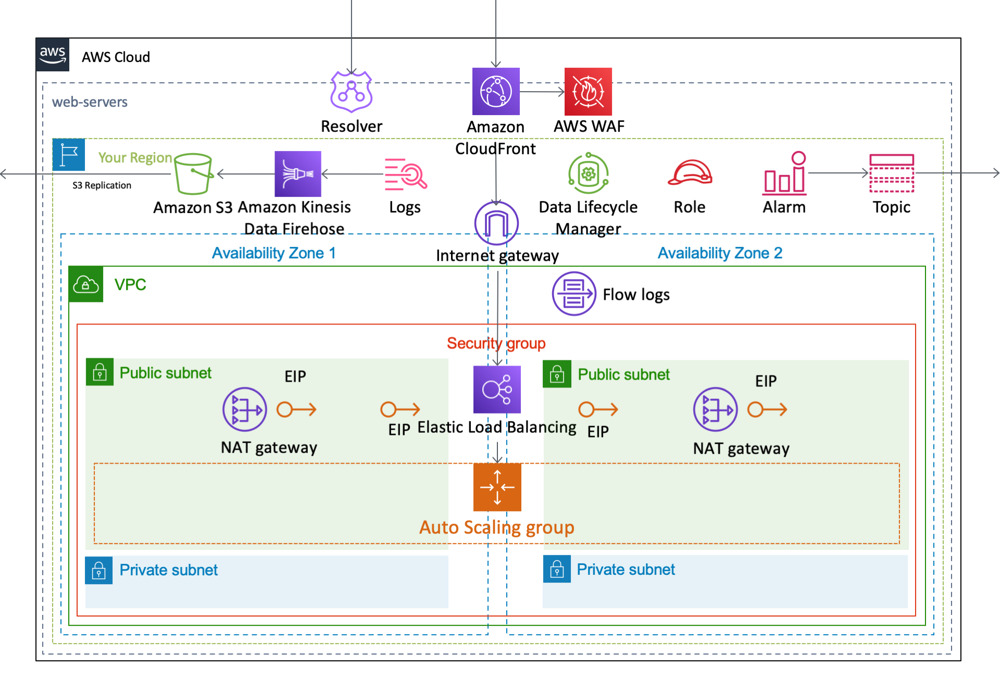

[**English**](README.md) / 日本語

# AWSCloudFormationTemplates/web-servers


 
``AWSCloudFormationTemplates/web-servers`` は、 ``Network Load Balancer``や ``VPC`` 、 ``EC2`` インスタンスなどの **EC2で構成されたWebサイトホスティング** に関連するAWSサービスを設定します。

## 前提条件

デプロイの前に以下を準備してください。

- EC2 インスタンスとロードバランサー用に設定された VPC とサブネット
- EC2 インスタンスアクセス用に作成されたキーペア
- Auto Scaling とロードバランシング要件の理解
- デプロイアーティファクトとログを保存する S3 バケット

## TL;DR

以下のボタンをクリックすることで、この **CloudFormationをデプロイ** することが可能です。

| 米国東部 (バージニア北部) | アジアパシフィック (東京) |
| --- | --- |
| [](https://console.aws.amazon.com/cloudformation/home?region=us-east-1#/stacks/create/review?stackName=WebServers&templateURL=https://eijikominami.s3-ap-northeast-1.amazonaws.com/aws-cloudformation-templates/web-servers/template.yaml) | [](https://console.aws.amazon.com/cloudformation/home?region=ap-northeast-1#/stacks/create/review?stackName=WebServers&templateURL=https://eijikominami.s3-ap-northeast-1.amazonaws.com/aws-cloudformation-templates/web-servers/template.yaml) |

以下のボタンから、個別のAWSサービスを有効化することも可能です。

| 作成されるAWSサービス | 米国東部 (バージニア北部) | アジアパシフィック (東京) |
| --- | --- | --- |
| Data Lifecycle Manager | [](https://console.aws.amazon.com/cloudformation/home?region=us-east-1#/stacks/create/review?stackName=DataLifecycleManager&templateURL=https://eijikominami.s3-ap-northeast-1.amazonaws.com/aws-cloudformation-templates/web-servers/dlm.yaml&param_LogicalName=DataLifecycleManager) | [](https://console.aws.amazon.com/cloudformation/home?region=ap-northeast-1#/stacks/create/review?stackName=DataLifecycleManager&templateURL=https://eijikominami.s3-ap-northeast-1.amazonaws.com/aws-cloudformation-templates/web-servers/dlm.yaml&param_LogicalName=DataLifecycleManager) |
| WAF | [](https://console.aws.amazon.com/cloudformation/home?region=us-east-1#/stacks/create/review?stackName=WAF&templateURL=https://s3-ap-northeast-1.amazonaws.com/eijikominami/aws-cloudformation-templates/edge/waf.yaml) | [](https://console.aws.amazon.com/cloudformation/home?region=ap-northeast-1#/stacks/create/review?stackName=WAF&templateURL=https://s3-ap-northeast-1.amazonaws.com/eijikominami/aws-cloudformation-templates/edge/waf.yaml) |

## アーキテクチャ

このテンプレートが作成するAWSリソースのアーキテクチャ図は、以下の通りです。



## デプロイ

以下のコマンドを実行することで、CloudFormationをデプロイすることが可能です。

```bash
aws cloudformation deploy --template-file template.yaml --stack-name WebServers --capabilities CAPABILITY_NAMED_IAM
```

デプロイ時に、以下のパラメータを指定することができます。

| 名前 | タイプ | デフォルト値 | 必須 | 詳細 |
| --- | --- | --- | --- | --- |
| AccountIdForAnalysis | String | | | 転送先の分析用AWSアカウント |
| ACMValidationMethod | String | DNS | 条件付き | ドメインの検証方法 |
| ACMDomainName | String | | | 証明書のドメイン名 |
| AlarmLevel | NOTICE / WARNING | NOTICE | ○ | CloudWatch アラームのアラームレベル |
| AutoScalingMaxSize | Number | 1 | ○ | |
| AutoScalingLoadBalancerType | None, application, network | None | ○ | 'None'を指定した場合、ELBは作成されません。 |
| BucketNameForAnalysis | String | | | 転送先の分析用 S3 バケット |
| BucketNameForArtifact | String | | | アーティファクトを保存する S3 バケット名 |
| CentralizedLogBucketName | String | | | 集約ログバケット名 |
| CertificateManagerARN | String | | | ARNを指定した場合、**CloudFront** もしくは **Elastic Load Balancer** に **SSL証明書** が紐付けられます。 |
| CloudFrontCompress | true or false | true | ○ | オブジェクトの自動圧縮の有効化フラグ |
| CloudFrontDefaultTTL | Number | 86400 | ○ | |
| CloudFrontMinimumTTL | Number | 0 | ○ | |
| CloudFrontMaximumTTL |  Number | 31536000 | ○ | |
| CloudFrontViewerProtocolPolicy | allow-all / redirect-to-https / https-only | redirect-to-https | ○ | |
| CloudFrontAdditionalName | String | | | AdditionalNameを指定した場合、**CloudFront** に **エイリアス名** が紐付けられます。 |
| CloudFrontSecondaryOriginId | String | | | SecondaryOriginIdを指定した場合、**CloudFront** に **セカンダリS3バケット** が紐付けられます。 |
| CloudFrontRestrictViewerAccess | ENABLED / DISABLED | DISABLED | ○ | ENABLEDを指定した場合、**CloudFront** の **Restrict Viewer Access** が有効化されます。 |
| CloudFront403ErrorResponsePagePath | String | | | エラーコード403のページパス |
| CloudFront404ErrorResponsePagePath | String | | | エラーコード404のページパス |
| CloudFront500ErrorResponsePagePath | String | | | エラーコード500のページパス |
| CodeStarConnectionArn | String | | | CodeStar connection の ARN |
| ComputeType | INSTANCE / CONTAINER / APPRUNNER | INSTANCE | ○ | コンピュート基盤 |
| DesiredCapacity | Number | 1 | ○ | | 
| DockerFilePath | String | | ○ | Dockerfile のパス | 
| DomainName | String | | | ドメイン名 | 
| EC2DailySnapshotScheduledAt | String | 17:00 | ○ | 週次の AMI 作成時刻 (UTC) |
| EC2DiskUsedPercentThreshold | Number | 90 | ○ | **ディスク使用率** アラームのしきい値 |
| EC2ImageId | AWS::EC2::Image::Id | ami-03dceaabddff8067e | ○ | Amazon Linux 2023 AMI (HVM), SSD Volume Type (64bit x86) |
| EC2InstanceType | String | t3.micro | ○ | | 
| EC2KeyName | String | | | 値が指定されない場合は、 **SSHキー** は設定されません。 |
| EC2MemUsedPercentThreshold | Number | 90 | ○ | **メモリ使用率** アラームのしきい値。このメトリクスはページキャッシュを含まないため、メモリの少ないホストでは 90 に達する前に **OOM killer** が動作します。 |
| EC2NetworkInterface | String | MANAGED | ○ | `PINNED` は専用のネットワークインターフェイスにプライベート IP アドレスを固定しますが、インスタンスの稼働中は置換できません。`MANAGED` はインスタンスにインターフェイスを持たせ、CloudFormation による置換を可能にし、 **Elastic IP アドレス** を新しいインスタンスへ移します。 |
| EC2VolumeSize | Number | 8 | ○ | |
| GitHubOwnerNameForArtifact | String | | | Artifact の GitHub オーナー名 |
| GitHubRepoNameForArtifact | String | | | Artifact の GitHub リポジトリ名 |
| GitHubBranchNameForArtifact | String | master | | Artifact の GitHub ブランチ名 |
| GitHubBranchNameForBuildSpec | String | master | | BuildSpec の GitHub ブランチ名 |
| **GlobalInfrastructure** | NONE / CLOUDFRONT / GLOBAL_ACCELERATOR | NONE | ○ | CloudFront や Global Accelerator を有効にするかどうか |
| Logging | ENABLED / DISABLED | ENABLED | ○ | ENABLEDを指定した場合、ログ機能が有効化されます。 |
| LogGroupNameTransferredToS3 | String | | | S3 にログを転送する CloudWatch Log Group 名 |
| Route53HostedZoneId | String | | | Route53のホストゾーンID |
| **SsmSecureStringAccess** | ENABLED / DISABLED | DISABLED | ○ | ENABLED を指定した場合、EC2 インスタンスが Parameter Store の SecureString を復号できます。 |
| SubnetPrivateCidrBlockForAz1 | String | 10.2.0.0/24 | ○ | AZ1 の プライベートサブネットの CIDR ブロック |
| SubnetPrivateCidrBlockForAz2 | String | 10.2.2.0/24 | ○ | AZ2 の プライベートサブネットの CIDR ブロック |
| SubnetPrivateCidrBlockForAz3 | String | 10.2.4.0/24 | ○ | AZ3 の プライベートサブネットの CIDR ブロック |
| SubnetPublicCidrBlockForAz1 | String | 10.2.1.0/25 | ○ | AZ1 の パブリックサブネットの CIDR ブロック |
| SubnetPublicCidrBlockForAz2 | String | 10.2.3.0/25 | ○ | AZ2 の パブリックサブネットの CIDR ブロック |
| SubnetPublicCidrBlockForAz3 | String | 10.2.5.0/25 | ○ | AZ3 の パブリックサブネットの CIDR ブロック |
| SubnetTransitCidrBlockAz1 | String | 10.2.1.128/25 | ○ | AZ1 の トランジットサブネットの CIDR ブロック |
| SubnetTransitCidrBlockAz2 | String | 10.2.3.128/25 | ○ | AZ2 の トランジットサブネットの CIDR ブロック |
| SubnetTransitCidrBlockAz3 | String | 10.2.5.128/25 | ○ | AZ3 の トランジットサブネットの CIDR ブロック |
| TransitGatewayId | String | | | Transit Gateway の Id |
| TransitGatewayDestinationCidrBlock | String | | | TransitGatewayに転送するアドレス範囲 |
| VPCCidrBlock | String | 10.2.0.0/21 | ○ | VPC の CIDR ブロック |
| WebACL | ENABLED / DISABLED | DISABLED | ○ | DISABLED に設定された場合、AWS WAFは作成されません。 |
| WebACLArnForCloudFront | String | | | CloudFrontにアタッチするWAFのARN |

## トラブルシューティング

### SSM State Manager の問題

`AWS-GatherSoftwareInventory` を含む SSM State Manager の関連付けが既に存在する場合、このテンプレートは失敗します。`IgnoreResourceConflicts` オプションを ENABLED に設定してこのテンプレートを実行してください。

### Data Lifecycle Manager のポリシータイプの問題

CloudFormation は `PolicyType` を **Update requires: No interruption** と記載していますが、Amazon Data Lifecycle Manager は既存のポリシーに対するポリシータイプの変更を拒否します。この値を変更するスタック更新は `The following parameter(s) cannot be updated: PolicyType` で失敗し、ロールバックも失敗してネストスタックの全階層が `UPDATE_ROLLBACK_FAILED` のまま残ることがあります。

ポリシータイプを変更する場合は、先にポリシーを削除し、次の更新で作り直してください。ロールバックが止まった場合は、ルートスタックに対して `continue-update-rollback` を実行し、ネストスタックを論理 ID のパスではなく物理名で指定してください。

```bash
aws cloudformation continue-update-rollback --stack-name ROOT_STACK \
  --resources-to-skip PHYSICAL_NESTED_STACK_NAME.DataLifecycleManager
```

### Data Lifecycle Manager のスケジュールの問題

作成ルールの `IntervalUnit` は `HOURS` のみを受け付け、`Interval` は 1、2、3、4、6、8、12、24 のみを受け付けます。1 日より長い間隔を指定する場合は `CronExpression` を使用してください。このテンプレートは `EC2DailySnapshotScheduledAt` と月曜固定の曜日から cron 式を組み立てます。

### ネットワークインターフェイスモードの問題

`PINNED` は `ENIForEC2` をデバイスインデックス 0 にアタッチしますが、稼働中のインスタンスからそのインデックスのインターフェイスは外せません。CloudFormation はリソースを置換する際、旧リソースを削除する前に新リソースを作成するため、`PINNED` での置換は生存中のインスタンスが保持し続けているインターフェイスを要求して `Interface: [eni-...] in use.` で失敗します。インターフェイス自体もモードに応じた条件付きリソースなので、同じ更新がアタッチ中のそれを削除しようとします。

すべての変更が置換を伴うわけではありません。`UserData` は **Some interruptions** と定義されており、ルートボリュームが EBS の場合 CloudFormation はインスタンスを置換せず再起動します。置換になるのはルートボリュームがインスタンスストアの場合だけです。`MetadataOptions` は中断すら伴いません。`PINNED` が更新を妨げると判断する前に、変更するプロパティの更新挙動を確認してください。

稼働中のスタックを `PINNED` から `MANAGED` へ移すとインスタンスが置換されるため、既定値を変更する前にテンプレート設定ファイルへモードを明記してください。何も渡していないスタックは既定値に依存しているため、既定値を変更すると次回のデプロイでインスタンスが動きます。
